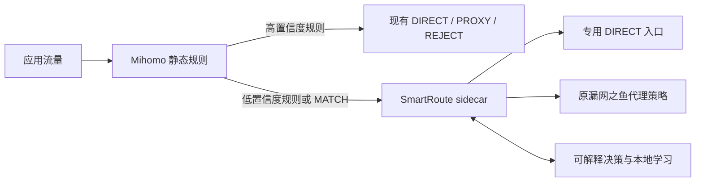

# SmartRoute

SmartRoute 是一个面向 Mihomo/Clash 生态的“自适应分流”实验项目。它不重新实现代理协议，而是在现有静态规则与代理内核之间加入一个可观测、可解释、可撤销的决策层：对规则无法确定的目标比较 `DIRECT` 与 `PROXY` 路径，按当前网络环境积累证据，并逐渐形成个人化路由策略。

当前状态：Phase 0 架构与可行性验证。已经实现实验性的 TCP/SOCKS5 sidecar 数据通路和独立 Test Lab；尚未接入真实 Mihomo、TLS readiness、学习持久化或发布安装包。

## 当前结论

值得做一个有明确退出条件的 MVP，但不值得现在就完整 fork Clash Verge Rev。

- 痛点真实：手工规则门槛高，公共规则无法完全适配每个运营商、校园网、公司网和移动网络。
- 技术可行：TCP，尤其是 HTTPS/TLS 流量，可以先用独立 sidecar 验证；不需要先修改 Mihomo 内核。
- 价值有边界：它最适合网络经常切换、代理延迟或流量成本较高、同时访问国内外服务的用户；不一定改善全局代理、隐私优先或以 UDP/QUIC 为主的场景。
- 市场尚未验证：浏览器插件和 Clash Verge Rev 的用户规模证明了分流需求，但不能证明用户一定需要“自动学习”，更不能证明付费意愿。
- 核心判断标准不是“生成了多少规则”，而是能否在不降低成功率和隐私安全的前提下，减少不必要代理并改善端到端延迟。

## 推荐路线

1. 先做 Shadow Mode，只测量、不改路由。
2. 再做 Mihomo 外挂式 TCP/TLS sidecar，让未知目标进入自适应路径。
3. 达到量化门槛后再集成 Clash Verge Rev UI。
4. 最后才考虑修改 Mihomo 内核以及支持 UDP/QUIC。

## 当前架构



不是所有流量都进入 SmartRoute。用户锁定、安全规则和高置信度规则保持原样；被选中的宽泛规则以及最后的 `MATCH/漏网之鱼` 才进入自适应路径。

## 已实现的 Phase 0 骨架

| 能力 | 状态 |
| --- | --- |
| 严格 JSON 配置与 loopback 安全校验 | 已实现 |
| Direct/Proxy 成对观测决策矩阵 | 实验性实现 |
| 结构化理由、置信度和证据输出 | 实验性实现 |
| SOCKS5 client/server、域名目标保留 | 实验性实现 |
| Direct/Proxy 错峰竞争、取消 loser | 实验性实现 |
| TCP sidecar relay 与 `serve` 命令 | 实验性实现 |
| 独立回环 Test Lab 与故障注入 | 已实现第一批场景 |
| TLS readiness gate | 接口已定义，解析未实现 |
| TLS ClientHello/0-RTT 安全处理 | 未实现 |
| SQLite 学习、TTL、网络画像 | 未实现 |
| Mihomo/Clash Verge Rev 集成 | 上游已锁定，Spike 待执行 |

## 本地开发

要求 Go 1.26+。

```bash
go run ./cmd/smartroute version
go run ./cmd/smartroute validate -config configs/smartroute.example.json
go run ./cmd/smartroute trace \
  -direct failure:tcp:250:tls_reset \
  -proxy success:tls:120
make check
```

## 独立测试环境

日常开发和 CI 不使用本机正在运行的 Clash。独立 Test Lab 只在当前进程内创建 `127.0.0.1:0` 随机端口，模拟目标服务、Direct 网关和 Proxy 网关；不会读取 Clash 配置、访问外网、修改系统代理或启动 TUN。

```bash
make testlab
```

当前覆盖 Direct 快速成功、Direct 卡住后 Proxy 恢复、两条路径均失败、域名目标保留和真实字节转发。更详细的边界见 [独立测试环境](docs/07-isolated-test-lab.md)。真实 Mihomo 测试后续也会启动单独子进程和临时配置，不会复用 Clash Verge Rev 的活动环境。

准备锁定版本的上游源码到被忽略的 `.upstream/`：

```bash
bash scripts/prepare-upstreams.sh
```

## 文档

- [项目与市场可行性评估](docs/01-project-assessment.md)
- [总体技术设计](docs/02-technical-design.md)
- [MVP 与验证计划](docs/03-mvp-validation-plan.md)
- [组件、接口、函数与配置目录](docs/04-component-catalog.md)
- [上游项目与版本锁定](docs/05-upstreams.md)
- [协议能力矩阵](docs/06-protocol-capability-matrix.md)
- [独立测试环境](docs/07-isolated-test-lab.md)
- [架构决策记录](docs/adr/README.md)
- [变更日志](CHANGELOG.md)

协作和文档维护规则见 [AGENTS.md](AGENTS.md)。仓库公开维护，第一方独立代码采用 MIT 许可；当前阶段仍不发布二进制版本。

架构图、接口表和 `AGENTS.md` 都是随实现演进的活文档：实验或代码推翻现有假设时，应在同一变更中更新文档与 ADR，而不是把早期框架固化为最终设计。

## 许可证

SmartRoute 的第一方独立代码采用 [MIT License](LICENSE)。Mihomo 与 Clash Verge Rev 等上游项目继续适用各自许可证；当前仅将其作为锁定版本的外部参考，不把上游源码纳入本仓库。

公开仓库：[github.com/firfisa/smartroute](https://github.com/firfisa/smartroute)

研究与设计快照日期：2026-08-02。
