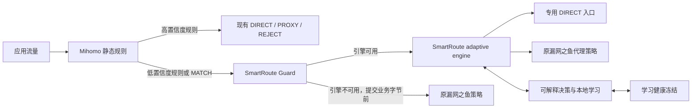

# SmartRoute

SmartRoute 是一个面向 Mihomo/Clash 生态的“自适应分流”实验项目。它不重新实现代理协议，而是在现有静态规则与代理内核之间加入一个可观测、可解释、可撤销的决策层：对规则无法确定的目标比较 `DIRECT` 与 `PROXY` 路径，按当前网络环境积累证据，并逐渐形成个人化路由策略。

当前状态：Phase 0 架构与可行性验证。已经实现实验性的可用性 Guard、TLS-over-SOCKS sidecar、无 0-RTT 的 TLS readiness 竞争、进程内临时学习闭环、系统性故障学习冻结、可选的跨会话强证据写入与 Shadow 评估、受限本地观测记录器、只读试用 preflight，以及锁定 Mihomo v1.19.29 的独立子进程测试；尚未实现跨会话自动策略、活动 Clash 配置接入或发布安装包。

## 当前结论

值得做一个有明确退出条件的 MVP，但不值得现在就完整 fork Clash Verge Rev。

- 痛点真实：手工规则门槛高，公共规则无法完全适配每个运营商、校园网、公司网和移动网络。
- 技术可行：TCP，尤其是 HTTPS/TLS 流量，可以先用独立 sidecar 验证；不需要先修改 Mihomo 内核。
- 价值有边界：它最适合网络经常切换、代理延迟或流量成本较高、同时访问国内外服务的用户；不一定改善全局代理、隐私优先或以 UDP/QUIC 为主的场景。
- 市场尚未验证：浏览器插件和 Clash Verge Rev 的用户规模证明了分流需求，但不能证明用户一定需要“自动学习”，更不能证明付费意愿。
- 核心判断标准不是“生成了多少规则”，而是能否在不降低成功率和隐私安全的前提下，减少不必要代理并改善端到端延迟。

## 推荐路线

1. 先做 Shadow Mode，只测量、不改路由。
2. 再做 Mihomo 外挂式 TCP/TLS sidecar，让未知目标进入自适应路径。
3. 达到量化门槛后再集成 Clash Verge Rev UI。
4. 最后才考虑修改 Mihomo 内核以及支持 UDP/QUIC。

## 当前架构



不是所有流量都进入 SmartRoute。用户锁定、安全规则和高置信度规则保持原样；被选中的宽泛规则以及最后的 `MATCH/漏网之鱼` 才进入自适应路径。

## 已实现的 Phase 0 骨架

| 能力 | 状态 |
| --- | --- |
| 严格 JSON 配置与 loopback 安全校验 | 已实现 |
| Direct/Proxy 成对观测决策矩阵 | 实验性实现 |
| 运行时已完成反事实证据 | 已实现：只保留 winner 前已经终止的另一条路径；取消/未启动不算失败 |
| 进程内学习与 TTL | 已实现：默认 `shadow`；`ephemeral-auto` 才应用偏好；重启清空 |
| 学习后的候选启动顺序 | 已实现：Direct/Proxy 均可先启动，首选失败时另一条立即接替，不变成单路锁定 |
| 系统性故障学习冻结 | 已实现：不同目标阈值、Proxy 专属恢复、网络/门户立即冻结、到期恢复；只冻结学习，不改变当前连接 |
| 结构化理由、置信度和证据输出 | 实验性实现 |
| SOCKS5 client/server、域名目标保留 | 实验性实现 |
| Direct/Proxy 错峰竞争、取消 loser | 实验性实现 |
| TCP sidecar relay 与 `serve` 命令 | 实验性实现 |
| 独立 availability Guard 与 `guard` 命令 | 已实现单元测试；隔离 Mihomo 故障/恢复运行待复验 |
| Guard/engine 独立进程 supervisor | 已实现本地 `supervise`、独立重启和封顶退避；Sidecar/Guard 取消时会中断并排空所有已接受 handler 后退出；OS 服务集成待实现 |
| 隐私安全的本地观测记录 | 已实现：默认关闭、目标 HMAC、容量/时间上限、暂停/清空/导出；真实试用尚未开启 |
| 独立回环 Test Lab 与故障注入 | 已实现第一批场景 |
| TLS readiness gate | 已实现：结构化 ServerHello 达到 L3，预读字节无损回放 |
| TLS ClientHello/0-RTT 安全处理 | 已实现分片重组；检测到 `early_data` 时在拨号前拒绝 |
| Direct 探测隐私策略 | 已实现：`privacy-first`、精确/后缀 deny、缺失策略 fail-closed；禁直连时只启 Proxy 且仍要求 L3 |
| SQLite 强证据存储与运行时写入 | 已实现：默认关闭、HMAC 目标键、独立会话、异步有界队列、迁移/校验/裁剪；仅存证据，不应用持久策略 |
| 持久证据生命周期 | 已实现：只读状态、一致性在线备份、临时副本验证、恢复到新路径；不覆盖、不自动激活 |
| 跨会话 Shadow 评估 | 已实现：强证据次数 + 独立 Session 双阈值；双向证据判冲突；只发建议事件，不改变路由 |
| 隐私安全的 Shadow 汇总 | 已实现：按精确目标在库内分组，只输出不足/冲突/Direct/Proxy 数量与阈值，不输出目标 HMAC |
| 连接级 readiness 汇总 | 已实现：暂停后只读汇总成功门槛、选路比例、Guard 回退和 p50/p95/p99；不输出目标 HMAC，不冒充应用成功率 |
| 受控试用会话分组 | 已实现：supervisor 为 engine/Guard/自身生成并共享随机 ID，子进程重启不换组；报告只输出会话数 |
| 受控试用只读 preflight | 已实现：验证隐私确认、Shadow/Auto 风险、暂停状态、SQLite/备份以及 24 小时内的 Test Lab/Mihomo Lab 完整证据；不读取 Clash，也不授权上线 |
| 独立 Mihomo listener 拓扑 | v1.19.29 已验证强制 Direct/Proxy、域名保留和循环规避 |
| Mihomo HTTPS/TLS 自适应路径 | macOS arm64 与 Linux amd64/v1.19.29 已验证 Direct 无 ServerHello 后由 Proxy 恢复并提交 L3 |
| 活动 Clash Verge Rev 集成 | 尚未写入或重载；留待配合下的真实试用 |

## 本地开发

要求 Go 1.26+。

```bash
go run ./cmd/smartroute version
go run ./cmd/smartroute validate -config configs/smartroute.example.json
go run ./cmd/smartroute trace \
  -direct failure:tcp:250:tls_reset \
  -proxy success:tls:120
make check
```

实验运行时建议由父进程统一启动两个子服务：

```bash
go run ./cmd/smartroute supervise \
  -config configs/smartroute.example.json \
  -acknowledge-direct-probes
```

`privacy-first` 模式不需要 Direct 探测确认。Supervisor 只管理 SmartRoute Guard 与 adaptive engine，不管理 Mihomo，也不能透明恢复恰好撞上 Guard 崩溃窗口的连接。

观测记录默认关闭。启用后，engine、Guard 和 supervisor 分源写入受限 JSONL，且不再把同一原始目标事件重复到 stdout：

```bash
go run ./cmd/smartroute observations status -config configs/smartroute.example.json
go run ./cmd/smartroute observations pause -config configs/smartroute.example.json
go run ./cmd/smartroute observations report -config configs/smartroute.example.json -hours 168
go run ./cmd/smartroute observations export -config configs/smartroute.example.json -destination /tmp/smartroute-export
go run ./cmd/smartroute observations clear -config configs/smartroute.example.json -confirm-clear
```

`report` 和 `clear` 必须先 `pause`。报告只输出事件、readiness、Direct/Proxy、Guard、健康冻结及延迟聚合，不输出目标/profile HMAC。这里的 `readiness_success_ratio` 只表示达到当前 TCP/TLS 提交门槛，不是网页成功、证书验证完成或用户可感知成功率。默认记录不含明文 hostname，导出不包含本地 HMAC 盐值；记录器不是学习策略库。

开启记录后，推荐通过 `supervise` 启动一次受控试用：它会自动生成不可读的随机 `trial_session_id`，并让 supervisor、Guard、engine 及其后续重启共享同一会话。单独启动 `serve`/`guard` 会各自生成会话；只有需要手工跨进程合并时才传入同一个符合 `trial-` + 32 位小写十六进制格式的 `-trial-session`。聚合报告仅显示 `trial_sessions_observed` 和旧记录的 `unscoped_events`，不显示具体 ID。

学习默认处于 `shadow`：会计算临时建议，但始终保持 Direct-first。要在独立测试或后续受控试用中应用进程内偏好，需要显式修改本地配置：

```json
"learning": {
  "mode": "ephemeral-auto",
  "max_entries": 10000,
  "proxy_promotion_wins": 3,
  "direct_promotion_wins": 5,
  "policy_ttl_hours": 72
}
```

这不是永久规则：策略按 `network profile + hostname + port + transport` 隔离，矛盾强证据会立即撤下偏好，TTL 到期或进程重启都会回到 Direct-first；内存表达到容量时停止接纳新目标，而不影响路由。

默认启用学习健康门：30 秒内 3 个不同目标同时双路失败会冻结全局学习，3 个不同目标出现 Proxy 路径失败会冻结 Proxy 相关学习；冻结时立即清空进程内偏好并停止新的临时/SQLite 证据写入。默认由 3 个不同目标的成功恢复（Proxy 故障必须是 Proxy 成功），或 5 分钟到期恢复。这个机制不会切换已经选中的路径，也不会删除冻结前已经写入的 SQLite 行；网络切换和 captive portal 的状态机入口已经实现，自动探测源尚未接入。

跨会话 SQLite 强证据写入默认关闭。要在隔离实验中启用，可在 `learning` 内设置：

```json
"persistence": {
  "enabled": true,
  "database_path": "data/learning.db",
  "queue_size": 256,
  "retention_hours": 720,
  "shutdown_timeout_ms": 2000,
  "direct_suggestion_sessions": 3,
  "proxy_suggestion_sessions": 2
}
```

它只保存目标 HMAC 和通过共享门控的结构化强证据，独立密钥位于 `<database>.key`。写入使用非阻塞有界队列；队列满或运行期数据库错误不会改变当前连接。当前不会从数据库加载自动策略、生成 Clash 规则或授权持久证据改变路由。备份、移动或删除时必须把数据库、`-wal`/`-shm`（如存在）和 `.key` 视为一个单元。

持久证据可以在不启用路由策略的情况下检查、备份并演练恢复：

```bash
go run ./cmd/smartroute learning status -config configs/smartroute.example.json
go run ./cmd/smartroute learning evaluate \
  -config configs/smartroute.example.json \
  -network-profile manual-experimental \
  -hostname example.com -port 443
go run ./cmd/smartroute learning report \
  -config configs/smartroute.example.json
go run ./cmd/smartroute learning backup \
  -config configs/smartroute.example.json \
  -destination /tmp/smartroute-learning-backup
go run ./cmd/smartroute learning verify-backup \
  -source /tmp/smartroute-learning-backup
go run ./cmd/smartroute learning restore \
  -source /tmp/smartroute-learning-backup \
  -destination /tmp/restored-learning.db
```

备份目录包含数据库密钥，因此与原数据库同等敏感，不是脱敏导出。恢复命令只写入全新路径，不会修改配置或自动启用恢复结果；失败的备份/恢复保留 `INCOMPLETE` 标记并拒绝后续使用。

`learning evaluate` 与运行期异步评估共用同一状态机。Direct 默认要求 5 次强证据、至少 3 个 Session；Proxy 默认要求 3 次、至少 2 个 Session。保留期内两个方向只要都出现强证据，就输出 `conflicting` 而不是多数决。`direct_suggested`/`proxy_suggested` 目前只是分析结果，不会进入候选顺序或生成规则。命令不会回显目标，但显式 hostname 参数仍可能留在本地 shell history 或短暂出现在进程列表中。

`learning report` 不需要 hostname，且不会输出目标明文或 HMAC；它统计保留期内有强配对证据的目标分别处于不足、冲突、Direct 建议或 Proxy 建议的数量。这个分母不包含全部访问目标，因此报告只能衡量“已取得强证据样本”的覆盖结构，不能单独证明延迟或成功率已经提升。

## 独立测试环境

日常开发和 CI 不使用本机正在运行的 Clash。进程内 Test Lab 只创建 `127.0.0.1:0` 随机端口；Mihomo Lab 则构建锁定版本，启动专属子进程、临时 home、随机回环端口和合成 DNS。两者都不会读取活动 Clash 配置、访问外网、修改系统代理或启动 TUN。

```bash
make testlab
bash scripts/prepare-upstreams.sh mihomo  # first Mihomo Lab run only
make mihomo-lab
```

真正进入用户配合的试用窗口前，先把两套实验结果保存为 JSON，并执行只读门槛检查：

```bash
go run ./cmd/smartroute-testlab > /tmp/smartroute-testlab-report.json
go run ./cmd/smartroute-mihomo-lab \
  -mihomo .cache/tools/mihomo-v1.19.29 \
  > /tmp/smartroute-mihomo-lab-report.json
go run ./cmd/smartroute observations pause \
  -config /tmp/smartroute-trial.json
go run ./cmd/smartroute trial preflight \
  -config /tmp/smartroute-trial.json \
  -testlab-report /tmp/smartroute-testlab-report.json \
  -mihomo-lab-report /tmp/smartroute-mihomo-lab-report.json \
  -acknowledge-direct-probes
```

其中 `/tmp/smartroute-trial.json` 是由示例复制到活动 Clash 目录之外、将 `observation.enabled` 显式设为 `true` 后验证过的候选试用配置。实验报告带 schema 版本和 UTC 生成时间；默认超过 24 小时、缺场景、隔离字段矛盾或 Mihomo 构建标记不匹配都会失败。若配置已存在 durable SQLite 状态，还必须先用 `learning backup` 创建快照并通过 `-learning-backup` 交给 preflight 匹配验证。`ready: true` 只说明前置证据齐全，不会读取或修改 Clash，更不代表已经获得真实配置写入、重载或启动试用的许可。

进程内场景覆盖 TCP 候选竞争、分片 ClientHello、early-data 拒绝、TLS loser 取消、ServerHello 预读回放、隐私禁止 Direct 时的 Proxy-only L3，以及自适应引擎不可用时的同连接原策略回退。成功竞争会保留 winner 之前已经完成的另一条路径证据，但不会等待 loser，也不会把取消或未启动当失败。既有 Mihomo 运行结果验证了强制 Direct/Proxy、域名保留、无递归、L1 ACK 假阳性，以及 HTTPS/TLS 从不可达 Direct 自动恢复到 Proxy 的 L3 提交；新增的 Guard 停止/恢复场景已进入隔离实验代码，仍需在允许环回子进程的 macOS/Linux 环境复验。这里的 L3 只证明收到了结构合法的 ServerHello，不代表证书或完整握手成功。详见 [独立测试环境](docs/07-isolated-test-lab.md)、[ADR-0007](docs/adr/0007-enforce-direct-probe-privacy.md) 和 [ADR-0010](docs/adr/0010-preserve-only-completed-counterfactual-evidence.md)。

为适配真实环境，可以对活动 Clash Verge Rev 目录进行只读、脱敏的结构检查；现阶段仍禁止自动写入或重载。本地观测记录器已经就绪，但尚未对活动环境启用。待隔离 Mihomo 测试、备份和回滚验证完成后，再在用户配合下进入短时真实试用。详见 [观测与真实试用计划](docs/08-observation-and-live-trial.md) 和 [ADR-0009](docs/adr/0009-bounded-local-observation-recorder.md)。

准备锁定版本的上游源码到被忽略的 `.upstream/`：

```bash
bash scripts/prepare-upstreams.sh
```

## 文档

- [项目与市场可行性评估](docs/01-project-assessment.md)
- [总体技术设计](docs/02-technical-design.md)
- [MVP 与验证计划](docs/03-mvp-validation-plan.md)
- [组件、接口、函数与配置目录](docs/04-component-catalog.md)
- [上游项目与版本锁定](docs/05-upstreams.md)
- [协议能力矩阵](docs/06-protocol-capability-matrix.md)
- [独立测试环境](docs/07-isolated-test-lab.md)
- [观测与真实试用计划](docs/08-observation-and-live-trial.md)
- [架构决策记录](docs/adr/README.md)
- [变更日志](CHANGELOG.md)

协作和文档维护规则见 [AGENTS.md](AGENTS.md)。仓库公开维护，第一方独立代码采用 MIT 许可；当前阶段仍不发布二进制版本。

架构图、接口表和 `AGENTS.md` 都是随实现演进的活文档：实验或代码推翻现有假设时，应在同一变更中更新文档与 ADR，而不是把早期框架固化为最终设计。

## 许可证

SmartRoute 的第一方独立代码采用 [MIT License](LICENSE)。Mihomo 与 Clash Verge Rev 等上游项目继续适用各自许可证；当前仅将其作为锁定版本的外部参考，不把上游源码纳入本仓库。

公开仓库：[github.com/firfisa/smartroute](https://github.com/firfisa/smartroute)

研究与设计快照日期：2026-08-02。
