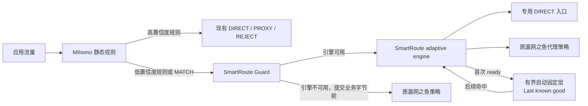

# SmartRoute

SmartRoute 是一个面向 Mihomo/Clash 生态的“自适应分流”实验项目。它不重新实现代理协议，而是在现有静态规则与代理内核之间加入一个简单的自动路由层：未知目标第一次比较 `DIRECT` 与 `PROXY` readiness，立即长期记住成功路径；以后单路复用，失效时自动尝试另一条并覆盖。

当前状态：`v0.1.0` 首个编号公开正式版本，运行时成熟度仍标记为 experimental。已经实现可用性 Guard、TLS-over-SOCKS sidecar、无 0-RTT 的 TLS readiness 竞争、默认启用的本地自动固定层、受限本地观测记录器、最终 `MATCH` 变换器，以及锁定 Mihomo v1.19.29 的独立验证。首个受控真实试用已覆盖真实 Direct/Proxy 分流、持久复用、进程迁移和 LaunchAgent 故障恢复；该版本可用于 macOS 自管使用，但仍不是带 GUI/一键安装的生产级发行版。

## 当前结论

值得做一个有明确退出条件的 MVP，但不值得现在就完整 fork Clash Verge Rev。

- 痛点真实：手工规则门槛高，公共规则无法完全适配每个运营商、校园网、公司网和移动网络。
- 技术可行：TCP，尤其是 HTTPS/TLS 流量，可以先用独立 sidecar 验证；不需要先修改 Mihomo 内核。
- 价值有边界：它最适合网络经常切换、代理延迟或流量成本较高、同时访问国内外服务的用户；不一定改善全局代理、隐私优先或以 UDP/QUIC 为主的场景。
- 市场尚未验证：浏览器插件和 Clash Verge Rev 的用户规模证明了分流需求，但不能证明用户一定需要“自动学习”，更不能证明付费意愿。
- 核心判断标准不是“生成了多少规则”，而是能否在不降低成功率和隐私安全的前提下，减少不必要代理并改善端到端延迟。

## 推荐路线

1. 先在独立 Test Lab 跑通“首次判断 → 立即记住 → 下次单路命中 → 失败后反向覆盖”的完整闭环。
2. 只读确定 Clash Verge Rev 当前规则、`MATCH/Other` 和监听器的真实绑定，不改活动配置。
3. 在用户配合的试用窗口把最终 `MATCH` 接入默认 `auto`，直接测量首判延迟、重复命中、fallback 和代理使用变化；诊断报告不作为自动规则门槛。
4. TCP/TLS 真实体验成立后再做 Clash Verge Rev UI；UDP/QUIC 和 Mihomo 内核改动留到协议专用判断方法成熟之后。

## 当前架构



不是所有流量都进入 SmartRoute。用户锁定、安全规则和高置信度规则保持原样；被选中的宽泛规则以及最后的 `MATCH/漏网之鱼` 才进入自适应路径。

## 已实现的 Phase 0 骨架

| 能力 | 状态 |
| --- | --- |
| 严格 JSON 配置与 loopback 安全校验 | 已实现 |
| Direct/Proxy 成对观测决策矩阵 | 实验性实现 |
| 运行时已完成反事实证据 | 已实现：只保留 winner 前已经终止的另一条路径；取消/未启动不算失败 |
| 自动持久策略层 | 已实现并默认启用：`auto` 第一次 TCP/TLS readiness 成功即记住，无需逐目标批准、重复计数、临时层或 TTL |
| 固定策略数据路径 | 已实现：命中时仅启动所选路径；提交前失败才顺序尝试另一条，反向成功立即覆盖旧选择 |
| 旧 Shadow/临时晋级路径 | 仅保留兼容与诊断；`auto` 不创建、不查询该 TTL/阈值状态机 |
| 结构化理由、置信度和证据输出 | 实验性实现 |
| SOCKS5 client/server、域名目标保留 | 实验性实现 |
| Direct/Proxy 错峰竞争、取消 loser | 实验性实现 |
| TCP sidecar relay 与 `serve` 命令 | 实验性实现 |
| 独立 availability Guard 与 `guard` 命令 | 单元测试及锁定 Mihomo v1.19.29 的 engine 停止→原策略回退→重启恢复拓扑均已通过 |
| Guard/engine 独立进程 supervisor | 已实现本地 `supervise`、独立重启和封顶退避；Sidecar/Guard 取消时会中断并排空所有已接受 handler 后退出；macOS 试用可生成精确的用户 LaunchAgent，正式安装器和其他平台服务仍待实现 |
| 隐私安全的本地观测记录 | 已实现：默认关闭、目标 HMAC、容量/时间上限、暂停/清空/导出；首个受控试用以无明文域名、每来源 3×1MiB、24 小时保留运行 |
| 独立回环 Test Lab 与故障注入 | 已实现 3 个基础路由场景和 4 步 last-known-good 闭环；报告逐步验证候选次数、TLS readiness、学习路径与反向覆盖 |
| 无网络 Trial Lab | 已实现：在自动清理的临时目录中演练 recorder → report v7 → assessment，并验证混入 session 会 fail-closed；输出不能作为 preflight 证据 |
| Sidecar 开销 Benchmark Lab | 已实现 fake/Mihomo 两种 gateway × TCP echo/TLS ServerHello 两种协议的四格配对；5×200 强制门槛最差 run p95 为 231–256µs；TUN/完整握手/真实应用仍待测 |
| 并发 Relay Load Lab | 已实现 fake/Mihomo 两层的 3×16 并发、每连接 1MiB 分块精确回显；正确性通过，但 provisional 0.70 吞吐比门槛分别以 0.668/0.677 最差轮结果未通过 |
| TLS readiness gate | 已实现：结构化 ServerHello 达到 L3，预读字节无损回放 |
| TLS ClientHello/0-RTT 安全处理 | 已实现分片重组；检测到 `early_data` 时在拨号前拒绝 |
| Direct 探测隐私策略 | 已实现：`privacy-first`、精确/后缀 deny、缺失策略 fail-closed；禁直连时只启 Proxy 且仍要求 L3 |
| SQLite 自动策略存储与运行时写入 | 已实现并默认开启：HMAC 目标键、异步有界队列、策略容量上限、迁移/校验；连接查询不访问 SQLite |
| 持久证据生命周期 | 已实现：只读状态、一致性在线备份、临时副本验证、恢复到新路径；不覆盖、不自动激活 |
| 旧 Shadow/人工固定管理面 | 保留为高级诊断与覆盖工具，不参与 `auto` 选择，也不是自动结果的审批流程 |
| 隐私安全的 Shadow 汇总 | 已实现：按精确目标在库内分组，只输出不足/冲突/Direct/Proxy 数量与阈值，不输出目标 HMAC |
| 连接级 readiness 汇总 | 已实现：暂停后只读汇总成功门槛、选路比例、Guard 回退和 p50/p95/p99；不输出目标 HMAC，不冒充应用成功率 |
| Post-commit relay 汇总 | 已实现：按 Direct/Proxy 聚合已提交 adaptive relay 的双向字节、持续时间、远端有字节覆盖和取消数；不记录 payload，不冒充应用成功或全局流量节省 |
| 连接事件精确关联 | 已实现：每个 adaptive 连接使用随机非语义 scope 关联 decision/diagnostic 与 relay outcome；报告仅输出配对、缺失和未匹配计数，不输出 ID，也不把缺失当失败 |
| 原策略声明基线对照 | 已实现：把 `original_fallback` 作为经操作者确认的原 `Other/MATCH` 路径类别，统计相同/改道选择及改道 winner 的实际 relay；不把声明当实测反事实，也不把 winner 字节叫节省量 |
| Relay 方向终止分类 | 已实现：分别聚合 client→remote 与 remote→client 的 EOF/timeout/reset/closed/I/O-error/canceled 固定类别；绝不记录原始错误，也不把类别直接当应用成功或学习失败 |
| 试用后数据质量闸门 | 已实现：preflight 预注册 session、配置指纹、窗口和阈值；`trial assess` 只接受该计划并检查预期 session、暂停状态、样本/scope/配对/取消比例；通过仅表示可做描述性分析 |
| 受控试用会话分组 | 已实现：supervisor 为 engine/Guard/自身生成并共享随机 ID，子进程重启不换组；报告只输出会话数 |
| 受控试用只读 preflight | 已实现：验证隐私确认、Shadow/Auto 风险、暂停状态、SQLite/备份以及 24 小时内的 Test Lab/Mihomo Lab 完整证据；不读取 Clash，也不授权上线 |
| 独立 Mihomo listener 拓扑 | v1.19.29 已验证强制 Direct/Proxy、域名保留和循环规避 |
| Mihomo HTTPS/TLS 自适应路径 | macOS arm64 与 Linux amd64/v1.19.29 已验证 Direct 无 ServerHello 后由 Proxy 恢复并提交 L3 |
| 活动 Clash 只读兼容性 | 已验证：当前唯一末尾 MATCH 实际选择代理树；活动 remote 同时启用 merge/script/rules/proxies/groups；最小接入必须在现有 script 之后替换 MATCH，并保留原根组回退 |
| Clash Verge 最终 MATCH 变换器 | 已实现：保留既有 script 和高置信规则，幂等添加 Guard/Direct/Proxy/Original loopback 对象；合成配置已通过 Node、pinned Mihomo `-t`，当前活动 script 也已只读组合并通过语法检查 |
| 完整 Runtime Lab | 已实现：真实 Clash 组合器 → 锁定 Mihomo → `smartroute supervise` 真实子进程 → 临时 SQLite；验证首判、重启单路复用、超时 fallback、反向覆盖和再次重启 |
| 本地拓扑 Doctor | 已实现：`baseline`/`armed`/`running` 只检查五个 loopback 端口；SOCKS 检查止于方法协商，不发目标 CONNECT |
| 私有真实试用候选包 | 已实现：当前 1,286 条规则保持数量和高置信前缀不变，组零变化；私有备份、五端口拓扑、运行时工作区和原子 install/rollback 均已验证 |
| 活动 Clash Verge Rev 集成 | 首个受控试用已按“先 armed、后安装/重载”启用；Guard/TUN 烟雾测试通过，回滚仍待试用窗口结束后执行 |

## 首次真实试用快照

截至 2026-08-04 的首个短窗口，身份隐藏 report v7 给出：34 次 Guard 决策全部选择 adaptive lane，覆盖 20 个目标 scope；22 次 Direct、12 次 Proxy，34/34 达到 TLS readiness。自动层新记住 13 条 Direct 和 7 条 Proxy，并出现 14 次路径不变，其中 9 次在连接开始时直接命中持久策略。该快照证明 SmartRoute 已接到真实兜底流量并实际复用学习结果；它不等于应用成功率、统计显著性或长期收益结论。

## 本地开发

要求 Go 1.26+；Clash Verge 变换器测试和组合工具要求 Node.js 24+。

```bash
go run ./cmd/smartroute version
go run ./cmd/smartroute validate -config configs/smartroute.example.json
go run ./cmd/smartroute doctor -phase baseline -config configs/smartroute.example.json
go run ./cmd/smartroute trace \
  -direct failure:tcp:250:tls_reset \
  -proxy success:tls:120
make check
make clash-transform-test
make clash-transform-mihomo
make active-candidate-test
make macos-launch-agent-test
make runtime-lab
make testlab
make trial-lab
make benchmark-lab
make benchmark-tls
make benchmark-mihomo
make benchmark-mihomo-tls
make load-lab
make load-sweep
make capacity-lab
make load-mihomo
```

## v0.1.0 发布构建

首个编号版本提供 macOS arm64/amd64 与 Linux arm64/amd64 的 CLI 压缩包。发布资产通过同一脚本生成，包含版本、Git commit、UTC 构建时间和 SHA-256：

```bash
make release VERSION=v0.1.0
tar -xzf dist/v0.1.0/smartroute-v0.1.0-darwin-arm64.tar.gz -C /tmp
/tmp/smartroute-v0.1.0-darwin-arm64/smartroute version
```

发布包只包含独立 SmartRoute 二进制、README 和 MIT License，不捆绑 Mihomo、Clash Verge Rev、订阅、节点或用户数据库。当前活动 Clash 接入仍按 [私有候选包](docs/14-live-trial-candidate-package.md) 和 [macOS LaunchAgent](docs/15-macos-launch-agent.md) 的受控流程完成。版本能力与限制见 [v0.1.0 release notes](docs/releases/v0.1.0.md)。

人工固定策略是可选高级管理面，不是自动学习的审批步骤，也不会改变当前运行连接：

```bash
go run ./cmd/smartroute policy lock \
  -config configs/smartroute.example.json \
  -network-profile manual-experimental \
  -hostname api.example.com -port 443 -path proxy
go run ./cmd/smartroute policy list -config configs/smartroute.example.json
go run ./cmd/smartroute policy revoke -config configs/smartroute.example.json -id policy-...
```

该数据库保存用户主动输入的明文精确目标，与 HMAC 强证据库分离。`serve`、Guard、临时学习和 durable suggestion 都不会读取或写入它；运行时激活要等单独 ADR 完成隐私冲突、单路失败和 observation schema 设计。详见 [Fixed Policy Management Plane](docs/12-fixed-policy-management-plane.md)。

`make testlab` 只绑定 `127.0.0.1:0`，目前会输出 7 个机器可读场景：3 个基础路由故障场景，以及“首次 Direct → Direct 单路复用 → Direct 失败后 Proxy fallback 并覆盖 → Proxy 单路复用”的 4 步自动学习闭环。Preflight 会逐字段验证这组场景，而不是只信任顶层 `passed`。`make trial-lab` 则完全不绑定端口，只用合成事件检查本地分析控制面，并明确输出 `preflight_evidence=false` 和所有授权字段为 false。两者都不连接外网、不读取 Clash。

`make benchmark-lab` 与 `make benchmark-tls` 使用 in-process fake SOCKS；相应 `benchmark-mihomo*` 命令另外启动明确锁定的临时 Mihomo 子进程、私有 home 和 synthetic DNS，不发现或操作活动 Clash。TCP echo 的 fake/Mihomo 配对 p95 为 246/200µs；TLS ServerHello readiness 为 228/230µs。TLS cell 使用完整解析且无 `early_data` 的 ClientHello，并要求精确有效 ServerHello，但不代表 Finished、证书、HTTP 或应用成功。四格默认均为 5×200 对，只有显式 `-enforce` 才执行 5ms 延迟门槛。详见 [基准方法与结果](docs/09-sidecar-overhead-benchmark.md)。

`make load-lab` 与 `make load-mihomo` 独立测量 16 条并发新连接上的持续分块 echo，不改变上述 latency benchmark 口径。`make load-sweep` 与 `make load-sweep-mihomo` 再运行固定的并发量/载荷矩阵，并记录仅覆盖当前 Go 进程的分配量和诊断性 CPU 差值。长流量 cell 在 fake/Mihomo 两层都收敛到约 0.665 ratio，未达到事先设置的 0.70；门槛没有下调，标准库 relay 也暂不做无证据的缓冲池改写。该结果说明额外 hop 在 loopback 极限负载下有真实成本，不能据此推导 WAN 或用户体验。详见 [并发 Relay Load Lab](docs/10-concurrent-relay-load-lab.md)。

`make capacity-lab` 与 `make capacity-mihomo` 使用固定的客户端累计字节时间表，判断 baseline/sidecar 能否跟上 100、500、1000、5000、8000 Mbps 的总需求。两层都按时完成到 5 Gbps，并在 8 Gbps 出现 baseline 仍满足、sidecar 超过容差的可归因边界。这解释了为何极限 loopback ratio 不等于普通带宽下的同比体验损失；该实验仍不是 RTT/丢包/带宽网络仿真。详见 [Offered-Load Capacity Lab](docs/11-offered-load-capacity-lab.md)。

实验运行时建议由父进程统一启动两个子服务：

```bash
go run ./cmd/smartroute supervise \
  -config configs/smartroute.example.json \
  -acknowledge-direct-probes
```

`privacy-first` 模式不需要 Direct 探测确认。Supervisor 只管理 SmartRoute Guard 与 adaptive engine，不管理 Mihomo，也不能透明恢复恰好撞上 Guard 崩溃窗口的连接。

活动 Clash 已把最终 `MATCH` 指向 Guard 时，不能把这个 Supervisor 只留在普通终端或 Codex 执行会话中。macOS 试用使用 [LaunchAgent 驻留边界](docs/15-macos-launch-agent.md)：生成器只接受私有、固定且可验证的 live runtime，精确复用其中的 `start_supervisor` 命令，并把 stdout/stderr 留在本地私有目录。默认测试不调用 `launchctl`；真实 bootstrap/bootout 仍是显式的受控操作。

观测记录默认关闭。启用后，engine、Guard 和 supervisor 分源写入受限 JSONL，且不再把同一原始目标事件重复到 stdout：

```bash
go run ./cmd/smartroute observations status -config configs/smartroute.example.json
go run ./cmd/smartroute observations pause -config configs/smartroute.example.json
go run ./cmd/smartroute observations report -config configs/smartroute.example.json -hours 168
go run ./cmd/smartroute observations export -config configs/smartroute.example.json -destination /tmp/smartroute-export
go run ./cmd/smartroute observations clear -config configs/smartroute.example.json -confirm-clear
go run ./cmd/smartroute trial assess -config /tmp/smartroute-trial.json \
  -preflight-report /tmp/smartroute-preflight.json
```

`report` 和 `clear` 必须先 `pause`。报告只输出事件、readiness、Direct/Proxy、Guard、健康冻结、声明基线、relay 双向字节、延迟及有界方向终止聚合，不输出目标/profile HMAC、连接 ID 或原始 I/O 错误。每个新连接的随机 `connection_id` 只在本地原始 debug 输出（未启用持久记录时）或 JSONL/export 中关联 terminal event 与 relay outcome；报告里的缺失/未匹配计数可能来自时间窗口、仍在进行的 relay、暂停或进程中断，不能当作路径失败。`declared_baseline` 只将实际选择与配置中声明的原 `Other/MATCH` Direct/Proxy 类别比较，不代表反事实路径被执行；改道 winner 的字节是实际承载量，不是“节省字节”。方向终止只允许 EOF/timeout/reset/closed/I/O-error/canceled 固定类别：EOF 不是应用成功，reset/timeout 也不会自动进入学习。这里的 `readiness_success_ratio` 只表示达到当前 TCP/TLS 提交门槛；relay 的远端字节可能只是预读回放的 TLS ServerHello，同样不是网页成功、证书验证完成或用户可感知成功率。字节仅覆盖 SmartRoute 已提交后的 adaptive relay，不含静态规则流量、TLS ClientHello 或链路开销，因此不能单独计算全局代理节省。默认记录不含明文 hostname，导出不包含本地 HMAC 盐值；记录器不是学习策略库。

开启记录后，普通实验可由 `supervise` 自动生成随机 `trial_session_id` 并让子进程及其重启共享。受控试用必须改用成功 preflight 输出的 `assessment_plan.trial_session_id` 显式启动 `supervise -trial-session ...`。单独启动 `serve`/`guard` 会各自生成会话。聚合报告只显示 session 数、预期 session 是否命中及非预期事件数，不显示具体 ID。

试用结束后先暂停记录，再把成功 preflight JSON 交给 `trial assess`。窗口和阈值只能在 preflight 前设置，preflight 之前的旧观测也不会进入窗口；默认要求至少 20 个 committed selection、connection/baseline scope 覆盖分别达到 99%、terminal/relay 配对完整度达到 95%、生命周期取消不超过 10%。评估还会拒绝配置指纹漂移、缺失/混入其他 session 或 unscoped 事件。`ready_for_descriptive_analysis: true` 只说明数据结构适合继续分析；输出始终明确 `static_baseline_verified=false`、`client_outcome_available=false`、`authorizes_policy_change=false`。

默认配置已经启用不需要逐域名批准的自动固定层：

```json
"learning": {
  "mode": "auto",
  "max_entries": 10000,
  "persistence": {
    "enabled": true,
    "database_path": "data/learning.db"
  }
}
```

第一次有路径达到 TCP/TLS readiness，就会立即成为该 `network profile + hostname + port + transport` 的 last-known-good 选择，同时异步落盘。自动模式只保存这张精确映射表，不创建学习 Session、不累积强证据历史、不跑跨会话评估。以后命中时只启动这个路径，避免重复双路探测；若它在提交业务数据前失败，最多使用总 readiness timeout 的一半，剩余时间保留给一次反向尝试；反向路径成功后立即覆盖旧选择。这里没有 provisional/confirmed、重复次数门槛或 TTL。

`auto` 不创建旧的临时晋级/TTL 引擎，也不应用旧的系统健康冻结。双路都失败时不会改写策略，因此无需再通过另一套状态机阻止错误晋级。旧 `durable-auto` 仍可读取，但只是兼容写法。

数据库保存目标 HMAC、结构化诊断证据和 HMAC 键控的自动策略，独立密钥位于 `<database>.key`。自动策略写入使用非阻塞有界队列；队列满或数据库错误不会改变当前连接。启动时最多加载 `max_entries` 条策略到内存，连接查询不访问 SQLite。在 Apple M4 Pro 上当前 lookup 基准约为 299–301ns、304B、9 allocs/op；构造默认 10,000 条索引约分配约 1.84MB、耗时约 0.35ms。这是本机工程基准，不等于进程总 RSS 或真实网络延迟。

持久证据可以在不启用路由策略的情况下检查、备份并演练恢复：

```bash
go run ./cmd/smartroute learning status -config configs/smartroute.example.json
go run ./cmd/smartroute learning evaluate \
  -config configs/smartroute.example.json \
  -network-profile manual-experimental \
  -hostname example.com -port 443
go run ./cmd/smartroute learning report \
  -config configs/smartroute.example.json
go run ./cmd/smartroute learning clear-policies \
  -config configs/smartroute.example.json -confirm-clear-policies
go run ./cmd/smartroute learning backup \
  -config configs/smartroute.example.json \
  -destination /tmp/smartroute-learning-backup
go run ./cmd/smartroute learning verify-backup \
  -source /tmp/smartroute-learning-backup
go run ./cmd/smartroute learning restore \
  -source /tmp/smartroute-learning-backup \
  -destination /tmp/restored-learning.db
```

备份目录包含数据库密钥，因此与原数据库同等敏感，不是脱敏导出。恢复命令只写入全新路径，不会修改配置或自动启用恢复结果；失败的备份/恢复保留 `INCOMPLETE` 标记并拒绝后续使用。

`learning evaluate` 和 `learning report` 是保留的高级诊断命令，不参与 `auto` 路由选择。自动层只采用实际达到 readiness 的最后路径；`learning clear-policies` 只清映射、保留诊断证据，需要重启来丢弃运行中内存快照，切换为 `shadow` 可暂时停止再次生成。

`learning report` 不需要 hostname，且不会输出目标明文或 HMAC；它统计保留期内有强配对证据的目标分别处于不足、冲突、Direct 建议或 Proxy 建议的数量。这个分母不包含全部访问目标，因此报告只能衡量“已取得强证据样本”的覆盖结构，不能单独证明延迟或成功率已经提升。

## 独立测试环境

日常开发和 CI 不使用本机正在运行的 Clash。进程内 Test Lab 只创建 `127.0.0.1:0` 随机端口；Mihomo Lab 则构建锁定版本，启动专属子进程、临时 home、随机回环端口和合成 DNS。两者都不会读取活动 Clash 配置、访问外网、修改系统代理或启动 TUN。

2026-08-03 的活动环境只读检查已经确认：当前生成配置有且只有一个末尾 `MATCH`，它指向两分支选择组，控制器当前选择最终落到代理节点。因此 SmartRoute 必须替换该 `MATCH` 的动作，而不是等待它之后的“漏网流量”。检查没有输出名称、订阅、节点或密钥，也没有执行写入或重载。详见 [活动 Clash 只读兼容性快照](docs/13-active-clash-readonly-compatibility.md)。

```bash
make testlab
bash scripts/prepare-upstreams.sh mihomo  # first Mihomo Lab run only
make mihomo-lab
```

真正进入用户配合的试用窗口前，先把两套实验结果保存为 JSON，并执行只读门槛检查：

```bash
go run ./cmd/smartroute-testlab > /tmp/smartroute-testlab-report.json
go run ./cmd/smartroute-mihomo-lab \
  -mihomo .cache/tools/mihomo-v1.19.29 \
  > /tmp/smartroute-mihomo-lab-report.json
go run ./cmd/smartroute observations pause \
  -config /tmp/smartroute-trial.json
go run ./cmd/smartroute trial preflight \
  -config /tmp/smartroute-trial.json \
  -testlab-report /tmp/smartroute-testlab-report.json \
  -mihomo-lab-report /tmp/smartroute-mihomo-lab-report.json \
  -acknowledge-direct-probes \
  -acknowledge-original-baseline \
  -assessment-window 168h \
  > /tmp/smartroute-preflight.json
```

其中 `/tmp/smartroute-trial.json` 是活动 Clash 目录之外的候选试用配置。`original_fallback` 必须人工核对为计划中 `original_endpoint` 背后的原 `Other/MATCH` 路径类别；preflight 不会读取 Clash 替你证明它。成功报告会固定随机 session、解码后配置的 SHA-256、窗口和评估阈值；把其中的 `assessment_plan.trial_session_id` 传给后续 `supervise -trial-session`。该报告是本地试验关联材料，不应提交或上传。修改配置、窗口或阈值后必须重新 preflight。`ready: true` 只说明前置证据齐全，不代表已经获得真实配置写入、重载或启动试用的许可。

进程内场景覆盖 TCP 候选竞争、分片 ClientHello、early-data 拒绝、TLS loser 取消、ServerHello 预读回放、隐私禁止 Direct 时的 Proxy-only L3，以及自适应引擎不可用时的同连接原策略回退。成功竞争会保留 winner 之前已经完成的另一条路径证据，但不会等待 loser，也不会把取消或未启动当失败。2026-08-02 的隔离 Mihomo v1.19.29 运行验证了强制 Direct/Proxy、域名保留、无递归、L1 ACK 假阳性、HTTPS/TLS Proxy 恢复，以及 Guard 在 engine 停止时回原策略并在重启后恢复 adaptive。这里的 L3 只证明收到了结构合法的 ServerHello，不代表证书或完整握手成功。详见 [独立测试环境](docs/07-isolated-test-lab.md)、[ADR-0007](docs/adr/0007-enforce-direct-probe-privacy.md) 和 [ADR-0010](docs/adr/0010-preserve-only-completed-counterfactual-evidence.md)。

为适配真实环境，可以对活动 Clash Verge Rev 目录进行只读、脱敏的结构检查。首个受控试用已经在用户确认的写入/重载窗口启用本地观测和最终 `MATCH` 变换；未来任何写入、重载或新试用仍需重新协调，不能由既有授权自动延伸。详见 [观测与真实试用计划](docs/08-observation-and-live-trial.md) 和 [ADR-0009](docs/adr/0009-bounded-local-observation-recorder.md)。

最终 `MATCH` 变换器可以完全离线验证：

```bash
make clash-transform-test
make clash-transform-mihomo
node scripts/compose-clash-script.mjs \
  --base /tmp/existing-script.js \
  --output /tmp/smartroute-composed.js
```

组合器只创建新文件并拒绝覆盖；它先调用已有 `main(config)`，再执行 SmartRoute 变换。这里的 `/tmp` 示例不能替换活动 profile，活动写入仍需单独协调。

真实试用候选使用 [私有候选包流程](docs/14-live-trial-candidate-package.md)。当前私有候选含活动脚本备份和精确回滚路径，不能提交或上传。`manage-active-clash-candidate.rb` 的 install/rollback 都要求显式 `--confirm-write`，且不会自动 reload；本轮候选已经在单独确认后安装，活动脚本和回滚备份仍通过内容及语义绑定验证。

准备锁定版本的上游源码到被忽略的 `.upstream/`：

```bash
bash scripts/prepare-upstreams.sh
```

## 文档

- [项目与市场可行性评估](docs/01-project-assessment.md)
- [总体技术设计](docs/02-technical-design.md)
- [MVP 与验证计划](docs/03-mvp-validation-plan.md)
- [组件、接口、函数与配置目录](docs/04-component-catalog.md)
- [上游项目与版本锁定](docs/05-upstreams.md)
- [协议能力矩阵](docs/06-protocol-capability-matrix.md)
- [独立测试环境](docs/07-isolated-test-lab.md)
- [观测与真实试用计划](docs/08-observation-and-live-trial.md)
- [真实试用私有候选包](docs/14-live-trial-candidate-package.md)
- [macOS LaunchAgent 驻留边界](docs/15-macos-launch-agent.md)
- [v0.1.0 发布说明](docs/releases/v0.1.0.md)
- [架构决策记录](docs/adr/README.md)
- [变更日志](CHANGELOG.md)

协作和文档维护规则见 [AGENTS.md](AGENTS.md)。仓库公开维护，第一方独立代码采用 MIT 许可；当前阶段仍不发布二进制版本。

架构图、接口表和 `AGENTS.md` 都是随实现演进的活文档：实验或代码推翻现有假设时，应在同一变更中更新文档与 ADR，而不是把早期框架固化为最终设计。

## 许可证

SmartRoute 的第一方独立代码采用 [MIT License](LICENSE)。Mihomo 与 Clash Verge Rev 等上游项目继续适用各自许可证；当前仅将其作为锁定版本的外部参考，不把上游源码纳入本仓库。

公开仓库：[github.com/firfisa/smartroute](https://github.com/firfisa/smartroute)

研究与设计快照日期：2026-08-02。
