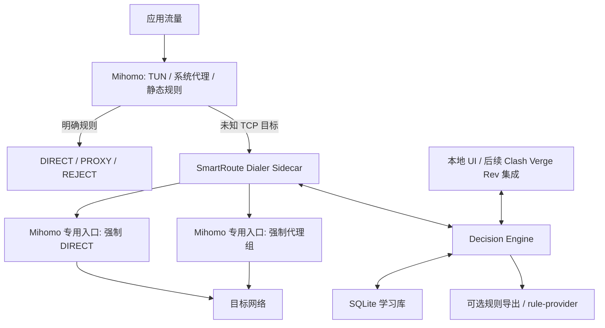
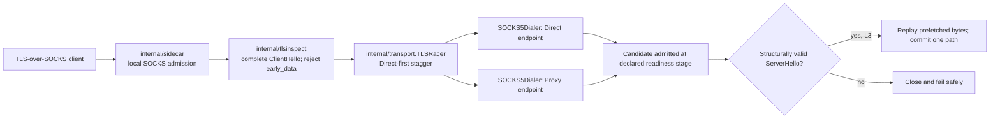
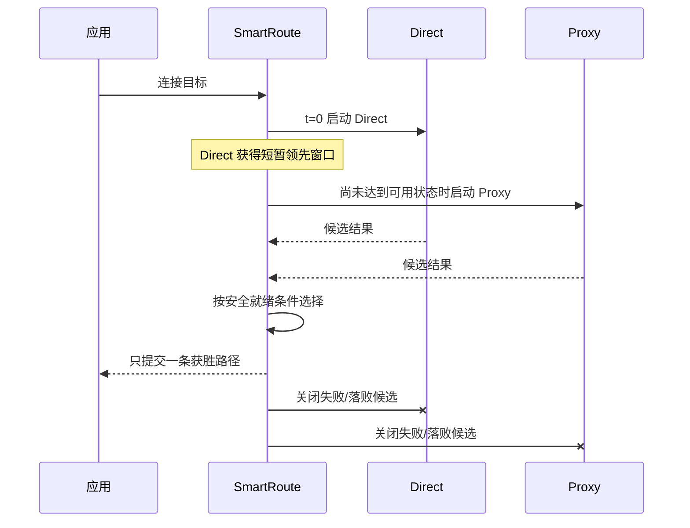
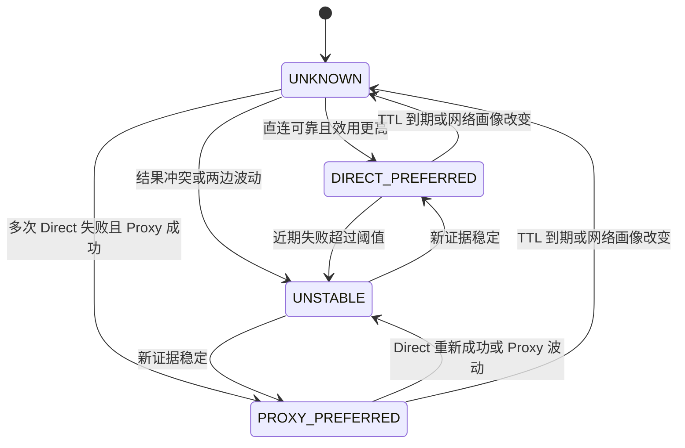

# SmartRoute 总体技术设计

版本：v0.2
状态：供原型验证，不是最终实现规范

## 1. 设计目标

SmartRoute 只接管“现有规则无法可靠决定”的流量，并满足以下约束：

1. 不降低既有 `REJECT`、局域网、用户锁定规则的优先级。
2. 任何自动判断都必须有可观察证据、置信度和过期时间。
3. 只有 `Direct 失败 + Proxy 成功` 才是“需要代理”的强证据。
4. 只要业务数据可能产生副作用，就不能把它复制到两条路径。
5. 网络环境变化后不得盲目沿用旧策略。
6. 默认本地处理，可暂停、撤销、锁定和清空。

非目标：

- 不重新实现代理协议、订阅系统、TUN 或 Fake-IP。
- MVP 不承诺 UDP/QUIC 自适应回退。
- 不把 HTTP 403/404/500 简单判定为网络失败。
- 不用大型模型决定路由。

## 2. 总体架构决策

推荐采用“独立自适应 sidecar + Mihomo 数据面 + 可选 Clash Verge Rev UI”的分层架构。



为什么不是先做外挂探测器：

- 单独探测可以生成建议，但不在真实连接路径上，无法可靠救回第一次连接。
- 合成探测与真实应用协议、DNS、连接复用和风控环境并不完全一致。
- sidecar 能在真实连接建立期间决定出口，同时保持 Mihomo 内核不改动。

为什么不是先 fork Mihomo：

- 内核改动的验证和维护成本高。
- 先用 SOCKS sidecar 可以验证最关键的路径竞争和学习收益。
- 只有 sidecar 的额外本地跳转成为明确瓶颈，或必须支持 UDP/QUIC 时，才值得进入内核。

## 3. MVP 数据路径

Mihomo 已支持为 listener 指定固定 `proxy`，也支持按 `IN-NAME` 等条件匹配规则；因此可以为 SmartRoute 暴露两个仅监听 loopback 的专用入口，一个强制 `DIRECT`，一个强制使用用户选定代理组。[Mihomo listeners](https://wiki.metacubex.one/en/config/inbound/listeners/)、[Mihomo 路由规则](https://wiki.metacubex.one/en/config/rules/)

该配置契约已经在锁定的 Mihomo v1.19.29 源码和独立子进程中核对：强制 Direct/Proxy、域名形式目标转发与循环规避成立。不过运行实验同时证明，Mihomo inbound 在目标解析和拨号前就回复 SOCKS 成功；该响应只能记作 L1 `StageOutbound`，不能当作 L2 `StageTCP`。证据表见 `docs/05-upstreams.md` 和 ADR-0004。

候选拓扑如下。该结构已在 macOS 与锁定版本的独立子进程中验证，其他平台、TUN/Fake-IP 和真实 selector 仍需分别验证：

```yaml
proxies:
  - name: SMARTRoute-Adapter
    type: socks5
    server: 127.0.0.1
    port: 17890

listeners:
  - name: smartroute-direct
    type: mixed
    listen: 127.0.0.1
    port: 17891
    proxy: DIRECT

  - name: smartroute-proxy
    type: mixed
    listen: 127.0.0.1
    port: 17892
    proxy: 用户选择的代理组

rules:
  # 用户锁定、隐私、REJECT、局域网和可靠规则仍在前面
  - RULE-SET,private,DIRECT
  - RULE-SET,known-direct,DIRECT
  - RULE-SET,known-proxy,用户选择的代理组
  # 只有原本会落入兜底的未知 TCP 域名进入 SmartRoute
  - AND,((NETWORK,tcp),(DOMAIN-REGEX,.+)),SMARTRoute-Adapter
  - MATCH,原有兜底策略
```

sidecar 接收 SOCKS5 目标后，再分别通过 `17891` 和 `17892` 建立候选连接。两个专用入口固定出口，不会重新落回 `SMARTRoute-Adapter`，从而避免递归。

MVP 可以让高置信度决策继续经过 sidecar，由本地缓存直接选择路径；这样不需要频繁重载 Mihomo。规则导出是优化和可移植功能，不是运行时依赖。

### 3.1 当前已实现切片



这一切片已能通过带显式 `-acknowledge-direct-probes` 的 `smartroute serve` 接收 TLS-over-SOCKS。sidecar 先回复本地 SOCKS admission，再跨 TLS record/TCP read 重组完整 ClientHello；畸形、过大、尾随首航字节或 `early_data` 会在候选拨号前拒绝。安全 ClientHello 可以复制到两条候选，首个返回结构合法 ServerHello 的路径达到 L3；gate 消耗的所有服务端字节都会原样回放给客户端，loser 被取消。

普通 TCP fake gateway 仍可通过显式契约声明 L2；真实 Mihomo listener 的 SOCKS ACK 只能声明 L1。`smartroute-mihomo-lab` 已验证 L1 Direct 无 ServerHello 时，Proxy 可凭 L3 ServerHello 赢得首连接。该结论不等于证书验证、Finished 或应用成功；活动配置接入仍需真实 TLS 兼容矩阵和回滚门槛。

## 4. 决策优先级

推荐从高到低：

1. `REJECT`、恶意域名和安全策略。
2. 用户手工锁定的 `DIRECT` / `PROXY` / `REJECT`。
3. 隐私保护列表：仅代理、永不直连探测。
4. 局域网、回环、公司内网等确定性系统规则。
5. 用户现有高可信静态规则集。
6. 当前网络画像下的高置信度学习策略。
7. `UNKNOWN/UNSTABLE` 进入自适应竞争。
8. 不支持自适应的流量沿用原有默认策略。

自动策略不能覆盖用户锁定或安全规则。

## 5. “成功”的分层定义

| 层级 | 观测 | 能证明什么 | 不能证明什么 |
| --- | --- | --- | --- |
| L0 | DNS 返回地址 | 当前解析路径有结果 | 地址正确、服务可访问 |
| L1 | 代理隧道/出站建立 | 本地到代理或出站可建立 | 目标服务已经可访问 |
| L2 | TCP 握手完成 | 目标端口路径可达 | TLS/SNI 不会被干扰 |
| L3 | TLS 服务端记录有效 | HTTPS 端到端握手开始正常 | 业务请求一定成功 |
| L4 | 收到合理协议响应 | 应用层有响应 | 403/地域内容就是失败 |

路由学习应记录“在哪一层失败”，而不是只有一个布尔值。

强证据矩阵：

| Direct | Proxy | 更新 |
| --- | --- | --- |
| 成功 | 成功 | 比较可靠度、延迟、成本和用户偏好 |
| 失败 | 成功 | 增加 `PROXY_PREFERRED` 证据 |
| 成功 | 失败 | 增加 `DIRECT_PREFERRED` 证据，同时检查代理健康 |
| 失败 | 失败 | 优先判定目标/本地网络故障，不晋升规则 |

DNS 应作为独立诊断维度。第二阶段可比较：

```text
Direct + 系统/本地 DNS
Direct + 可信 DoH/DoT
Proxy + 远端 DNS
```

但不建议每条未知连接同时启动三条路径。先做 Direct/Proxy 主对照，发生歧义时再后台诊断 DNS 和地址族。

## 6. 竞争拨号与安全提交点

### 6.1 基本时序



默认领先窗口可以从 150–250ms 起步，但必须根据网络画像和历史 RTT 调整。RFC 8305 的 250ms 是 IPv4/IPv6 Happy Eyeballs 的经验参考，不是 Direct/Proxy 的协议规定。[RFC 8305](https://datatracker.ietf.org/doc/html/rfc8305)

### 6.2 不同协议的安全就绪条件

| 流量类型 | MVP 策略 | 是否复制首段数据 |
| --- | --- | --- |
| TLS 1.2/1.3，无 0-RTT | 已实现最小切片：解析完整 ClientHello；首个结构合法 ServerHello 胜出并回放预读字节 | 仅复制握手 |
| TLS 1.3 早期数据 | 不复制 early data；使用历史路径或仅连接级选择 | 否 |
| 服务端先发协议（如 SSH banner） | 同时等待候选服务端数据，先返回有效数据者胜出 | 无需复制客户端业务数据 |
| 明文 HTTP | 默认只做连接级竞争；即使 GET 通常安全也不作为默认重放依据 | 否 |
| 未知客户端先发协议 | 建连后选择一次；业务字节发出后不自动切换 | 否 |
| UDP/QUIC | MVP 沿用静态或历史规则，不做通用竞争 | 否 |

关键原则：

- 在业务数据正式发出前，可以建立多个候选通道。
- 一旦可能有副作用的数据已经发给远端，就不能假设失败路径没有执行。
- RFC 9110 明确要求代理不得自动重试非幂等请求。[RFC 9110 §9.2.2](https://datatracker.ietf.org/doc/html/rfc9110#section-9.2.2)
- TLS ClientHello 跨包、TLS 1.3 early data、ECH 和连接复用必须有专门测试，不能靠一次 `read()` 猜协议。

### 6.3 第一次连接能否无感恢复

- TCP SYN 被丢弃：可以，Proxy 候选在领先窗口后启动。
- TCP 建连成功但 TLS ClientHello 后被阻断：HTTPS 场景可以通过安全握手竞争恢复。
- 应用业务数据发出后才失败：通常不能安全地透明重放，只能记录结果并优化下次连接。
- UDP/QUIC：第一版不承诺。

这也是 sidecar MVP 比“后台探测器”更有价值的原因。

## 7. 学习模型

### 7.1 路由键

最小键：

```text
network_profile + hostname + destination_port + transport
```

可选上下文：

```text
process_scope + address_family + dns_path
```

不要默认把进程加入所有键，否则样本被过度切碎。只有用户设置进程级策略或观测到稳定差异时才细分。

### 7.2 状态机



`DIRECT_LOCKED`、`PROXY_LOCKED` 和 `REJECT_LOCKED` 仅由用户或管理员生成，不由算法自动生成。

### 7.3 MVP 晋升规则

起始建议，最终阈值以实验为准：

- `PROXY_PREFERRED`：至少 3 次可配对观测，跨至少 2 个独立会话；每次 Direct 在 L2/L3 失败而 Proxy 在更高层成功；本地网络和代理健康检查正常。
- `DIRECT_PREFERRED`：至少 5 次 Direct 成功；近期成功率高于目标 SLO；相比 Proxy 满足用户选定的速度/流量偏好。
- `UNSTABLE`：近期相互矛盾的强证据达到阈值，继续竞争而不导出规则。
- 两边都失败：不改变偏好，只记故障。
- 自动状态全部有 TTL；失效后先降为观察状态，不直接反向晋升。
- 单次强故障可以临时切路，但不能生成长期规则。

### 7.4 统计模型

MVP 可使用：

- 成功率：带时间衰减的计数或 Beta-Bernoulli 后验。
- 延迟：EWMA + p50/p95 近似，不只看平均值。
- 置信度：样本量、时间新鲜度、对照质量和故障层级共同决定。
- 效用：`可靠度 - 延迟代价 - 代理流量代价 - 隐私代价`，权重由模式决定。

预设模式：

- 平衡：可靠性优先，直连满足 SLO 时减少代理。
- 低延迟：两路都可靠时选更快路径。
- 节省流量：可靠直连优先。
- 隐私优先：未知目标不直连探测，SmartRoute 只做诊断和代理内节点选择。

不建议第一版使用黑盒机器学习，因为样本稀疏、标签有噪声，并且用户需要解释每次决策。

## 8. 网络画像

同一域名在不同网络下不能共享永久结论。画像可以由本地信息组合：

- OS 网络服务/接口类型。
- 默认网关标识的本地哈希。
- DNS 服务器集合的本地哈希。
- IPv4、IPv6 和 NAT64 可用状态。
- 可选 SSID/BSSID，本地哈希且明确告知用户。
- 可选公网 ASN 或粗粒度前缀；这需要外部查询，应默认关闭或做本地映射。

SSID 不是可信身份，可能重名或被伪造。画像需要相似度和版本，不应只用字符串相等。

策略：

- 高相似度：加载该画像历史。
- 中相似度：加载但降低置信度，先复验。
- 低相似度：创建新画像并进入 `UNKNOWN`。
- Captive Portal、VPN 切换、默认网关变化时暂停晋升。

## 9. 数据模型

建议 SQLite 表：

```text
network_profiles
  id, local_fingerprint, features_json, first_seen_at, last_seen_at

targets
  id, hostname, port, transport, process_scope, created_at

observations
  id, profile_id, target_id, path, dns_path, address_family,
  started_at, stage_reached, success, failure_class,
  connect_ms, ready_ms, bytes_sent_before_commit, paired_observation_id

policies
  profile_id, target_id, state, confidence, preferred_path,
  source, expires_at, last_evaluated_at, reason_json

manual_overrides
  scope, target_pattern, action, created_at, note

exports
  policy_id, rule_type, rule_value, generated_at, revoked_at
```

域名应原样保存在用户本机，数据库文件设置最小权限。未来若做匿名统计，不能把“直接哈希域名”称为匿名化，因为域名字典很容易反查。

## 10. 规则生成

默认生成完整主机规则：

```text
DOMAIN,api.example.com,PROXY
```

不要由一次或少量观测自动提升为：

```text
DOMAIN-SUFFIX,example.com,PROXY
```

后缀合并条件：

- 使用 Public Suffix List 确定可注册域边界。
- 多个同级子域拥有一致、足量且新鲜的证据。
- 不存在已知的相反子域策略。
- 合并前向用户展示影响范围，默认只建议、不自动执行。

CDN IP、Anycast IP 和共享主机 IP 不生成长期 IP 规则。IP-only 流量第一版沿用原规则。

Mihomo API 能读取规则命中信息、连接、代理状态并更新 rule-provider；本地 provider 文件还必须位于 Mihomo `HomeDir` 或显式安全路径内。[Mihomo API](https://wiki.metacubex.one/en/api/)、[Mihomo rule-provider](https://wiki.metacubex.one/en/config/rule-providers/)

推荐：运行时决策先保留在 sidecar；用户明确导出或策略稳定后，再生成两个 provider：

```text
learned-direct.yaml
learned-proxy.yaml
```

## 11. UI 与可解释性

主界面不应首先展示复杂规则，而应展示四类信息：

- 当前网络画像和模式。
- 今日恢复访问、避免代理、额外探测开销。
- 新建议：某目标建议 Direct/Proxy，附失败层级和对照次数。
- 异常：结果波动、DNS 差异、代理节点问题。

每条策略至少展示：

```text
目标：api.example.com:443/TCP
当前网络：Home Wi-Fi
决策：Proxy preferred
原因：最近 4 次 Direct 在 TLS 阶段失败；Proxy 4 次成功
置信度：高
到期：3 天后复验
操作：锁定 / 反转 / 暂停探测 / 删除记录
```

必要开关：

- Shadow Mode。
- 探测模式总开关。
- 隐私优先模式。
- 永不直连探测列表。
- 仅对当前进程或站点临时启用。
- 自动晋升阈值和最长探测窗口。
- 一键回到原始规则模式。

## 12. 关键风险与解决方式

| 风险 | 后果 | 默认应对 |
| --- | --- | --- |
| 网站本身宕机 | 把服务故障误判为封锁 | 必须有同期 Proxy 对照；两边失败不晋升 |
| 本地网络整体异常 | 大量错误规则 | 设置 Direct/Proxy 控制探针；异常时冻结学习 |
| 代理节点异常 | 错误偏向 Direct | 独立记录代理健康，不能把节点故障当目标结论 |
| DNS 污染/分流 | 把 DNS 问题误判为传输问题 | 记录解析路径，歧义时做受控 DNS 对照 |
| TCP 成功、TLS 失败 | 过早选择 Direct | HTTPS 使用安全握手就绪条件 |
| 非幂等请求重放 | 重复支付、提交或写操作 | 业务数据发送后禁止透明换路；不复制未知 payload |
| TLS 1.3 0-RTT | 复制早期业务数据 | 检出 early data 后禁用握手双发 |
| 混合出口与账号风控 | 登录异常、地域内容变化 | eTLD+1/进程会话亲和，敏感站点默认锁定 |
| 恶意页面训练规则 | 规则投毒、代理资源消耗 | 完整域名粒度、跨会话阈值、限速、可见建议 |
| 直连探测泄露目标 | 隐私风险 | 显式启用、隐私列表、默认本地、清晰日志 |
| 双连接开销 | 服务器/代理负载上升 | 只对未知/不稳定目标竞争；延迟启动第二路；及时取消 |
| CDN 动态变化 | 规则过时 | TTL、时间衰减、网络画像隔离、定期小流量复验 |
| Captive Portal | 大量假成功/重定向 | 门户检测期间暂停学习 |
| HTTP/2/3 连接复用 | 域名观测归因不完整 | 记录连接级上下文；不对单次复用结果泛化 |
| ECH/SNI 不可见 | 无法从明文嗅探域名 | 优先使用 SOCKS 目标或 Fake-IP DNS 映射，不解密 TLS |
| 本地控制 API 暴露 | 内核被未授权控制 | loopback + 强 secret；最终集成使用受认证 IPC |
| 动态配置失误 | 全局断网 | 原子写入、配置预检、保留上一版本、一键回滚 |

还需要防止 sidecar 被利用为 SSRF 探测器：默认只处理来自本地 Mihomo 的真实连接；管理 API 不接受任意公网探测请求；禁止探测云元数据、link-local 和未授权局域网目标。

## 13. 可观测性

必须记录但默认不上传：

- 路由键和网络画像 ID。
- 每条候选路径的开始/完成时间。
- 到达的最高成功层级。
- 失败类别：DNS、timeout、refused、reset、TLS alert、proxy unavailable、canceled。
- 决策理由、置信度和策略版本。
- 选路前已经发送的字节数。
- 取消候选数量和额外连接开销。

日志不得包含：

- TLS/HTTP 正文。
- 查询参数、Cookie、认证头。
- 代理订阅密钥。
- 默认公开的完整浏览历史。

## 14. 从 Sidecar 到内核的迁移条件

满足以下至少两项再考虑修改 Mihomo 内核：

- sidecar 本地转发对 p95 延迟产生可测瓶颈。
- 需要完整支持 UDP/QUIC 会话和取消语义。
- SOCKS 边界丢失了关键 TUN/进程/DNS 元数据。
- 跨平台配置循环规避不够稳定。
- MVP 已有稳定用户群，核心收益被真实数据验证。
- 上游维护者愿意接受通用化的 adaptive group 设计。

理想的内核配置最终可能类似：

```yaml
proxy-groups:
  - name: ADAPTIVE
    type: adaptive
    candidates: [DIRECT, 用户代理组]
    direct-head-start: 200ms
    cache-ttl: 72h
    network-aware: true
    privacy-policy: explicit-opt-in
```

但这只是长期接口草图，不应成为 MVP 的前置条件。
