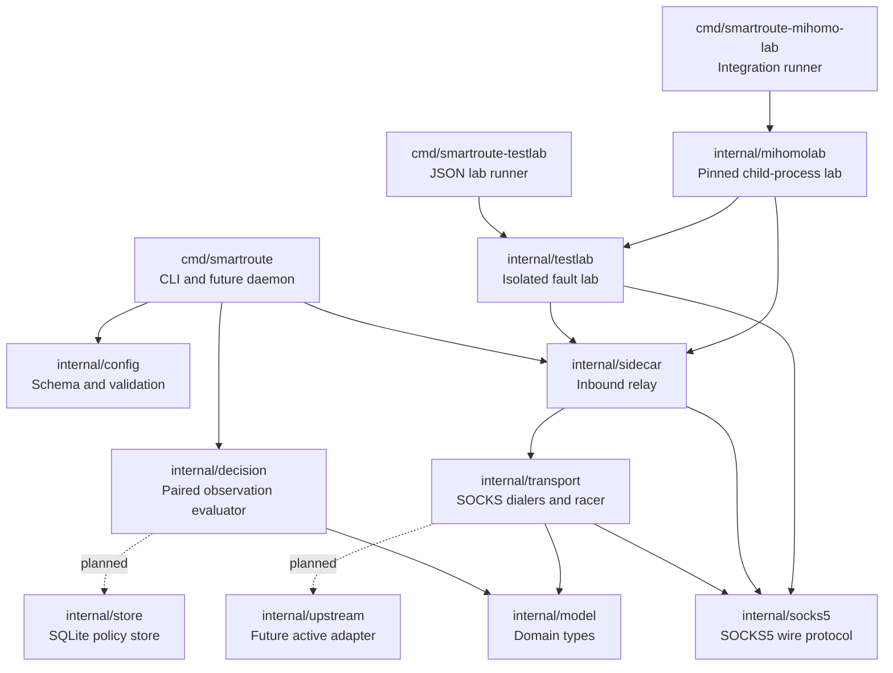

# SmartRoute Component and Interface Catalog

Version: v0.2
Last updated: 2026-08-02

This file is the maintained registry for components, interfaces, commands, configuration fields, and decision reason codes. Status is explicit: `implemented`, `experimental`, or `planned`.

## 1. Component map



Solid edges are implemented imports. Dashed edges are planned Phase 0–2 relationships.

## 2. Component registry

| Component | Owner | Status | Responsibility | Explicit non-responsibility | Primary tests |
| --- | --- | --- | --- | --- | --- |
| `cmd/smartroute` | CLI | experimental | Command parsing, config validation, synthetic decision trace, experimental sidecar lifecycle | Persistence and active Clash configuration | `cmd/smartroute/main_test.go`; sidecar exercised by Test Lab |
| `cmd/smartroute-testlab` | Test | implemented | Run deterministic loopback scenarios and print JSON report | Real destinations or Clash integration | `internal/testlab/lab_test.go` plus CI named step |
| `cmd/smartroute-mihomo-lab` | Test | implemented | Run the exact pinned Mihomo binary in an isolated topology and print JSON | Discovering or operating the active Clash instance | `internal/mihomolab/lab_test.go`; `make mihomo-lab` |
| `internal/config` | Core | implemented | Strict JSON schema, safe loopback defaults, validation | Mihomo YAML generation | `internal/config/config_test.go` |
| `internal/model` | Core | implemented | Path, target, readiness, observation, decision types and readable JSON evidence | State persistence | `internal/model/model_test.go` plus consumer tests |
| `internal/decision` | Core | experimental | Evaluate one paired Direct/Proxy observation | Multi-session promotion and decay | `internal/decision/evaluator_test.go` |
| `internal/socks5` | Data plane | experimental | No-auth SOCKS5 CONNECT parsing/client handshake and domain preservation | Authentication, UDP ASSOCIATE, BIND | `internal/socks5/protocol_test.go`; Test Lab |
| `internal/transport` | Data plane | experimental | SOCKS5 candidate dialing, Direct-first stagger, timeout, cancellation, loser cleanup | TLS/application readiness parsing | `internal/transport/racer_test.go`; Test Lab |
| `internal/sidecar` | Data plane | experimental | Inbound SOCKS5 server, enforce minimum commit stage, bidirectional relay, decision event | TLS parsing, learning persistence, or active Clash modification | Test Lab and Mihomo Lab |
| `internal/testlab` | Test | implemented | Ephemeral loopback echo target, fake Direct/Proxy gateways, deterministic faults | External network and active Clash access | `internal/testlab/lab_test.go` |
| `internal/mihomolab` | Test | implemented | Temporary config/home, child lifecycle, synthetic DNS, forced-listener and readiness assertions | Active Clash discovery, external traffic, TUN, system proxy | `internal/mihomolab/lab_test.go`; explicit runtime command |
| `internal/upstream` | Integration | planned | Mihomo config/API adapter and topology validation | Shipping Mihomo source | Planned integration tests |
| `internal/store` | Persistence | planned | SQLite observations, policies, migrations | Analytics uploads | Planned migration/recovery tests |

## 3. Implemented function and interface registry

| Symbol | Owner | Inputs | Output | Error behavior | Stability | Tests |
| --- | --- | --- | --- | --- | --- | --- |
| `config.Default()` | `internal/config` | None | Safe Phase 0 `Config` | None | experimental | `TestDefaultIsValid` |
| `config.Load(path)` | `internal/config` | JSON file path | Validated `Config` | Wraps read/decode errors; rejects unknown fields | experimental | `TestLoadRejectsUnknownFields` |
| `Config.Validate()` | `internal/config` | Config value | `error` | Joins all detectable validation errors | experimental | Config test table |
| `Observation.Validate()` | `internal/model` | Observation value | `error` | Rejects invalid path/stage, negative latency, weak success, unclassified failure | experimental | Decision tests |
| `Observation.MarshalJSON()` | `internal/model` | Observation value | JSON with stage names and millisecond latency | Returns JSON encoding errors | experimental | `TestObservationJSONUsesReadableUnits` |
| `model.ParseStage(value)` | `internal/model` | Stage name | `Stage` | Rejects unknown stage | experimental | CLI parser tests |
| `PairEvaluator.Evaluate(direct, proxy)` | `internal/decision` | Ordered paired observations | Explainable `Decision` | Rejects invalid observations/config | experimental | Outcome-matrix table |
| `socks5.ReadRequest(rw)` | `internal/socks5` | SOCKS byte stream | Domain/IP target and port | Rejects auth, unsupported commands/address types, malformed input | experimental | Protocol and Test Lab tests |
| `socks5.DialContext(ctx, endpoint, target)` | `internal/socks5` | Context, SOCKS endpoint, target | Connected tunnel | Closes on cancellation; returns handshake/reply errors | experimental | Test Lab |
| `CandidateDialer.Dial(ctx, target)` | `internal/transport` | Context and target | Connection and observation | Implementer classifies cancellation/path error | experimental contract | Racer tests |
| `SOCKS5Dialer.Dial(ctx, target)` | `internal/transport` | TCP target, fixed endpoint, declared `ReadinessStage` | SOCKS tunnel plus observation at the declared stage; default L1 | Classifies timeout, cancellation, SOCKS failure; rejects invalid stages | experimental | Test Lab and Mihomo Lab |
| `Racer.Race(ctx, target)` | `internal/transport` | Two dialers, head-start, timeout, target | One owned winning connection and reason | Cancels/drains loser; returns `RaceError` when both fail | experimental | `internal/transport/racer_test.go` |
| `ReadinessGate.Await(ctx, conn, target)` | `internal/transport` | Context, candidate connection, target | Readiness observation | Must not lose or unsafely replay consumed bytes | contract only | Planned |
| `sidecar.Server.Serve(ctx, listener)` | `internal/sidecar` | Context, caller-owned listener, optional `MinimumCommitStage` | Serves until cancellation/error; hard floor L2 | Rejects failed or below-stage candidates; a weaker override cannot bypass L2; never reads Clash config | experimental | Test Lab and Mihomo Lab |
| `testlab.RunAll(ctx)` | `internal/testlab` | Context | Isolation and scenario JSON model | Fails if any scenario invariant fails | implemented | `internal/testlab/lab_test.go` |
| `mihomolab.Run(ctx, binaryPath)` | `internal/mihomolab` | Context and explicit pinned binary path | Isolation, topology, readiness and scenario report | Rejects wrong version/config; owns and stops only its child | implemented | `internal/mihomolab/lab_test.go`; `make mihomo-lab` |

## 4. CLI contract

| Command | Status | Purpose | Network effects | Persistence |
| --- | --- | --- | --- | --- |
| `smartroute version` | implemented | Print version, commit, build date | None | None |
| `smartroute validate -config PATH` | implemented | Strictly parse and validate local JSON config | None | None |
| `smartroute trace -direct SPEC -proxy SPEC` | implemented | Evaluate one synthetic paired observation and print JSON | None | None |
| `smartroute serve -acknowledge-direct-probes` | experimental | Run TCP/SOCKS5 sidecar against configured loopback endpoints | Configured loopback listener and candidate dials | None; emits decision JSON only |
| `smartroute policy` | planned | Inspect, lock, revoke, or export policy | None by default | Policy store |
| `smartroute-testlab` | implemented | Run isolated deterministic data-plane scenarios | Ephemeral loopback sockets only | None |
| `smartroute-mihomo-lab -mihomo PATH` | implemented | Run isolated pinned-Mihomo contract scenarios | Child process, temporary home, local synthetic DNS and ephemeral loopback sockets only | Temporary files removed; JSON report only |

Trace observation syntax:

```text
success:<stage>:<latency_ms>
failure:<stage>:<latency_ms>:<failure_class>
```

Example:

```bash
go run ./cmd/smartroute trace \
  -direct failure:tcp:250:tls_reset \
  -proxy success:tls:120
```

## 5. Configuration reference

| JSON field | Type | Default | Validation | Behavior |
| --- | --- | --- | --- | --- |
| `version` | integer | `1` | Must equal current schema version | Enables explicit migrations |
| `listen_address` | host:port | `127.0.0.1:17890` | Literal loopback, non-zero, unique | Experimental `serve` SOCKS listener |
| `direct_endpoint` | host:port | `127.0.0.1:17891` | Literal loopback, non-zero, unique | Experimental Direct SOCKS candidate endpoint |
| `proxy_endpoint` | host:port | `127.0.0.1:17892` | Literal loopback, non-zero, unique | Experimental Proxy SOCKS candidate endpoint |
| `original_fallback` | enum | `proxy` | `direct` or `proxy` | Used by synthetic paired evaluator; runtime fallback integration is planned |
| `decision.direct_head_start_ms` | integer | `200` | 10–2000 | Delay before starting Proxy for an unknown target |
| `decision.max_direct_penalty_ms` | integer | `150` | 0–5000 | Direct may be this much slower and still win when both succeed |
| `decision.candidate_timeout_ms` | integer | `5000` | Must exceed head start | Overall candidate deadline |
| `learning.proxy_promotion_wins` | integer | `3` | At least 2 | Planned paired wins before Proxy promotion |
| `learning.direct_promotion_wins` | integer | `5` | At least 2 | Planned paired wins before Direct promotion |
| `learning.policy_ttl_hours` | integer | `72` | Positive | Planned learned-policy expiry |
| `privacy.mode` | enum | `explicit-opt-in` | `explicit-opt-in` or `privacy-first` | Controls whether unknown targets may be directly probed |
| `privacy.never_direct_probe` | string list | empty | Exact/suffix semantics not implemented yet | Reserved deny list; no runtime behavior yet |

Fields marked planned in behavior are validated now but must not be described as active runtime features.

## 6. Decision reason-code catalog

| Reason code | Selected route | Evidence meaning | Promotion meaning |
| --- | --- | --- | --- |
| `direct_only_success` | Direct | Direct succeeded; Proxy failed | Strong Direct evidence, not an automatic permanent lock |
| `proxy_only_success` | Proxy | Direct failed; Proxy succeeded | Strong Proxy evidence |
| `both_success_direct_within_budget` | Direct | Both succeeded and Direct met configured latency budget | Medium Direct evidence |
| `both_success_proxy_materially_faster` | Proxy | Both succeeded and Direct exceeded latency budget | Medium Proxy evidence |
| `both_failed_use_original` | Original fallback | Neither path succeeded | No route promotion |

Runtime race/commit reasons:

| Reason code | Meaning | Commit behavior |
| --- | --- | --- |
| `direct_candidate_before_head_start` | Direct candidate was admitted before Proxy launch | Commit only if observation reaches configured minimum stage |
| `direct_candidate_won` | Direct candidate won after both candidates could run | Same stage gate applies |
| `proxy_candidate_won` | Proxy candidate won | Same stage gate applies |
| `candidate_below_commit_stage` | Winning transport candidate did not prove target readiness | Close candidate, return SOCKS failure, `committed=false`, never learn |

## 7. Planned event catalog

| Event | Producer | Minimum fields | Consumer | Status |
| --- | --- | --- | --- | --- |
| `candidate.started` | Racer | target ID, path, timestamp | Metrics/debug | planned; not emitted yet |
| `candidate.ready` | Readiness gate | path, stage, latency | Decision engine | planned |
| `candidate.failed` | Dialer/gate | path, stage, failure class | Decision engine | planned |
| `candidate.canceled` | Racer | path, cancellation reason | Metrics | planned |
| `decision.selected` | Sidecar/decision engine | target, selected path, reason, observation, `committed` | CLI/store/UI | experimental sidecar event; persistent form planned |
| `policy.promoted` | Learning engine | old/new state, evidence, expiry | Store/UI/export | planned |
| `learning.frozen` | Health guard | failing control, profile ID | UI/metrics | planned |

Events must never contain HTTP bodies, credentials, cookies, subscription URLs, or raw TLS secrets.

## 8. Maintenance checklist

When a symbol, field, event, or component changes:

1. Update its row in this file.
2. Update the relevant Mermaid diagram if dependencies changed.
3. Add an ADR if responsibility or safety semantics changed.
4. Add/update tests and name them in the registry.
5. Record user-visible changes in `CHANGELOG.md`.
