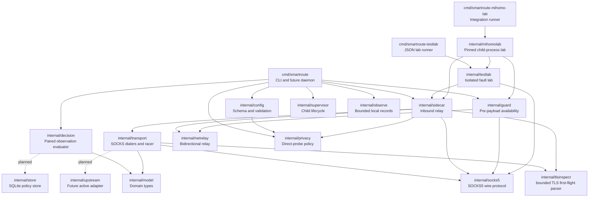

# SmartRoute Component and Interface Catalog

Version: v0.4
Last updated: 2026-08-02

This file is the maintained registry for components, interfaces, commands, configuration fields, and decision reason codes. Status is explicit: `implemented`, `experimental`, or `planned`.

## 1. Component map



Solid edges are implemented imports. Dashed edges are planned Phase 0–2 relationships.

## 2. Component registry

| Component | Owner | Status | Responsibility | Explicit non-responsibility | Primary tests |
| --- | --- | --- | --- | --- | --- |
| `cmd/smartroute` | CLI | experimental | Command parsing, config validation, synthetic decision trace, Guard/engine lifecycles, and observation controls | Learned-policy persistence and active Clash configuration | `cmd/smartroute/main_test.go`; data plane exercised by Test Labs |
| `cmd/smartroute-testlab` | Test | implemented | Run deterministic loopback scenarios and print JSON report | Real destinations or Clash integration | `internal/testlab/lab_test.go` plus CI named step |
| `cmd/smartroute-mihomo-lab` | Test | implemented | Run the exact pinned Mihomo binary in an isolated topology and print JSON | Discovering or operating the active Clash instance | `internal/mihomolab/lab_test.go`; `make mihomo-lab` |
| `internal/config` | Core | implemented | Strict JSON schema, safe loopback defaults, validation | Mihomo YAML generation | `internal/config/config_test.go` |
| `internal/model` | Core | implemented | Path, target, readiness, observation, decision types and readable JSON evidence | State persistence | `internal/model/model_test.go` plus consumer tests |
| `internal/decision` | Core | experimental | Evaluate one paired Direct/Proxy observation | Multi-session promotion and decay | `internal/decision/evaluator_test.go` |
| `internal/socks5` | Data plane | experimental | No-auth SOCKS5 CONNECT parsing/client handshake and domain preservation | Authentication, UDP ASSOCIATE, BIND | `internal/socks5/protocol_test.go`; Test Lab |
| `internal/transport` | Data plane | experimental | SOCKS5 candidate dialing, TCP and TLS racing, ServerHello gate, cancellation, exact prefetched-byte replay | Certificate/Finished/application validation | Racer and TLS readiness tests; Mihomo Lab |
| `internal/tlsinspect` | Data plane | experimental | Bounded TLS record reassembly, ClientHello/ServerHello structure checks, early-data rejection | TLS decryption, certificate validation, payload logging | `internal/tlsinspect/tlsinspect_test.go` |
| `internal/sidecar` | Data plane | experimental | SOCKS admission, TLS first-flight orchestration, stage enforcement, relay, decision and diagnostic events | Learning persistence or active Clash modification | Sidecar net.Pipe tests, Test Lab and Mihomo Lab |
| `internal/guard` | Data plane | experimental | Before forwarding payload to either lane, select the adaptive engine or fall back to the original-policy SOCKS listener | Direct/Proxy evidence, learning, post-commit replay, Guard-process supervision | `internal/guard/server_test.go`; Mihomo Lab fault scenarios |
| `internal/netrelay` | Data plane | experimental | Shared bidirectional TCP copying and half-close handling | Routing decisions or payload inspection | Consumer tests in Guard, Sidecar and Test Lab |
| `internal/privacy` | Policy | experimental | Validate/normalize exact and suffix deny rules; decide whether a target may open Direct | Network I/O, hostname persistence, or route learning | `internal/privacy/policy_test.go`; Sidecar privacy tests |
| `internal/supervisor` | Runtime | experimental | Independently monitor Guard/engine child processes, cap restart backoff, and emit lifecycle events | Supervising Mihomo, replaying failed connections, or host-level service installation | `internal/supervisor/supervisor_test.go`; CLI service-spec tests |
| `internal/observe` | Persistence | experimental | HMAC-pseudonymize typed events, write bounded per-source JSONL, and implement pause/resume/clear/export | Learned policy, payload capture, process identity, cloud upload, or active Clash access | `internal/observe/recorder_test.go`; CLI sink/control tests |
| `internal/testlab` | Test | implemented | Ephemeral loopback echo target, fake Direct/Proxy gateways, deterministic faults | External network and active Clash access | `internal/testlab/lab_test.go` |
| `internal/mihomolab` | Test | implemented | Temporary config/home, child lifecycle, synthetic DNS, forced-listener and readiness assertions | Active Clash discovery, external traffic, TUN, system proxy | `internal/mihomolab/lab_test.go`; explicit runtime command |
| `internal/upstream` | Integration | planned | Mihomo config/API adapter and topology validation | Shipping Mihomo source | Planned integration tests |
| `internal/store` | Persistence | planned | SQLite learned policies, promotion state, TTL, and migrations | Raw analytics uploads or JSONL observation recording | Planned migration/recovery tests |

## 3. Implemented function and interface registry

| Symbol | Owner | Inputs | Output | Error behavior | Stability | Tests |
| --- | --- | --- | --- | --- | --- | --- |
| `config.Default()` | `internal/config` | None | Safe Phase 0 `Config` | None | experimental | `TestDefaultIsValid` |
| `config.Load(path)` | `internal/config` | JSON file path | Validated `Config` | Wraps read/decode errors; rejects unknown fields | experimental | `TestLoadRejectsUnknownFields` |
| `Config.Validate()` | `internal/config` | Config value | `error` | Joins all detectable validation errors | experimental | Config test table |
| `Observation.Validate()` | `internal/model` | Observation value | `error` | Rejects invalid path/stage, negative latency, weak success, unclassified failure | experimental | Decision tests |
| `Observation.MarshalJSON()` | `internal/model` | Observation value | JSON with stage names and millisecond latency | Returns JSON encoding errors | experimental | `TestObservationJSONUsesReadableUnits` |
| `model.ParseStage(value)` | `internal/model` | Stage name | `Stage` | Rejects unknown stage | experimental | CLI parser tests |
| `PairEvaluator.Evaluate(direct, proxy)` | `internal/decision` | Ordered paired observations | Explainable `Decision` | Rejects invalid observations/config | experimental | Outcome-matrix table |
| `socks5.ReadRequest(rw)` | `internal/socks5` | SOCKS byte stream | Domain/IP target and port | Rejects auth, unsupported commands/address types, malformed input | experimental | Protocol and Test Lab tests |
| `socks5.DialContext(ctx, endpoint, target)` | `internal/socks5` | Context, SOCKS endpoint, target | Connected tunnel | Closes on cancellation; returns handshake/reply errors | experimental | Test Lab |
| `CandidateDialer.Dial(ctx, target)` | `internal/transport` | Context and target | Connection and observation | Implementer classifies cancellation/path error | experimental contract | Racer tests |
| `SOCKS5Dialer.Dial(ctx, target)` | `internal/transport` | TCP target, fixed endpoint, declared `ReadinessStage` | SOCKS tunnel plus observation at the declared stage; default L1 | Classifies timeout, cancellation, SOCKS failure; rejects invalid stages | experimental | Test Lab and Mihomo Lab |
| `Racer.Race(ctx, target)` | `internal/transport` | Two dialers, head-start, timeout, target | One owned winning connection and reason | Cancels/drains loser; returns `RaceError` when both fail | experimental | `internal/transport/racer_test.go` |
| `tlsinspect.ReadClientHello(reader, max)` | `internal/tlsinspect` | TLS byte stream and byte limit | Opaque validated ClientHello with exact record bytes | Rejects malformed, oversized, trailing first-flight data and `early_data` | experimental | Fragmentation/rejection table |
| `tlsinspect.ReadServerHello(reader, max)` | `internal/tlsinspect` | TLS byte stream and byte limit | Structurally valid ServerHello plus exact consumed records | Classifies alerts, truncation, malformed and unexpected messages | experimental | Fragmentation/alert tests |
| `ReadinessGate.Await(ctx, conn, target)` | `internal/transport` | Context, candidate connection, target | Stage, failure class and prefetched bytes | Must not lose or unsafely replay consumed bytes | experimental contract | TLS gate tests |
| `TLSRacer.Race(ctx, target, hello)` | `internal/transport` | Two candidates, validated no-early-data ClientHello, gate and timing | L3 winner connection with replay prefix | Cancels loser; returns paired classified failures | experimental | `internal/transport/tls_readiness_test.go` |
| `TLSRacer.ConnectPath(ctx, target, hello, path)` | `internal/transport` | One policy-selected candidate and validated no-early-data ClientHello | L3 connection with replay prefix | Rejects invalid/missing path; returns `TLSPathError` with classified observation | experimental | Proxy-only success/replay and failure tests |
| `privacy.New(mode, patterns)` | `internal/privacy` | Mode and exact/suffix deny patterns | Immutable compiled local policy | Rejects unknown mode, whitespace, URL-like/invalid host syntax and suffix IP rules | experimental | Policy validation table |
| `Policy.Evaluate(target)` | `internal/privacy` | Target hostname/IP | Allow/deny plus stable reason code | Missing policy and invalid target fail closed to Proxy-only | experimental | Exact/suffix/boundary/privacy-first tests |
| `Supervisor.Run(ctx)` | `internal/supervisor` | Context, service specs, starter, restart policy | Runs independent monitors until cancellation | Rejects invalid/duplicate services; runtime failures trigger capped restart rather than stopping siblings | experimental | Restart, start-error, independence, cancellation tests |
| `CommandStarter.Start(ctx, service)` | `internal/supervisor` | Executable/args and synchronized stdout/stderr | Started child implementing `Wait()` | Parent cancellation interrupts child; `WaitDelay` kills after grace period | experimental | Supervisor consumers; platform process integration pending |
| `observe.New(options)` | `internal/observe` | Local directory, source and capacity/privacy limits | Source-specific recorder | Rejects unsafe paths/limits and invalid salt; initialization errors are explicit | experimental | Recorder validation/privacy tests |
| `Recorder.Record(event)` | `internal/observe` | Typed bounded event with optional raw target | Pseudonymous JSONL record or paused no-op | Oversized/write errors return to caller; runtime caller warns once and continues routing | experimental | Hashing, pause, rotation and oversized-event tests |
| `observe.Inspect/Pause/Resume/Clear/Export` | `internal/observe` | Observation directory and explicit destination/paused state | Lifecycle status or local file operation | Only manages engine/Guard/supervisor subdirectories; clear requires pause; export refuses nesting/existing destination and omits salt/symlinks | experimental | Control and export tests |
| `sidecar.Server.Serve(ctx, listener)` | `internal/sidecar` | Context, listener, plain Racer or TLSRacer | Serves until cancellation/error; TLS mode requires L3 | Rejects unsafe ClientHello before dialing; never reads Clash config | experimental | Sidecar, Test Lab and Mihomo Lab |
| `guard.Server.Serve(ctx, listener)` | `internal/guard` | Context, listener, adaptive/original dialers and bounded timeouts | Serves SOCKS targets; commits one availability lane before payload | Falls back on adaptive handshake failure; refuses when both lanes fail; never replays post-commit data | experimental | Adaptive, unavailable, wedged and dual-failure unit tests; Mihomo Lab scenarios |
| `netrelay.Bidirectional(left, right)` | `internal/netrelay` | Two owned TCP-like connections | Relays both directions until completion | Best-effort half-close; relay errors are not routing evidence | experimental | Guard/Sidecar end-to-end tests |
| `testlab.RunAll(ctx)` | `internal/testlab` | Context | Isolation and scenario JSON model | Fails if any scenario invariant fails | implemented | `internal/testlab/lab_test.go` |
| `mihomolab.Run(ctx, binaryPath)` | `internal/mihomolab` | Context and explicit pinned binary path | Isolation, topology, readiness and scenario report | Rejects wrong version/config; owns and stops only its child | implemented | `internal/mihomolab/lab_test.go`; `make mihomo-lab` |

## 4. CLI contract

| Command | Status | Purpose | Network effects | Persistence |
| --- | --- | --- | --- | --- |
| `smartroute version` | implemented | Print version, commit, build date | None | None |
| `smartroute validate -config PATH` | implemented | Strictly parse and validate local JSON config | None | None |
| `smartroute trace -direct SPEC -proxy SPEC` | implemented | Evaluate one synthetic paired observation and print JSON | None | None |
| `smartroute serve [-acknowledge-direct-probes]` | experimental | Run TLS-over-SOCKS sidecar with runtime privacy policy | Privacy-first/deny targets open Proxy only; acknowledged explicit-opt-in targets may race Direct/Proxy | Optional bounded engine JSONL; otherwise debug stdout |
| `smartroute guard` | experimental | Run the separate availability boundary in front of the adaptive engine | Configured loopback Guard, engine and original-policy SOCKS endpoints | Optional bounded Guard JSONL; otherwise debug stdout |
| `smartroute supervise` | experimental | Run Guard and adaptive engine as independently restartable children | Same loopback effects as the two child commands; does not operate Mihomo | Optional bounded per-source JSONL; otherwise debug stdout |
| `smartroute observations status\|pause\|resume\|clear\|export` | experimental | Operate the configured local recorder directory | None | Status/control, confirmed deletion, or redacted file export |
| `smartroute policy` | planned | Inspect, lock, revoke, or export policy | None by default | Policy store |
| `smartroute-testlab` | implemented | Run isolated deterministic data-plane scenarios | Ephemeral loopback sockets only | None |
| `smartroute-mihomo-lab -mihomo PATH` | implemented | Run isolated pinned-Mihomo contract scenarios | Child process, temporary home, local synthetic DNS and ephemeral loopback sockets only | Temporary files removed; JSON report only |

Trace observation syntax:

```text
success:<stage>:<latency_ms>
failure:<stage>:<latency_ms>:<failure_class>
```

Example:

```bash
go run ./cmd/smartroute trace \
  -direct failure:tcp:250:tls_reset \
  -proxy success:tls:120
```

## 5. Configuration reference

| JSON field | Type | Default | Validation | Behavior |
| --- | --- | --- | --- | --- |
| `version` | integer | `1` | Must equal current schema version | Enables explicit migrations |
| `listen_address` | host:port | `127.0.0.1:17890` | Literal loopback, non-zero, unique | Experimental `serve` SOCKS listener |
| `direct_endpoint` | host:port | `127.0.0.1:17891` | Literal loopback, non-zero, unique | Experimental Direct SOCKS candidate endpoint |
| `proxy_endpoint` | host:port | `127.0.0.1:17892` | Literal loopback, non-zero, unique | Experimental Proxy SOCKS candidate endpoint |
| `guard_listen_address` | host:port | `127.0.0.1:17893` | Literal loopback, non-zero, unique | Experimental `guard` SOCKS listener |
| `original_endpoint` | host:port | `127.0.0.1:17894` | Literal loopback, non-zero, unique | Mihomo listener forced to the user's original catch-all policy |
| `guard_adaptive_timeout_ms` | integer | `250` | 10–2000 | Maximum local adaptive-engine SOCKS handshake time before same-connection fallback |
| `original_fallback` | enum | `proxy` | `direct` or `proxy` | Used by synthetic paired evaluator; Guard runtime uses `original_endpoint` instead |
| `decision.direct_head_start_ms` | integer | `200` | 10–2000 | Delay before starting Proxy for an unknown target |
| `decision.max_direct_penalty_ms` | integer | `150` | 0–5000 | Direct may be this much slower and still win when both succeed |
| `decision.candidate_timeout_ms` | integer | `5000` | Must exceed head start | Overall candidate deadline |
| `learning.proxy_promotion_wins` | integer | `3` | At least 2 | Planned paired wins before Proxy promotion |
| `learning.direct_promotion_wins` | integer | `5` | At least 2 | Planned paired wins before Direct promotion |
| `learning.policy_ttl_hours` | integer | `72` | Positive | Planned learned-policy expiry |
| `privacy.mode` | enum | `explicit-opt-in` | `explicit-opt-in` or `privacy-first` | `privacy-first` opens zero Direct candidates; explicit mode also requires CLI acknowledgment |
| `privacy.never_direct_probe` | string list | empty | Plain exact; leading `.` or `*.` suffix; normalized ASCII hostname/IP; invalid entries reject config | Matching entries override acknowledgment and use Proxy-only L3 |
| `observation.enabled` | boolean | `false` | Boolean | Enables local persistence and suppresses duplicate raw runtime stdout events |
| `observation.directory` | path | `data/observations` | Non-empty; not `.` or filesystem root | Git-ignored local salt, pause marker and source subdirectories |
| `observation.max_file_bytes` | integer | `8388608` | 1024–1073741824 | Hard per-file bound; oversized single events are rejected |
| `observation.max_files_per_source` | integer | `4` | 1–100 | Oldest files pruned independently for engine, Guard and supervisor |
| `observation.retention_hours` | integer | `168` | 1–8760 | Age pruning occurs during source-file rotation |
| `observation.include_cleartext_hostname` | boolean | `false` | Boolean | Explicitly adds hostname to persisted rows; network profile remains HMAC-only |

Fields marked planned in behavior are validated now but must not be described as active runtime features.

## 6. Decision reason-code catalog

| Reason code | Selected route | Evidence meaning | Promotion meaning |
| --- | --- | --- | --- |
| `direct_only_success` | Direct | Direct succeeded; Proxy failed | Strong Direct evidence, not an automatic permanent lock |
| `proxy_only_success` | Proxy | Direct failed; Proxy succeeded | Strong Proxy evidence |
| `both_success_direct_within_budget` | Direct | Both succeeded and Direct met configured latency budget | Medium Direct evidence |
| `both_success_proxy_materially_faster` | Proxy | Both succeeded and Direct exceeded latency budget | Medium Proxy evidence |
| `both_failed_use_original` | Original fallback | Neither path succeeded | No route promotion |

Runtime race/commit reasons:

| Reason code | Meaning | Commit behavior |
| --- | --- | --- |
| `direct_candidate_before_head_start` | Direct candidate was admitted before Proxy launch | Commit only if observation reaches configured minimum stage |
| `direct_candidate_won` | Direct candidate won after both candidates could run | Same stage gate applies |
| `proxy_candidate_won` | Proxy candidate won | Same stage gate applies |
| `candidate_below_commit_stage` | Winning transport candidate did not prove target readiness | Close candidate, return SOCKS failure, `committed=false`, never learn |
| `client_hello_rejected` | Client first flight was unsafe or invalid | Close after local SOCKS admission; open zero candidates |
| `tls_candidates_failed` | Neither candidate returned a valid ServerHello | Close connection; report both classified path failures; never learn success |
| `privacy_proxy_path_failed` | Direct was forbidden and the only Proxy path failed L3 | Close; emit policy reason, Direct skipped marker and classified Proxy failure |

Direct-probe privacy reasons:

| Reason code | Direct candidate | Meaning |
| --- | ---: | --- |
| `direct_probe_allowed_explicit_opt_in` | Allowed | Process acknowledgment is present and no deny rule matches |
| `privacy_first_proxy_only` | Forbidden | Global privacy-first mode |
| `never_direct_probe_exact` | Forbidden | Exact hostname/IP deny entry matched |
| `never_direct_probe_suffix` | Forbidden | Apex or label-boundary suffix entry matched |
| `invalid_target_proxy_only` | Forbidden | Runtime target cannot be safely normalized |
| `missing_privacy_policy_proxy_only` | Forbidden | Sidecar was constructed without a compiled policy; fail closed |

Guard availability reasons:

| Reason code | Selected lane | Meaning |
| --- | --- | --- |
| `adaptive_available` | Adaptive | Adaptive engine completed its local SOCKS handshake before the bounded timeout |
| `adaptive_unavailable_use_original` | Original | Adaptive engine refused/timed out before payload; the same client connection uses the original-policy listener |
| `adaptive_and_original_unavailable` | None | Neither local lane accepted the target; return SOCKS failure |

## 7. Event catalog

| Event | Producer | Minimum fields | Consumer | Status |
| --- | --- | --- | --- | --- |
| `candidate.started` | Racer | target ID, path, timestamp | Metrics/debug | planned; not emitted yet |
| `candidate.ready` | Readiness gate | path, stage, latency | Decision engine | planned |
| `candidate.failed` | Dialer/gate | path, stage, failure class | Decision engine | planned |
| `candidate.canceled` | Racer | path, cancellation reason | Metrics | planned |
| `decision` | Sidecar/decision engine | `event_type`, target, selected path, reason, optional `policy_reason`, observation, `committed` | CLI/recorder/UI | experimental `DecisionEvent`; JSONL schema v1 implemented |
| `diagnostic` | Sidecar | `event_type`, target, reason, failure class, optional Direct/Proxy failures and `policy_reason` | CLI/debug | experimental `DiagnosticEvent`; no payload bytes |
| `guard_decision` | Guard | `event_type`, target, selected lane, reason, bounded failure classes, `committed` | CLI/recorder/UI | experimental; JSONL schema v1 implemented, no payload bytes |
| `supervisor` | Supervisor | `event_type`, service, state, attempt, bounded failure class, optional `backoff_ms` | CLI/recorder/operator | experimental; states include `started`, `start_failed`, `exited`, `restart_scheduled`, `stopped` |
| `policy.promoted` | Learning engine | old/new state, evidence, expiry | Store/UI/export | planned |
| `learning.frozen` | Health guard | failing control, profile ID | UI/metrics | planned |

Events must never contain HTTP bodies, credentials, cookies, subscription URLs, or raw TLS secrets.

## 8. Maintenance checklist

When a symbol, field, event, or component changes:

1. Update its row in this file.
2. Update the relevant Mermaid diagram if dependencies changed.
3. Add an ADR if responsibility or safety semantics changed.
4. Add/update tests and name them in the registry.
5. Record user-visible changes in `CHANGELOG.md`.
