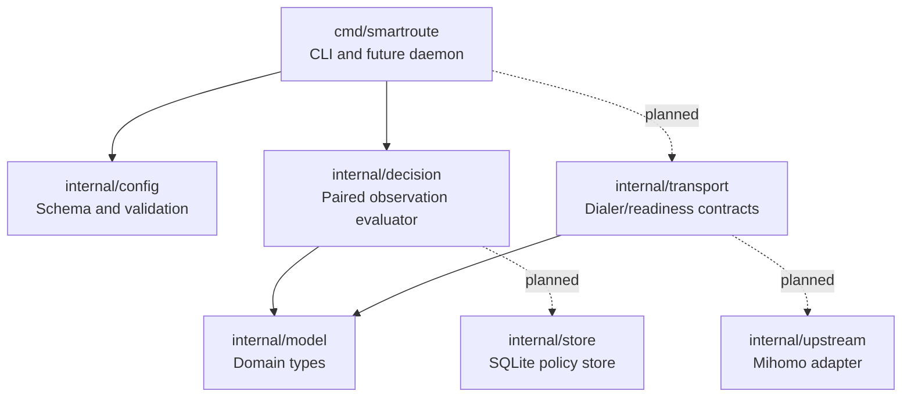

# SmartRoute Component and Interface Catalog

Version: v0.1
Last updated: 2026-08-02

This file is the maintained registry for components, interfaces, commands, configuration fields, and decision reason codes. Status is explicit: `implemented`, `experimental`, or `planned`.

## 1. Component map



Solid edges are implemented imports. Dashed edges are planned Phase 0–2 relationships.

## 2. Component registry

| Component | Owner | Status | Responsibility | Explicit non-responsibility | Primary tests |
| --- | --- | --- | --- | --- | --- |
| `cmd/smartroute` | CLI | implemented | Command parsing, config validation, synthetic decision trace | Real proxying, persistence | `cmd/smartroute/main_test.go` |
| `internal/config` | Core | implemented | Strict JSON schema, safe loopback defaults, validation | Mihomo YAML generation | `internal/config/config_test.go` |
| `internal/model` | Core | implemented | Path, target, readiness, observation, decision types and readable JSON evidence | State persistence | `internal/model/model_test.go` plus consumer tests |
| `internal/decision` | Core | experimental | Evaluate one paired Direct/Proxy observation | Multi-session promotion and decay | `internal/decision/evaluator_test.go` |
| `internal/transport` | Data plane | experimental contracts | Candidate dialer and readiness-gate boundaries | Implemented racing or TLS parsing | Build coverage; behavior tests planned |
| `internal/upstream` | Integration | planned | Mihomo config/API adapter and topology validation | Shipping Mihomo source | Planned integration tests |
| `internal/store` | Persistence | planned | SQLite observations, policies, migrations | Analytics uploads | Planned migration/recovery tests |

## 3. Implemented function and interface registry

| Symbol | Owner | Inputs | Output | Error behavior | Stability | Tests |
| --- | --- | --- | --- | --- | --- | --- |
| `config.Default()` | `internal/config` | None | Safe Phase 0 `Config` | None | experimental | `TestDefaultIsValid` |
| `config.Load(path)` | `internal/config` | JSON file path | Validated `Config` | Wraps read/decode errors; rejects unknown fields | experimental | `TestLoadRejectsUnknownFields` |
| `Config.Validate()` | `internal/config` | Config value | `error` | Joins all detectable validation errors | experimental | Config test table |
| `Observation.Validate()` | `internal/model` | Observation value | `error` | Rejects invalid path/stage, negative latency, weak success, unclassified failure | experimental | Decision tests |
| `Observation.MarshalJSON()` | `internal/model` | Observation value | JSON with stage names and millisecond latency | Returns JSON encoding errors | experimental | `TestObservationJSONUsesReadableUnits` |
| `model.ParseStage(value)` | `internal/model` | Stage name | `Stage` | Rejects unknown stage | experimental | CLI parser tests |
| `PairEvaluator.Evaluate(direct, proxy)` | `internal/decision` | Ordered paired observations | Explainable `Decision` | Rejects invalid observations/config | experimental | Outcome-matrix table |
| `CandidateDialer.Dial(ctx, target)` | `internal/transport` | Context and target | Connection and observation | Implementer must classify cancellation/path error | contract only | Planned |
| `ReadinessGate.Await(ctx, conn, target)` | `internal/transport` | Context, candidate connection, target | Readiness observation | Must not lose or unsafely replay consumed bytes | contract only | Planned |

## 4. CLI contract

| Command | Status | Purpose | Network effects | Persistence |
| --- | --- | --- | --- | --- |
| `smartroute version` | implemented | Print version, commit, build date | None | None |
| `smartroute validate -config PATH` | implemented | Strictly parse and validate local JSON config | None | None |
| `smartroute trace -direct SPEC -proxy SPEC` | implemented | Evaluate one synthetic paired observation and print JSON | None | None |
| `smartroute serve` | planned | Run SOCKS5 sidecar | Loopback listeners and candidate dials | Observation/policy store |
| `smartroute policy` | planned | Inspect, lock, revoke, or export policy | None by default | Policy store |

Trace observation syntax:

```text
success:<stage>:<latency_ms>
failure:<stage>:<latency_ms>:<failure_class>
```

Example:

```bash
go run ./cmd/smartroute trace \
  -direct failure:tcp:250:tls_reset \
  -proxy success:tls:120
```

## 5. Configuration reference

| JSON field | Type | Default | Validation | Behavior |
| --- | --- | --- | --- | --- |
| `version` | integer | `1` | Must equal current schema version | Enables explicit migrations |
| `listen_address` | host:port | `127.0.0.1:17890` | Literal loopback, non-zero, unique | Future sidecar SOCKS listener |
| `direct_endpoint` | host:port | `127.0.0.1:17891` | Literal loopback, non-zero, unique | Mihomo listener forced to Direct |
| `proxy_endpoint` | host:port | `127.0.0.1:17892` | Literal loopback, non-zero, unique | Mihomo listener forced to proxy policy |
| `original_fallback` | enum | `proxy` | `direct` or `proxy` | Route used when both candidates fail or SmartRoute rolls back |
| `decision.direct_head_start_ms` | integer | `200` | 10–2000 | Delay before starting Proxy for an unknown target |
| `decision.max_direct_penalty_ms` | integer | `150` | 0–5000 | Direct may be this much slower and still win when both succeed |
| `decision.candidate_timeout_ms` | integer | `5000` | Must exceed head start | Overall candidate deadline |
| `learning.proxy_promotion_wins` | integer | `3` | At least 2 | Planned paired wins before Proxy promotion |
| `learning.direct_promotion_wins` | integer | `5` | At least 2 | Planned paired wins before Direct promotion |
| `learning.policy_ttl_hours` | integer | `72` | Positive | Planned learned-policy expiry |
| `privacy.mode` | enum | `explicit-opt-in` | `explicit-opt-in` or `privacy-first` | Controls whether unknown targets may be directly probed |
| `privacy.never_direct_probe` | string list | empty | Exact/suffix semantics not implemented yet | Reserved deny list; no runtime behavior yet |

Fields marked planned in behavior are validated now but must not be described as active runtime features.

## 6. Decision reason-code catalog

| Reason code | Selected route | Evidence meaning | Promotion meaning |
| --- | --- | --- | --- |
| `direct_only_success` | Direct | Direct succeeded; Proxy failed | Strong Direct evidence, not an automatic permanent lock |
| `proxy_only_success` | Proxy | Direct failed; Proxy succeeded | Strong Proxy evidence |
| `both_success_direct_within_budget` | Direct | Both succeeded and Direct met configured latency budget | Medium Direct evidence |
| `both_success_proxy_materially_faster` | Proxy | Both succeeded and Direct exceeded latency budget | Medium Proxy evidence |
| `both_failed_use_original` | Original fallback | Neither path succeeded | No route promotion |

## 7. Planned event catalog

| Event | Producer | Minimum fields | Consumer | Status |
| --- | --- | --- | --- | --- |
| `candidate.started` | Racer | target ID, path, timestamp | Metrics/debug | planned |
| `candidate.ready` | Readiness gate | path, stage, latency | Decision engine | planned |
| `candidate.failed` | Dialer/gate | path, stage, failure class | Decision engine | planned |
| `candidate.canceled` | Racer | path, cancellation reason | Metrics | planned |
| `decision.selected` | Decision engine | selected path, reason, confidence | Store/UI | planned |
| `policy.promoted` | Learning engine | old/new state, evidence, expiry | Store/UI/export | planned |
| `learning.frozen` | Health guard | failing control, profile ID | UI/metrics | planned |

Events must never contain HTTP bodies, credentials, cookies, subscription URLs, or raw TLS secrets.

## 8. Maintenance checklist

When a symbol, field, event, or component changes:

1. Update its row in this file.
2. Update the relevant Mermaid diagram if dependencies changed.
3. Add an ADR if responsibility or safety semantics changed.
4. Add/update tests and name them in the registry.
5. Record user-visible changes in `CHANGELOG.md`.
