# SmartRoute Component and Interface Catalog

Version: v0.32
Last updated: 2026-08-05

This file is the maintained registry for components, interfaces, commands, configuration fields, and decision reason codes. Status is explicit: `implemented`, `experimental`, or `planned`.

## 1. Component map

```mermaid
flowchart TB
    CLI["cmd/smartroute\nCLI and future daemon"]
    Config["internal/config\nSchema and validation"]
    Model["internal/model\nDomain types"]
    ConnectionID["internal/connectionid\nRandom event correlation"]
    Decision["internal/decision\nPaired observation evaluator"]
    Learning["internal/learning\nAutomatic key + legacy diagnostics"]
    Health["internal/health\nLegacy diagnostic freeze"]
    SOCKS["internal/socks5\nSOCKS5 wire protocol"]
    Transport["internal/transport\nSOCKS dialers and racer"]
    TLSInspect["internal/tlsinspect\nbounded TLS first-flight parser"]
    Sidecar["internal/sidecar\nInbound relay"]
    Guard["internal/guard\nPre-payload availability"]
    NetRelay["internal/netrelay\nBidirectional relay"]
    Privacy["internal/privacy\nDirect-probe policy"]
    Supervisor["internal/supervisor\nChild lifecycle"]
    Observe["internal/observe\nBounded local records"]
    RuntimeCheck["internal/runtimecheck\nLocal topology doctor"]
    TestLab["internal/testlab\nFault + auto-learning lab"]
    LabCLI["cmd/smartroute-testlab\nJSON lab runner"]
    TrialLab["internal/triallab\nSynthetic analysis rehearsal"]
    TrialLabCLI["cmd/smartroute-trial-lab\nNetwork-free lab runner"]
    BenchLab["internal/benchlab\nPaired sidecar overhead"]
    BenchLabCLI["cmd/smartroute-benchmark-lab\nLoopback benchmark runner"]
    LoadLab["internal/loadlab\nConcurrent relay load"]
    LoadLabCLI["cmd/smartroute-load-lab\nLoad runner"]
    LoadSweepCLI["cmd/smartroute-load-sweep\nFixed matrix runner"]
    CapacityCLI["cmd/smartroute-capacity-lab\nOffered-load runner"]
    MihomoLab["internal/mihomolab\nPinned child-process lab"]
    MihomoLabCLI["cmd/smartroute-mihomo-lab\nIntegration runner"]
    RuntimeLabCLI["cmd/smartroute-runtime-lab\nFull process runner"]
    Mihomo["internal/upstream\nFuture active adapter"]
    Store["internal/store\nSQLite evidence + last-known-good index"]
    FixedPolicy["internal/fixedpolicy\nManual exact-target policies"]
    Trial["internal/trial\nRead-only trial preflight"]
    ClashTransform["integrations/clash-verge\nFinal MATCH transform"]
    ReleaseBuilder["scripts/build-release.sh\nVersioned release archives"]
    ReleaseWorkflow[".github/workflows/release.yml\nTagged GitHub release"]

    CLI --> Config
    CLI --> Decision
    CLI --> Learning
    CLI --> Health
    CLI --> Sidecar
    CLI --> Guard
    CLI --> Privacy
    CLI --> Supervisor
    CLI --> Observe
    CLI --> RuntimeCheck
    CLI --> Store
    CLI --> FixedPolicy
    CLI --> Trial
    Config --> Privacy
    Config --> Learning
    Decision --> Model
    Learning --> Model
    Health --> Learning
    Health --> Model
    Store --> Learning
    Store --> Model
    Trial --> Config
    Trial --> Observe
    Trial --> Store
    Trial --> TestLab
    Trial --> MihomoLab
    Transport --> Model
    Transport --> SOCKS
    Transport --> TLSInspect
    Sidecar --> TLSInspect
    Sidecar --> ConnectionID
    Sidecar --> SOCKS
    Sidecar --> Transport
    Sidecar --> NetRelay
    Sidecar --> Privacy
    Sidecar --> Learning
    Sidecar -. "optional failure signals" .-> Health
    Observe --> ConnectionID
    Guard --> SOCKS
    Guard --> NetRelay
    TestLab --> Sidecar
    TestLab --> SOCKS
    LabCLI --> TestLab
    TrialLabCLI --> TrialLab
    TrialLab --> Observe
    TrialLab --> Trial
    BenchLabCLI --> BenchLab
    BenchLab --> TestLab
    BenchLab --> Sidecar
    BenchLab --> MihomoLab
    LoadLabCLI --> LoadLab
    LoadSweepCLI --> LoadLab
    CapacityCLI --> LoadLab
    LoadLab --> TestLab
    LoadLab --> Sidecar
    LoadLab --> MihomoLab
    MihomoLabCLI --> MihomoLab
    RuntimeLabCLI --> MihomoLab
    RuntimeLabCLI --> ClashTransform
    MihomoLab --> Sidecar
    MihomoLab --> Guard
    MihomoLab --> TestLab
    Transport -. "planned" .-> Mihomo
    Store --> CLI
    FixedPolicy -. "future authorized activation" .-> Sidecar
    ClashTransform --> Guard
    ClashTransform --> Mihomo
    ReleaseBuilder --> CLI
    ReleaseWorkflow --> ReleaseBuilder
```



Solid edges are implemented imports. Dashed edges are planned Phase 0–2 relationships.

## 2. Component registry

| Component | Owner | Status | Responsibility | Explicit non-responsibility | Primary tests |
| --- | --- | --- | --- | --- | --- |
| `cmd/smartroute` | CLI | experimental | Command parsing, config validation, Guard/engine lifecycles, observation/reporting, durable writer, bounded last-known-good index, status/clear/backup/restore | Destructive evidence cleanup, suffix generalization, live rule-lane inference, and active Clash configuration | `cmd/smartroute/main_test.go`; data plane exercised by Test Labs |
| `cmd/smartroute-testlab` | Test | implemented | Run three deterministic base-route scenarios plus the four-step last-known-good TLS contract and print report v2 | Real destinations, durable-file persistence, or Clash integration | `internal/testlab/lab_test.go` plus CI named step |
| `cmd/smartroute-trial-lab` | Test | implemented | Rehearse recorder → report-v6 → assessment with positive and mixed-session synthetic windows | Preflight evidence, listeners, network traffic, real targets, live trial or policy authority | `internal/triallab/lab_test.go`; `make trial-lab`; CI named step |
| `cmd/smartroute-benchmark-lab` | Test | implemented | Compare the same fake or pinned-Mihomo forced-DIRECT loopback path with and without the sidecar, using TCP echo or TLS ServerHello protocol cells | TUN/full-handshake/application claims, external targets, active Clash access, or implicit latency enforcement | `internal/benchlab/lab_test.go`; four `make benchmark*` targets; CI smoke steps |
| `cmd/smartroute-load-lab` | Test | implemented | Compare concurrent chunked-echo baseline/sidecar batches across fake or pinned-Mihomo forced-DIRECT tiers | Latency, simultaneous full duplex, maximum/WAN throughput, application claims, active Clash, or implicit performance enforcement | `internal/loadlab/lab_test.go`; `make load-lab`; `make load-mihomo`; CI smoke steps |
| `cmd/smartroute-load-sweep` | Test | implemented | Run the fixed six-cell concurrency/payload matrix with aggregate allocation and diagnostic process-CPU deltas | Arbitrary matrix input, kernel/Mihomo CPU, RSS/energy, production profiling, active Clash, or automatic threshold changes | `internal/loadlab/lab_test.go`; `make load-sweep`; `make load-sweep-mihomo`; CI smoke steps |
| `cmd/smartroute-capacity-lab` | Test | implemented | Compare baseline/sidecar completion against a fixed client-paced aggregate offered-load matrix | Bandwidth queues, RTT/loss/congestion emulation, arbitrary rate input, application success, active Clash, or performance enforcement | `internal/loadlab/lab_test.go`; `make capacity-lab`; `make capacity-mihomo`; CI smoke steps |
| `cmd/smartroute-mihomo-lab` | Test | implemented | Run the exact pinned Mihomo binary in an isolated topology and print JSON | Discovering or operating the active Clash instance | `internal/mihomolab/lab_test.go`; `make mihomo-lab` |
| `cmd/smartroute-runtime-lab` | Test | implemented | Run the real Clash composer, pinned Mihomo, actual `smartroute supervise` children, policy-only SQLite, restart reuse, timeout fallback and opposite overwrite | Active Clash discovery/write, external traffic, TUN/system proxy, application-success or live-trial authorization | Runtime helper tests; `make runtime-lab`; pinned-Mihomo workflow |
| `internal/config` | Core | implemented | Strict JSON schema, safe loopback defaults, validation | Mihomo YAML generation | `internal/config/config_test.go` |
| `internal/model` | Core | implemented | Path, target, readiness, observation, decision types and readable JSON evidence | State persistence | `internal/model/model_test.go` plus consumer tests |
| `internal/connectionid` | Observability | implemented | Generate and validate fresh random non-semantic per-connection event scopes | Route/learning keys, stable identity, sequence generation, persistence, or network transmission | Format, malformed-value and uniqueness tests; Sidecar lifecycle tests |
| `internal/decision` | Core | experimental | Evaluate one paired Direct/Proxy observation | Multi-session promotion and decay | `internal/decision/evaluator_test.go` |
| `internal/learning` | Policy | experimental | Normalize automatic target keys and retain legacy ephemeral/Shadow diagnostic helpers | Automatic policy storage, approval, suffix generalization, or authority over the `auto` mapping lifecycle | Canonical-key, legacy engine/evaluator, runtime no-ephemeral and Sidecar tests |
| `internal/fixedpolicy` | Policy management | experimental | Transactionally lock/list/revoke user-authored exact profile/hostname/port/TCP Direct/Proxy policies with optional expiry and retained history | Runtime route selection, automatic suggestion promotion, suffix rules, UDP, Clash writes, backup/clear, or evidence collection | Missing read-only state, normalization, replacement, expiry, revoke, corruption/future schema and CLI lifecycle tests |
| `internal/health` | Legacy diagnostics | experimental | Freeze legacy ephemeral/evidence learning after distinct-target failures | Selecting or suppressing default `auto` mappings, probing networks, or changing routes | `internal/health/gate_test.go`; legacy runtime tests |
| `internal/socks5` | Data plane | experimental | No-auth SOCKS5 CONNECT parsing/client handshake and domain preservation | Authentication, UDP ASSOCIATE, BIND | `internal/socks5/protocol_test.go`; Test Lab |
| `internal/transport` | Data plane | experimental | SOCKS5 candidate dialing, TCP and TLS racing, ServerHello gate, cancellation, exact prefetched-byte replay | Certificate/Finished/application validation | Racer and TLS readiness tests; Mihomo Lab |
| `internal/tlsinspect` | Data plane | experimental | Bounded TLS record reassembly, ClientHello/ServerHello structure checks, early-data rejection | TLS decryption, certificate validation, payload logging | `internal/tlsinspect/tlsinspect_test.go` |
| `internal/sidecar` | Data plane | experimental | SOCKS admission, TLS first-flight orchestration, stage enforcement, relay, bounded direction-end propagation, declared-original-path propagation, per-connection terminal/outcome scoping, and cancellation-time handler draining | Raw relay errors, payload inspection, live baseline verification, counterfactual execution/savings, application-success inference, SQLite I/O, durable policy evaluation, post-commit replay, or active Clash modification | Sidecar net.Pipe lifecycle/outcome/scope tests, Test Lab and Mihomo Lab |
| `internal/guard` | Data plane | experimental | Before forwarding payload to either lane, select adaptive/original policy; cancel and join accepted handlers before server exit | Direct/Proxy evidence, learning, post-commit replay, Guard-process supervision | Guard net.Pipe lifecycle/server tests; Mihomo Lab fault scenarios |
| `internal/netrelay` | Data plane | experimental | Context-aware bidirectional TCP copying, directional byte/end-reason results, half-close handling, cancellation closure, and copy-goroutine join | Raw error export, routing decisions, application-success inference, retry, replay, or payload inspection | Exact counts, bounded classification and cancellation tests; Guard/Sidecar/Test Lab consumers |
| `internal/privacy` | Policy | experimental | Validate/normalize exact and suffix deny rules; decide whether a target may open Direct | Network I/O, hostname persistence, or route learning | `internal/privacy/policy_test.go`; Sidecar privacy tests |
| `internal/supervisor` | Runtime | experimental | Independently monitor Guard/engine child processes, cap restart backoff, and emit lifecycle events | Supervising Mihomo, replaying failed connections, or host-level service installation | `internal/supervisor/supervisor_test.go`; CLI service-spec tests |
| `internal/observe` | Persistence | experimental | HMAC-pseudonymize typed events, persist random scopes/declared path/bounded direction ends, write bounded schema-5 JSONL, implement lifecycle controls, and aggregate identity-free readiness/post-commit/pair/baseline/end metrics | Raw I/O errors, learned policy, payload capture, live rule-lane or counterfactual-savings inference, total-wire/application-success measurement, cloud upload, or active Clash access | Recorder/session/control/report/schema-migration tests; CLI sink/report tests |
| `internal/runtimecheck` | Runtime safety | experimental | Verify `baseline`, `armed`, or `running` across the five configured loopback ports; SOCKS probes stop after no-auth method negotiation | Destination CONNECT, route identity, DNS/application success, Clash reads/writes/reload, external network | Phase matrix, non-SOCKS rejection and CLI tests |
| `internal/testlab` | Test | implemented | Ephemeral loopback echo/TLS targets, exact no-early-data ClientHello/ServerHello fixtures, mutable fake Direct/Proxy gateways, deterministic faults, and four-connection automatic-learning validation | Full TLS handshake, certificates, durable-file persistence, external network, and active Clash access | `internal/testlab/lab_test.go`; `internal/testlab/tls_test.go` |
| `internal/triallab` | Test | implemented | Use a removed temporary workspace to exercise real JSONL recording, pause, expected-session reporting, pairing, and assessment gates | Preflight readiness, data-plane testing, persistent artifacts, identity output, network/Clash/system-proxy access | Positive/mixed session, isolation, privacy and cancellation tests |
| `internal/benchlab` | Test | implemented | Measure paired baseline/sidecar loopback latency across fake/Mihomo gateways and TCP-echo/TLS-ServerHello protocols; report per-run/aggregate signed deltas and exact readiness counts | Full TLS handshake, real application success, TUN cost, external network, active Clash, persistence, or automatic rollout authority | Options/statistics, fake TCP/TLS loopback and opt-in pinned-Mihomo integration tests |
| `internal/loadlab` | Test | implemented | Alternate concurrent baseline/sidecar chunked-echo batches; aggregate exact bytes, completion latency, throughput and process-runtime deltas; run fixed load and client-paced capacity matrices without raw connection rows | Single-connection latency, WAN/RTT/loss emulation, kernel/Mihomo resource attribution, payload export, application success, active Clash, persistence, or rollout authority | Validation/statistics/runtime-delta/sweep/capacity, exact fake load/cancellation and opt-in pinned-Mihomo tests |
| `internal/mihomolab` | Test | implemented | Temporary config/home, child lifecycle, synthetic DNS, forced-listener/readiness assertions, reusable benchmarks, and full transformed-config/supervisor/persistence Runtime Lab orchestration | Active Clash discovery, external traffic, full TLS handshake, TUN, system proxy | `internal/mihomolab/*_test.go`; `make mihomo-lab`; `make runtime-lab` |
| `internal/trial` | Safety | experimental | Read-only pre-trial validation plus post-trial descriptive data-quality gates over current observation aggregates | Proving baseline/product benefit, statistical testing, running labs, changing policy/state, opening listeners, inspecting/authorizing active Clash, or starting/continuing a trial | Preflight/assessment pure-function tests; CLI machine-readable failure tests |
| `internal/upstream` | Integration | planned | Mihomo config/API adapter and topology validation | Shipping Mihomo source | Planned integration tests |
| `internal/store` | Persistence | experimental | Exact HMAC-keyed last-known-good rows, bounded in-memory lookup, a dedicated policy-only async writer, and separate legacy evidence lifecycle tools | Cleartext targets, suffix policies, committed replay, or JSONL recording | SQLite, policy-index, policy/evidence writer and lifecycle test suites plus lookup and 10,000-entry load benchmarks |
| `integrations/clash-verge` | Integration | experimental | Idempotently preserve existing rules/script output, replace the single final MATCH, and add loopback Guard/Direct/Proxy/original-policy objects | Reading/writing the active app directory, subscription handling, reload, TUN/DNS ownership, or node copying | `scripts/test-clash-transform.mjs`; synthetic pinned-Mihomo `-t` validation |
| `scripts/prepare-active-clash-candidate.rb` | Integration lifecycle | experimental | Resolve the current script binding read-only, back it up privately, transform the current generated config, produce a redacted diff, and require pinned-Mihomo validation | Installing, reloading, exporting full transformed config, changing controller/TUN/system proxy | Synthetic package test and current read-only package evidence |
| `scripts/manage-active-clash-candidate.rb` | Integration lifecycle | experimental | Re-resolve the current profile-to-script binding, verify package/content checksums, and atomically install or roll back one active script after explicit confirmation | Reloading Clash, changing `profiles.yaml`, accepting a different bound script, deleting packages, or running traffic tests | Synthetic metadata-change acceptance, binding-drift rejection, verify/unconfirmed/install/rollback tests; current active verify |
| `scripts/prepare-macos-launch-agent.rb` | Runtime lifecycle | experimental | Validate one private pinned live runtime and render a private KeepAlive/RunAtLoad user LaunchAgent with local logs | Calling `launchctl`, installing/uninstalling services, moving runtime state, touching Clash, or claiming reboot durability for a temporary runtime | Synthetic command/config/session drift, permissions, plist lint and structure tests; first live bootstrap |
| `scripts/relocate-live-runtime.rb` | Runtime lifecycle | experimental | Copy one stopped private runtime to a new durable path, rebase config/runbook absolute paths, and validate the config and learning store | Stopping/starting services, calling `launchctl`, deleting the source, touching Clash, or copying a running SQLite store | Synthetic relocation/path/privacy test; first Application Support migration |
| `scripts/build-release.sh` | Release | implemented | Cross-build the main CLI with embedded version/commit/time, package README and MIT license, and emit SHA-256 checksums | Bundling Mihomo/Clash, user state, signing/notarization, uploading, or mutating Git | Native version smoke plus checksum verification; tagged release workflow |
| `.github/workflows/release.yml` | Release | implemented | Re-run static/race/transform/docs/macOS lifecycle checks for `v*` tags, build four archives, and publish one GitHub release | Choosing version numbers, signing/notarization, or bypassing repository tests | Local workflow parity plus GitHub Actions tagged run |

## 3. Implemented function and interface registry

| Symbol | Owner | Inputs | Output | Error behavior | Stability | Tests |
| --- | --- | --- | --- | --- | --- | --- |
| `config.Default()` | `internal/config` | None | Safe Phase 0 `Config` | None | experimental | `TestDefaultIsValid` |
| `config.Load(path)` | `internal/config` | JSON file path | Validated `Config` | Wraps read/decode errors; rejects unknown fields | experimental | `TestLoadRejectsUnknownFields` |
| `Config.Validate()` | `internal/config` | Config value | `error` | Joins all detectable validation errors | experimental | Config test table |
| `learning.UsesAutomaticPolicy(mode)` | `internal/learning` | Canonical or compatibility mode string | Whether last-known-good storage is active | Unknown strings return false and config validation rejects them | experimental | Config and runtime tests |
| `Observation.Validate()` | `internal/model` | Observation value | `error` | Rejects invalid path/stage, negative latency, weak success, unclassified failure | experimental | Decision tests |
| `Observation.MarshalJSON/UnmarshalJSON()` | `internal/model` | Observation value or readable JSON | Symmetric stage names and millisecond latency | Decode rejects unknown stage and any invalid observation | experimental | Readable-units and round-trip tests |
| `model.ParseStage(value)` | `internal/model` | Stage name | `Stage` | Rejects unknown stage | experimental | CLI parser tests |
| `connectionid.New()` | `internal/connectionid` | OS entropy | Fresh `conn-` plus 128-bit lowercase hex scope | Entropy failure is explicit to caller; Sidecar degrades observation to unscoped without changing routing | implemented | Format and uniqueness tests; Sidecar failure test |
| `connectionid.Validate(value)` | `internal/connectionid` | Candidate scope string | `error` | Rejects labels, wrong length, uppercase and non-hex values | implemented | Validation table |
| `PairEvaluator.Evaluate(direct, proxy)` | `internal/decision` | Ordered paired observations | Explainable `Decision` | Rejects invalid observations/config | experimental | Outcome-matrix table |
| `socks5.ReadRequest(rw)` | `internal/socks5` | SOCKS byte stream | Domain/IP target and port | Rejects auth, unsupported commands/address types, malformed input | experimental | Protocol and Test Lab tests |
| `socks5.DialContext(ctx, endpoint, target)` | `internal/socks5` | Context, SOCKS endpoint, target | Connected tunnel | Closes on cancellation; returns handshake/reply errors | experimental | Test Lab |
| `CandidateDialer.Dial(ctx, target)` | `internal/transport` | Context and target | Connection and observation | Implementer classifies cancellation/path error | experimental contract | Racer tests |
| `SOCKS5Dialer.Dial(ctx, target)` | `internal/transport` | TCP target, fixed endpoint, declared `ReadinessStage` | SOCKS tunnel plus observation at the declared stage; default L1 | Classifies timeout, cancellation, SOCKS failure; rejects invalid stages | experimental | Test Lab and Mihomo Lab |
| `Racer.Race(ctx, target)` | `internal/transport` | Two dialers, preferred path, head-start, timeout, target | Winner plus optional already-completed `OtherObservation` | Defaults Direct-first; preferred failure starts opposite immediately; never waits for loser | experimental | Both preference orders, fallback, prior-failure, cancellation and dual-failure tests |
| `tlsinspect.ReadClientHello(reader, max)` | `internal/tlsinspect` | TLS byte stream and byte limit | Opaque validated ClientHello with exact record bytes | Rejects malformed, oversized, trailing first-flight data and `early_data` | experimental | Fragmentation/rejection table |
| `tlsinspect.ReadServerHello(reader, max)` | `internal/tlsinspect` | TLS byte stream and byte limit | Structurally valid ServerHello plus exact consumed records | Classifies alerts, truncation, malformed and unexpected messages | experimental | Fragmentation/alert tests |
| `ReadinessGate.Await(ctx, conn, target)` | `internal/transport` | Context, candidate connection, target | Stage, failure class and prefetched bytes | Must not lose or unsafely replay consumed bytes | experimental contract | TLS gate tests |
| `TLSRacer.Race(ctx, target, hello)` | `internal/transport` | Two candidates, validated no-early-data ClientHello, gate and timing | L3 winner connection with replay prefix | Cancels loser; returns paired classified failures | experimental | `internal/transport/tls_readiness_test.go` |
| `TLSRacer.RacePreferred(ctx, target, hello, path)` | `internal/transport` | Same TLS contract plus Direct/Proxy first preference | L3 winner with preferred launch order | Invalid preference fails before dialing; opposite path remains available | experimental | Proxy-first and fallback tests |
| `TLSRacer.ConnectPath(ctx, target, hello, path)` | `internal/transport` | One policy-selected candidate and validated no-early-data ClientHello | L3 connection with replay prefix | Rejects invalid/missing path; returns `TLSPathError` with classified observation | experimental | Proxy-only success/replay and failure tests |
| `TLSRacer.ConnectPreferredWithFallback(ctx, target, hello, path)` | `internal/transport` | Exact remembered Direct/Proxy path and validated no-early-data ClientHello | Selected-path L3 result or one opposite-path recovery | Both attempts share one timeout; selected path gets at most half so the opposite retains a real budget; committed data is never replayed | experimental | Selected-only, silent-timeout fallback, immediate fallback and dual-failure tests plus Runtime Lab |
| `privacy.New(mode, patterns)` | `internal/privacy` | Mode and exact/suffix deny patterns | Immutable compiled local policy | Rejects unknown mode, whitespace, URL-like/invalid host syntax and suffix IP rules | experimental | Policy validation table |
| `Policy.Evaluate(target)` | `internal/privacy` | Target hostname/IP | Allow/deny plus stable reason code | Missing policy and invalid target fail closed to Proxy-only | experimental | Exact/suffix/boundary/privacy-first tests |
| `learning.New(config)` | `internal/learning` | Mode, Direct/Proxy thresholds, TTL, optional clock | Concurrent process-local engine | Rejects unknown mode, low thresholds, and non-positive TTL | experimental | Config validation and engine tests |
| `Engine.Observe(target, winner, other)` | `internal/learning` | Scoped target, ready winner, optional completed opposite observation | Explainable update and ephemeral policy | Rejects invalid pairs; incomplete/canceled/pre-outbound evidence returns non-applied reason | experimental | Promotion, contradiction and weak-evidence tests |
| `Engine.PreferredPath(target)` | `internal/learning` | Scoped target | Live Direct/Proxy preference or empty | Returns empty in shadow/unknown/unstable/expired/invalid cases | experimental | Shadow, scope and TTL tests |
| `Engine.Clear()` | `internal/learning` | None | Empty process-local policy table | Does not alter durable evidence | experimental | Runtime health-freeze test |
| `applySmartRoute(config, options)` | `integrations/clash-verge` | Existing post-script config and five distinct loopback ports | Same config with final MATCH adapter and three forced listeners | Rejects ambiguous/non-final MATCH, graph cycles, unknown/reject branches, top-level/explicit-listener collisions, invalid ports, or partial prior transforms | experimental | Synthetic graph, idempotency, all-port collision, composer and Mihomo syntax tests |
| `prepare-active-clash-candidate.rb` | `scripts` | Active app directory, new output outside app/repo, pinned Mihomo path | Private candidate/backup/manifest/rollback package | Refuses overwrite, unsafe output, missing binding, semantic drift, or Mihomo failure; cleans incomplete output | experimental | Synthetic positive/ambiguity/overwrite tests and current active read-only run |
| `manage-active-clash-candidate.rb` | `scripts` | Package, action, explicit write confirmation | Redacted verification/state JSON | Accepts unrelated `profiles.yaml` metadata changes but refuses a different resolved script, checksum drift, unconfirmed write, unsafe mode, or wrong state; never reloads | experimental | Synthetic metadata/binding/exact install/rollback and current verify |
| `prepare-live-trial-runtime.rb` | `scripts` | Verified original-state candidate, executable SmartRoute binary, new private output, network-profile label | Private pinned binary/config/state/runbook workspace with paused observations and baseline doctor evidence | Refuses legacy topology-less candidate, occupied ports, overwrite, non-private workspace, invalid config/binary; never writes or reloads Clash | experimental | Synthetic runtime workspace, permissions, random session and exact sequence test; first live workspace |
| `prepare-macos-launch-agent.rb` | `scripts` | Private live runtime, new output plist, bounded label | Linted private user LaunchAgent using exact runbook supervisor arguments and private stdout/stderr | Refuses public runtime/log directory, command/binary/config/session drift, invalid label, overwrite, or invalid plist; never calls `launchctl` | experimental | Synthetic render/lint/permission/drift test; live running topology check after manual bootstrap |
| `relocate-live-runtime.rb` | `scripts` | Stopped private live runtime and new output path | Private copied runtime with rebased config/runbook, validated policy store, and no stale plist | Refuses occupied Engine/Guard ports, public/incomplete source, existing/nested output, invalid config/store, or non-private result; leaves source intact | experimental | Synthetic exact rebase/privacy test; live migration and restart recovery |
| `build-release.sh VERSION` | `scripts` | Semver-like `v*` version, clean worktree, and current Git commit | Four platform archives plus `checksums.txt`, with version/commit/time embedded in each binary | Rejects invalid versions, a dirty release worktree, or an existing output directory; any build/package/checksum failure aborts. `ALLOW_DIRTY_RELEASE=1` exists only for local smoke builds | implemented | Native binary version smoke, `shasum -c`, tagged release workflow |
| `runtimecheck.CheckTopology(ctx, config, phase, timeout)` | `internal/runtimecheck` | Validated loopback config and baseline/armed/running expectation | Identity-free five-endpoint local readiness report | Invalid phase/timeout is explicit; unexpected listener or non-SOCKS service fails; no destination CONNECT or external traffic | experimental | Full phase matrix and non-SOCKS listener test |
| `health.New(config)` | `internal/health` | Failure/recovery thresholds, windows, optional clock | Concurrent deterministic health gate | Rejects low thresholds/non-positive durations; opens no network connection | experimental | Validation and race tests |
| `Gate.ObserveBothPathsFailed/ObserveProxyPathFailed` | `internal/health` | Scoped target | Updated active/frozen transition | Counts distinct SHA-256 canonical target identities only; relevant failures can extend freeze | experimental | Duplicate, threshold, window and concurrency tests |
| `Gate.ObservePathSucceeded` | `internal/health` | Scoped target and successful path | Reset or recovery transition | Direct success cannot recover Proxy outage; duplicate target does not advance recovery | experimental | Global/Proxy recovery matrix |
| `Gate.ObserveNetworkProfileChanged/ObserveCaptivePortal` | `internal/health` | Explicit local signal | Immediate frozen transition | Signal sources are not yet automatic; route is unchanged | experimental | Immediate-signal and expiry tests |
| `learning.NewDurableEvaluator(config)` | `internal/learning` | Direct/Proxy win and distinct-session thresholds | Pure deterministic Shadow evaluator | Rejects thresholds below 2 | experimental | Durable configuration and matrix tests |
| `DurableEvaluator.Evaluate(summary)` | `internal/learning` | Directional wins and distinct sessions | Insufficient, conflicting, or exact-path suggestion with evidence/reason | Rejects negative/impossible summaries; any evidence in both directions conflicts | experimental | Full outcome matrix and invalid-evidence tests |
| `DurableEvaluator.Report(summaries)` | `internal/learning` | Identity-free exact-target summaries | Aggregate category/evidence/reason/threshold counts | Rejects zero-evidence or invalid target summaries; never returns identity | experimental | Category matrix, empty and invalid-report tests |
| `Supervisor.Run(ctx)` | `internal/supervisor` | Context, service specs, starter, restart policy | Runs independent monitors until cancellation | Rejects invalid/duplicate services; runtime failures trigger capped restart rather than stopping siblings | experimental | Restart, start-error, independence, cancellation tests |
| `CommandStarter.Start(ctx, service)` | `internal/supervisor` | Executable/args and synchronized stdout/stderr | Started child implementing `Wait()` | Parent cancellation interrupts child; `WaitDelay` kills after grace period | experimental | Supervisor consumers; platform process integration pending |
| `observe.New(options)` | `internal/observe` | Local directory, source, capacity/privacy limits, optional validated random trial session | Source-specific recorder | Rejects unsafe paths/limits, invalid salt, and human-readable/invalid session IDs; initialization errors are explicit | experimental | Recorder validation/privacy/session tests |
| `observe.NewTrialSessionID/ValidateTrialSessionID` | `internal/observe` | None or candidate ID | Random `trial-` + 128-bit lowercase hex, or validation result | Random-source errors propagate; arbitrary labels/uppercase/wrong length rejected | experimental | Uniqueness, format and rejection tests |
| `Recorder.Record(event)` | `internal/observe` | Typed bounded event with optional raw target, connection scope, declared baseline, relay counters and bounded end reasons | Pseudonymous schema-5 JSONL record or paused no-op | Rejects semantic/malformed scopes, baseline and arbitrary/inconsistent end strings; oversized/write errors return; routing continues | experimental | Hashing, relay/scope/baseline privacy, invalid/end consistency, pause, rotation and oversized-event tests |
| `observe.Inspect/Pause/Resume/Clear/Export` | `internal/observe` | Observation directory and explicit destination/paused state | Lifecycle status or local file operation | Only manages engine/Guard/supervisor subdirectories; clear requires pause; export refuses nesting/existing destination and omits salt/symlinks | experimental | Control and export tests |
| `observe.BuildReport(directory, options)` | `internal/observe` | Managed schema-1/2/3/4/5 JSONL, lower time bound, optional expected trial session | Report v7 identity-free readiness/path/Guard/session-match, automatic learning/writer reasons, post-commit relay/end, connection-pair completeness, and declared-baseline comparison | Rejects invalid expected scope, unknown reasons without echo, arbitrary strings/corruption/contradiction/overflow; returns only identity-free counts, never IDs, savings, or application success | experimental | Mixed-version, automatic-reason, expected/unexpected session privacy, end-token, exact-pair/window, baseline, overflow and corruption tests |
| `store.Open(ctx, config)` | `internal/store` | Context, DB path, busy timeout | Migrated/integrity-checked SQLite store with local HMAC key | Rejects unsafe path, missing/invalid key, `store.ErrCorrupt`, and future schema; never replaces data | experimental | Open/reopen, corruption, permissions and future-schema tests |
| `store.OpenReadOnly(ctx, config)` | `internal/store` | Existing DB path and timeout | Integrity-checked exact-current-schema store | Never creates key/DB or migrates; rejects missing key, corruption and any schema mismatch | experimental | Missing/current/old-schema tests; CLI status tests |
| `Store.StartSession(ctx, id, time)` | `internal/store` | Safe local session ID and timestamp | Durable independent-session row | Rejects invalid/duplicate sessions and cancellation | experimental | Session and foreign-key tests |
| `Store.AppendStrongEvidence(...)` | `internal/store` | Target, known session, winner/opposite pair, timestamp | Whether a schema-v1 row was written | Shared learning gate skips weak/incomplete pairs; unsafe failure tokens and DB errors are explicit | experimental | Strong/weak/privacy/concurrent-write tests |
| `Store.ListEvidence/Summarize` | `internal/store` | Target and lower timestamp bound | Ordered rows or wins/distinct-session counts | Invalid stored stages/directions fail visibly | experimental | Scope, summary and corrupt-row tests |
| `Store.ListTargetSummaries(ctx, since)` | `internal/store` | Retention cutoff | One wins/session summary per exact target | Groups by HMAC internally but returns no key or identity; honors cancellation | experimental | Scope, cutoff, cancellation and JSON privacy tests |
| `Store.PruneEvidence/TrimEvidenceTo/Checkpoint` | `internal/store` | Retention cutoff, row ceiling, or context | Deleted evidence count or compact WAL boundary | Transactionally removes empty sessions; row trim retains newest evidence; errors never imply replacement | experimental | Age/row/session pruning and privacy-file tests |
| `Store.RememberDurablePath` | `internal/store` | Exact target, actual ready path, timestamp, capacity | Upsert plus optional oldest-row eviction result keyed only by HMAC | Rejects invalid target/path/time/capacity; transaction failure leaves routing memory unaffected | experimental | Insert, overwrite, capacity replacement and persistence tests |
| `Store.NewDurablePolicyIndex` | `internal/store` | Context and capacity | Bounded HMAC-keyed process snapshot | Performs SQLite reads only during construction; rejects corrupt/oversize rows | experimental | Reload, corruption and capacity tests |
| `DurablePolicyIndex.PreferredPath` | `internal/store` | Exact runtime target | Direct, Proxy, or empty | No SQLite I/O or cleartext persistence | experimental | Exact-scope lookup, allocation budget and benchmark |
| `DurablePolicyIndex.Remember` | `internal/store` | Exact runtime target, actual ready path, timestamp | Immediate snapshot update plus optional oldest-entry eviction | Invalid target is explicit; unchanged path is a no-op and does not request another durable write | experimental | Immediate overwrite, capacity and unchanged-path tests |
| `Store.ClearDurablePolicies` | `internal/store` | Explicit management context | Removed automatic-policy count | Retains strong evidence; running snapshot requires restart | experimental | Store and CLI confirmation tests |
| `store.NewAsyncPolicyWriter(...)` | `internal/store` | Store, mapping capacity, queue capacity, optional error callback | Background last-known-good writer used by `auto` | Never writes evidence/session rows or performs assessment; per-write errors do not stop later work | experimental | Queue bounds, ordered Direct/Proxy writes, error continuation and automatic-runtime reload tests |
| `AsyncPolicyWriter.Enqueue(request)` | `internal/store` | Exact target, ready path and timestamp | Immediate accepted flag plus safe policy reason | Never blocks; full/closed queues affect persistence only, not current routing | experimental | Backpressure, close and persistence tests |
| `AsyncPolicyWriter.Close(ctx)` | `internal/store` | Shutdown context | Drained completion or context error | Stops admission and drains accepted mapping writes | experimental | Drain and timeout behavior through runtime tests |
| `store.NewAsyncWriter(...)` | `internal/store` | Store, session, queue capacity, optional error callback | Background strong-evidence writer | Rejects unsafe construction; individual append errors are counted and later writes continue | experimental | Queue bounds, errors, skips and close tests |
| `store.NewAsyncWriterWithOptions(...)` | `internal/store` | Store, session, queue/error/written/processed callbacks | Legacy background evidence writer with diagnostic callbacks | Written hook runs only for strong rows; processed hook also receives winner-only readiness; hook errors/panics are counted without changing routing or stopping later work | experimental | Callback selection, winner-only processing and error/panic-isolation tests |
| `AsyncWriter.Enqueue(request)` | `internal/store` | Target, completed pair and timestamp | Immediate accepted flag plus safe durable reason | Never blocks; full/closed queues drop only durable evidence | experimental | Backpressure and close/enqueue race tests |
| `AsyncWriter.Close(ctx)` | `internal/store` | Shutdown context | Drained completion or context error | Stops admission, drains accepted work, never force-closes its store | experimental | Drain and timeout tests |
| `runtimeLearningEngine.Observe(...)` | `cmd/smartroute` | Sidecar target, ready winner and optional completed opposite observation | Immediate last-known-good update, optional ephemeral update, and durable enqueue reason | Invalid winner is explicit; unchanged automatic path suppresses another queue write; writer result never becomes a route error | experimental | First-winner, overwrite, Shadow and Sidecar metadata tests |
| `Store.Status(ctx)` | `internal/store` | Current-schema store | Schema, aggregate evidence, and Direct/Proxy mapping counts | Contains no target/session identity or failure details; query errors are explicit | experimental | Aggregate/privacy and CLI tests |
| `Store.Backup(ctx, destination)` | `internal/store` | Open source store and new directory | Online SQLite snapshot, key, verified manifest | Refuses existing/unsafe destination; failures retain `INCOMPLETE` | experimental | Snapshot consistency, modes, reopen, marker and overwrite tests |
| `store.VerifyBackup(ctx, source)` | `internal/store` | Completed snapshot directory | Validated manifest and aggregate status | Rejects incomplete/tampered/unknown/non-regular/corrupt artifacts; verifies a private copy | experimental | Source-immutability and tamper tests |
| `store.RestoreBackup(ctx, source, destination)` | `internal/store` | Verified snapshot and new DB path | Restored DB/key plus aggregate status | Never overwrites or activates; failures retain `.INCOMPLETE` | experimental | New-path restore and existing-path refusal tests |
| `sidecar.Server.Serve(ctx, listener)` | `internal/sidecar` | Context, listener, racers, optional clock/outcome/scope generator | Cancels/joins handlers; TLS requires L3; emits terminal and bounded relay outcome with one random connection scope | Rejects unsafe ClientHello; entropy failure produces unscoped events only; outcome does not feed learning; never reads Clash config | experimental | Sidecar lifecycle/readiness/byte-count/scope tests, Test Lab and Mihomo Lab |
| `Server.OnRelayOutcome(event)` | `internal/sidecar` | Connection scope, target, selected path, post-commit directional bytes, duration and bounded termination | One callback after both relay directions end | Optional; no payload/raw error/application status; callback is absent in isolated labs unless explicitly tested | experimental | Exact byte/duration/path/scope and privacy persistence tests |
| `guard.Server.Serve(ctx, listener)` | `internal/guard` | Context, listener, adaptive/original dialers and bounded timeouts | Commits one lane before payload; cancels and joins every accepted handler before return | Falls back only before commit; shutdown interruption never replays or learns | experimental | Pending-handshake drain, adaptive/unavailable/wedged/dual-failure tests; Mihomo Lab |
| `netrelay.Bidirectional(ctx, left, right)` | `internal/netrelay` | Context and two owned TCP-like connections | Directional copied-byte counts, fixed end reasons and explicit cancellation; closes/joins both directions | Discards raw copy errors after bounded classification; reasons are not routing/application evidence | experimental | Exact payload, EOF/timeout/reset/closed/I/O classification, and two-end cancellation tests; Guard/Sidecar consumers |
| `testlab.RunAll(ctx)` | `internal/testlab` | Context | Isolation and scenario JSON model | Fails if any scenario invariant fails | implemented | `internal/testlab/lab_test.go` |
| `testlab.ScenariosComplete(scenarios)` | `internal/testlab` | Machine-readable report-v2 scenario rows | Whether the exact seven-scenario field contract is complete | Rejects missing, duplicate, renamed, failed, or internally inconsistent rows; performs no I/O | implemented | Valid `RunAll` output and forged auto-attempt rejection; trial preflight consumer |
| `testlab.StartEchoTargetOn(ctx, host)` | `internal/testlab` | Context and literal loopback IP | Owned echo target on an OS-assigned port | Rejects hostnames and non-loopback addresses; close owns only its listener | implemented | Loopback-host validation and integration scenarios |
| `testlab.StartTLSTarget(ctx)` | `internal/testlab` | Context | Owned loopback target that parses one ClientHello and returns the exact fixture ServerHello; accepted count | Listener failures are explicit; malformed/early-data first flights receive no ServerHello; close owns only its listener | implemented | Fixture parser and live target exact-byte/count tests |
| `testlab.SyntheticClientHelloRecords()` / `SyntheticServerHelloRecord()` | `internal/testlab` | None | Fresh exact fixture bytes | ClientHello is structurally valid, fragmented and contains no early_data; ServerHello is L3-only | implemented | Both fixtures parsed by `internal/tlsinspect` tests |
| `mihomolab.Run(ctx, binaryPath)` | `internal/mihomolab` | Context and explicit pinned binary path | Isolation, topology, readiness and scenario report | Rejects wrong version/config; owns and stops only its child | implemented | `internal/mihomolab/lab_test.go`; `make mihomo-lab` |
| `mihomolab.StartDirectBenchmarkTopology(ctx, binaryPath)` | `internal/mihomolab` | Context and explicit pinned lab binary | Owned forced-DIRECT listener, domain target, version/config/health state | Rejects wrong version/config; close stops only owned services and removes exact temporary home | implemented | Config/DNS unit tests; `make benchmark-mihomo` |
| `mihomolab.StartTLSBenchmarkTopology(ctx, binaryPath)` | `internal/mihomolab` | Context and explicit pinned lab binary | Same owned boundary backed by a counted synthetic TLS target | Same ownership/version/config failures; proves only ServerHello readiness | implemented | Config/fixture tests; `make benchmark-mihomo-tls` |
| `trial.Preflight(ctx, options)` | `internal/trial` | Config, acknowledgments, report/backup paths, evidence age, trial session, window, thresholds and optional clock | Stable checks plus versioned digested assessment plan | Invalid plan, missing confirmation or stale/contradictory evidence fails closed; never mutates state or inspects/authorizes active Clash | experimental | Plan, privacy/baseline, freshness, isolation, cancellation and matching-backup tests |
| `trial.NewAssessmentPlan(config, session, notBefore, window, thresholds)` | `internal/trial` | Decoded config, validated random session, non-zero UTC boundary, whole-second window and valid thresholds | Versioned plan with decoded-config and canonical-plan SHA-256 values | Rejects invalid scope/time/thresholds; digest is tamper-evident, not an authenticated signature | experimental | Construction, invalid-input, digest and config-drift tests |
| `trial.LoadAssessmentPlan(path, config)` | `internal/trial` | Strict successful preflight JSON and current decoded config | Verified fixed session/window/thresholds | Rejects unknown fields/version, unready/unsafe claims, digest tampering and config drift | experimental | Tamper, unready and config-drift tests |
| `trial.AssessObservations(report, thresholds, clock)` | `internal/trial` | Current report v7 for the expected session, pre-registered thresholds and optional clock | Machine-readable descriptive-analysis readiness, checks and identity-free metrics | Incomplete/mixed/unexpected/inconsistent data fails; always denies policy authority and verified baseline/client outcome | experimental | Valid window, each fail-closed gate, invariants, thresholds and safety claims |
| `triallab.Run(ctx)` | `internal/triallab` | Cancellable context | Versioned identity-free synthetic scenario report | Removes its exact temporary workspace; cancellation/failure returns a non-authoritative failed report | implemented | Clean window, unexpected session, identity omission, isolation and canceled context |
| `benchlab.Run(ctx, options)` | `internal/benchlab` | Context plus bounded run/sample/warmup/p95/enforcement, optional Mihomo path, and TCP/TLS protocol choice | Versioned gateway tier/protocol/environment/isolation, distributions, exact response/ClientHello correctness and gate report | Correctness always fails closed; missing/wrong Mihomo, TLS, cancellation and listener failures are explicit; latency only errors when explicitly enforced | implemented | Validation, signed percentile and all four gateway/protocol cells |
| `loadlab.Run(ctx, options)` | `internal/loadlab` | Context plus bounded run/concurrency/bytes/chunk/warmup/ratio/enforcement and optional Mihomo path | Versioned isolation, per-run batch/ratio, aggregate throughput/completion, exact connection/byte/attempt report | Correctness always fails closed; first worker failure cancels siblings; ratio only errors when explicitly enforced | implemented | Option/statistics, exact fake load/cancel and opt-in pinned-Mihomo tests |
| `loadlab.RunSweep(ctx, options)` | `internal/loadlab` | Context plus bounded run/chunk/warmup/ratio, optional Mihomo path, and one to 32 unique cells | Detailed cell reports plus compact throughput/allocation/process-CPU summaries and matrix-wide correctness | Rejects invalid/duplicate cells; stops on the first cell execution error; never enforces the environment-dependent ratio | implemented | Sweep validation and loopback execution tests; both gateway-tier commands |
| `loadlab.RunCapacity(ctx, options)` | `internal/loadlab` | Context, fixed offered-load cells, bounded load shape, deadline tolerance and optional Mihomo path | Detailed cell reports plus baseline-attributable deadline overrun summaries | Rejects invalid/duplicate rates; correctness fails closed; deadline results are always report-only | implemented | Duration math, validation, loopback pacing and both gateway-tier commands |
| `fixedpolicy.Open(ctx, config)` | `internal/fixedpolicy` | Local database path and busy timeout | Current-schema transactional management store | Creates only for a mutating management command; quick-checks, constrains and rejects corruption/future schema | experimental | Secure creation, lock/replacement/revoke and schema tests |
| `fixedpolicy.ListReadOnly(ctx, config, includeInactive, now)` | `internal/fixedpolicy` | Existing or missing database plus explicit time | Database existence and active/all exact rules | Missing store returns empty without creation; corrupt/future schema errors | experimental | Missing, expiry/history and corruption tests |
| `Store.Lock(ctx, request)` / `Store.Revoke(ctx, id, time)` | `internal/fixedpolicy` | Explicit manual exact target/path/TTL or random rule ID | New/superseded or revoked rule | Invalid/non-TCP scope rejects; replacement and revocation are transactional | experimental | Domain normalization, permanent/TTL replacement and repeat-revoke tests |

## 4. CLI contract

| Command | Status | Purpose | Network effects | Persistence |
| --- | --- | --- | --- | --- |
| `smartroute version` | implemented | Print version, commit, build date | None | None |
| `smartroute validate -config PATH` | implemented | Strictly parse and validate local JSON config | None | None |
| `smartroute trace -direct SPEC -proxy SPEC` | implemented | Evaluate one synthetic paired observation and print JSON | None | None |
| `smartroute serve [-acknowledge-direct-probes]` | experimental | Run TLS-over-SOCKS sidecar with default automatic last-known-good routing | Unknown targets race; `auto` hits open one selected path then pre-commit fallback; privacy deny remains Proxy-only | Bounded HMAC index and asynchronous local persistence; no ephemeral TTL engine in `auto` |
| `smartroute guard` | experimental | Run the separate availability boundary in front of the adaptive engine | Configured loopback Guard, engine and original-policy SOCKS endpoints | Optional bounded Guard JSONL; otherwise debug stdout |
| `smartroute supervise` | experimental | Run Guard and adaptive engine as independently restartable children | Same loopback effects as the two child commands; does not operate Mihomo | Enabled recording auto-generates one random trial session shared by supervisor, children and restarts |
| `smartroute observations status\|pause\|resume\|clear\|export` | experimental | Operate the configured local recorder directory | None | Status/control, confirmed deletion, or redacted file export |
| `smartroute observations report` | experimental | Aggregate a paused bounded observation window, including declared-baseline selection comparison | None | Strict read-only JSON; no target/profile/connection IDs; declared baseline is not an observed rule trace and changed bytes are not savings |
| `smartroute learning status` | experimental | Inspect durable evidence and identity-free active policy counts | None | Missing state is not created; existing current schema is opened read-only |
| `smartroute learning evaluate` | experimental | Evaluate one exact target against retained cross-session evidence | None | Opens store read-only; omits target from output; never applies suggestion |
| `smartroute learning report` | experimental | Aggregate retained target assessments for trial analysis | None | Opens read-only and emits no target identity/key; denominator is targets with strong evidence |
| `smartroute learning clear-policies` | experimental | One-command rollback of automatic last-known-good mappings | None; running service must restart to discard its snapshot | Requires confirmation; keeps all strong evidence |
| `smartroute learning backup` | experimental | Snapshot configured evidence into a new private directory | None beyond local SQLite locks | Includes DB/key/manifest; never a redacted export |
| `smartroute learning verify-backup` | experimental | Validate checksums and SQLite contents on a temporary copy | None | Leaves source snapshot unchanged |
| `smartroute learning restore` | experimental | Restore a snapshot to a new database path | None | Refuses every existing DB/key/marker; never updates config or activates policy |
| `smartroute trial preflight` | experimental | Evaluate prerequisites and pre-register the assessment session/config/window/thresholds | None; does not prove the declaration, run labs, or inspect active Clash | Read-only except private temporary backup-verification copies; emitted session-bearing report stays local and never authorizes activation |
| `smartroute trial assess` | experimental | Verify the saved preflight plan, build its paused expected-session report, and gate descriptive analysis | None; reads only managed local observation state and never active Clash | No writes or post-trial threshold override; pass never verifies baseline/client outcome or authorizes policy/rollout changes |
| `smartroute policy list\|lock\|revoke` | experimental | Manage manual exact-target fixed policies without activating them | None | Separate cleartext local SQLite store; list missing is non-creating; runtime never loads it |
| `smartroute-testlab` | implemented | Run isolated deterministic data-plane scenarios | Ephemeral loopback sockets only | None |
| `smartroute-trial-lab` | implemented | Rehearse the local observation and assessment control plane | None | Creates then removes one private temporary workspace; output is never preflight evidence |
| `smartroute-benchmark-lab [-mihomo PATH] [-tls]` | implemented | Measure paired local sidecar TCP echo or TLS ServerHello readiness overhead through fake or pinned-Mihomo gateway | Ephemeral loopback sockets; optional owned pinned child, temporary home and synthetic DNS | No retained files; TLS is L3-only; latency gate is report-only unless `-enforce` is supplied |
| `smartroute-load-lab [-mihomo PATH]` | implemented | Measure alternating concurrent chunked-echo relay batches | Ephemeral loopback sockets; optional owned pinned child, temporary home and synthetic DNS | Aggregate JSON only; ratio gate report-only unless `-enforce`; never authorizes rollout |
| `smartroute-load-sweep [-mihomo PATH]` | implemented | Run the fixed six-cell load matrix and compare allocation shape | Same isolated loopback/owned-child boundary as Load Lab | Aggregate JSON only; current-process metrics exclude kernel/Mihomo child; CPU deltas are diagnostic; never authorizes rollout |
| `smartroute-capacity-lab [-mihomo PATH]` | implemented | Determine whether baseline and sidecar meet a fixed aggregate client-demand schedule | Same isolated loopback/owned-child boundary as Load Lab | Aggregate JSON only; explicitly not network emulation; performance report-only; never authorizes rollout |
| `smartroute-mihomo-lab -mihomo PATH` | implemented | Run isolated pinned-Mihomo contract scenarios | Child process, temporary home, local synthetic DNS and ephemeral loopback sockets only | Temporary files removed; JSON report only |
| `smartroute-runtime-lab -mihomo PATH -smartroute PATH ...` | implemented | Execute the actual transformed final-MATCH runtime and persistence restart contract | Owned Mihomo/SmartRoute/Node children, temporary home and ephemeral loopback sockets only | Removed private workspace; report proves policy-only rows, restart reuse, fallback overwrite and zero active-Clash access |
| `make clash-transform-test` | implemented | Test synthetic final-MATCH graphs, idempotency, collisions and non-overwriting composition | None | Temporary files only; no active Clash access |
| `make clash-transform-mihomo` | implemented | Generate a synthetic transformed config and run pinned Mihomo `-t` | Owned local child invocation only; no listener/TUN/system-proxy changes | Temporary config/home removed; no active Clash access |
| `make active-candidate-test` | implemented | Rehearse private package creation, verification, atomic install and rollback | Synthetic temporary app directory only | No active Clash access; package and app are removed |
| `make release VERSION=vX.Y.Z` | implemented | Build macOS/Linux arm64/amd64 release archives from the current commit | Go module resolution only when dependencies are not cached | Writes only ignored `dist/VERSION`; does not tag, push, publish, sign, or include private runtime state |

Trace observation syntax:

```text
success:<stage>:<latency_ms>
failure:<stage>:<latency_ms>:<failure_class>
```

Example:

```bash
go run ./cmd/smartroute trace \
  -direct failure:tcp:250:tls_reset \
  -proxy success:tls:120
```

## 5. Configuration reference

| JSON field | Type | Default | Validation | Behavior |
| --- | --- | --- | --- | --- |
| `version` | integer | `1` | Must equal current schema version | Enables explicit migrations |
| `listen_address` | host:port | `127.0.0.1:17890` | Literal loopback, non-zero, unique | Experimental `serve` SOCKS listener |
| `direct_endpoint` | host:port | `127.0.0.1:17891` | Literal loopback, non-zero, unique | Experimental Direct SOCKS candidate endpoint |
| `proxy_endpoint` | host:port | `127.0.0.1:17892` | Literal loopback, non-zero, unique | Experimental Proxy SOCKS candidate endpoint |
| `guard_listen_address` | host:port | `127.0.0.1:17893` | Literal loopback, non-zero, unique | Experimental `guard` SOCKS listener |
| `original_endpoint` | host:port | `127.0.0.1:17894` | Literal loopback, non-zero, unique | Mihomo listener forced to the user's original catch-all policy |
| `guard_adaptive_timeout_ms` | integer | `250` | 10–2000 | Maximum local adaptive-engine SOCKS handshake time before same-connection fallback |
| `original_fallback` | enum | `proxy` | `direct` or `proxy` | Synthetic evaluator fallback and operator-declared category behind `original_endpoint`; propagated as report baseline but never treated as an observed rule result |
| `decision.direct_head_start_ms` | integer | `200` | 10–2000 | Delay before starting Proxy for an unknown target |
| `decision.max_direct_penalty_ms` | integer | `150` | 0–5000 | Direct may be this much slower and still win when both succeed |
| `decision.candidate_timeout_ms` | integer | `5000` | Must exceed head start | Overall candidate deadline |
| `learning.mode` | enum | `auto` | `auto`; `durable-auto`, `shadow`, and `ephemeral-auto` remain compatibility/diagnostic spellings | Auto immediately remembers exact last-ready paths without approval or TTL |
| `learning.max_entries` | integer | `10000` | 1–1000000; missing value becomes default | Bounds automatic policy rows and startup index memory |
| `learning.proxy_promotion_wins` | legacy integer | `3` | At least 2 only in legacy modes | Hidden compatibility field for legacy ephemeral/Shadow diagnostics; ignored and not validated by `auto` |
| `learning.direct_promotion_wins` | legacy integer | `5` | At least 2 only in legacy modes | Hidden compatibility field for legacy ephemeral/Shadow diagnostics; ignored and not validated by `auto` |
| `learning.policy_ttl_hours` | legacy integer | `72` | Positive only in legacy modes | Hidden compatibility field; ignored and not validated by `auto` |
| `learning.health.enabled` | legacy boolean | `false` | Boolean | Diagnostic freeze only; ignored by `auto` |
| `learning.health.failure_threshold` | integer | `3` | 2–1000 | Different targets required to freeze global or Proxy learning |
| `learning.health.recovery_threshold` | integer | `3` | 2–1000 | Different successful targets required for early recovery |
| `learning.health.failure_window_seconds` | integer | `30` | 1–3600 | Active-state distinct failure aggregation window |
| `learning.health.freeze_duration_seconds` | integer | `300` | 1–86400 | Freeze expiry and extension duration |
| `learning.persistence.enabled` | boolean | `true` | Required by `auto` | Opens asynchronous local last-known-good persistence; lookup remains in memory |
| `learning.persistence.database_path` | path | `data/learning.db` | Non-empty file path; not `.` or filesystem root | SQLite file; sibling `.key` and any WAL/SHM files share its lifecycle |
| `learning.persistence.queue_size` | integer | `256` | 1–65536 | Bounds pending non-blocking policy writes in `auto`; a full queue never changes the current route |
| `learning.persistence.retention_hours` | legacy integer | `720` | 1–87600 only in legacy modes | Evidence retention for Shadow/ephemeral diagnostics; ignored and not validated by `auto` |
| `learning.persistence.max_evidence_rows` | legacy integer | `100000` | 1000–10000000 only in legacy modes | Evidence ceiling for Shadow/ephemeral diagnostics; ignored and not validated by `auto` |
| `learning.persistence.shutdown_timeout_ms` | integer | `2000` | 100–30000 | Bounds writer drain plus WAL checkpoint during shutdown |
| `learning.persistence.direct_suggestion_sessions` | legacy integer | `3` | 2–1000 only in legacy modes | Shadow suggestion threshold; ignored and not validated by `auto` |
| `learning.persistence.proxy_suggestion_sessions` | legacy integer | `2` | 2–1000 only in legacy modes | Shadow suggestion threshold; ignored and not validated by `auto` |
| `fixed_policy.database_path` | path | `data/fixed-policies.db` | Non-empty file path; not `.` or filesystem root | Cleartext user-authored exact policies; management commands only, never opened by runtime in Phase 0 |
| `privacy.mode` | enum | `explicit-opt-in` | `explicit-opt-in` or `privacy-first` | `privacy-first` opens zero Direct candidates; explicit mode also requires CLI acknowledgment |
| `privacy.never_direct_probe` | string list | empty | Plain exact; leading `.` or `*.` suffix; normalized ASCII hostname/IP; invalid entries reject config | Matching entries override acknowledgment and use Proxy-only L3 |
| `observation.enabled` | boolean | `false` | Boolean | Enables local persistence and suppresses duplicate raw runtime stdout events |
| `observation.directory` | path | `data/observations` | Non-empty; not `.` or filesystem root | Git-ignored local salt, pause marker and source subdirectories |
| `observation.max_file_bytes` | integer | `8388608` | 1024–1073741824 | Hard per-file bound; oversized single events are rejected |
| `observation.max_files_per_source` | integer | `4` | 1–100 | Oldest files pruned independently for engine, Guard and supervisor |
| `observation.retention_hours` | integer | `168` | 1–8760 | Age pruning occurs during source-file rotation |
| `observation.include_cleartext_hostname` | boolean | `false` | Boolean | Explicitly adds hostname to persisted rows; network profile remains HMAC-only |

Fields marked planned in behavior are validated now but must not be described as active runtime features.

## 6. Decision reason-code catalog

| Reason code | Selected route | Evidence meaning | Promotion meaning |
| --- | --- | --- | --- |
| `direct_only_success` | Direct | Direct succeeded; Proxy failed | Strong Direct evidence, not an automatic permanent lock |
| `proxy_only_success` | Proxy | Direct failed; Proxy succeeded | Strong Proxy evidence |
| `both_success_direct_within_budget` | Direct | Both succeeded and Direct met configured latency budget | Medium Direct evidence |
| `both_success_proxy_materially_faster` | Proxy | Both succeeded and Direct exceeded latency budget | Medium Proxy evidence |
| `both_failed_use_original` | Original fallback | Neither path succeeded | No route promotion |

Runtime race/commit reasons:

| Reason code | Meaning | Commit behavior |
| --- | --- | --- |
| `direct_candidate_before_head_start` | Direct candidate was admitted before Proxy launch | Commit only if observation reaches configured minimum stage |
| `direct_candidate_won` | Direct candidate won after both candidates could run | Same stage gate applies |
| `proxy_candidate_won` | Proxy candidate won | Same stage gate applies |
| `proxy_candidate_before_head_start` | Learned Proxy-first candidate became ready before Direct launch | Commit at the same stage gate; absence of Direct is not failure evidence |
| `durable_policy_selected` | Automatic policy's selected path reached ServerHello | Only that candidate opened; commit at the same L3 gate |
| `durable_policy_fallback` | Automatic selected path failed before commit and the opposite path recovered | Sequential fallback only; opposite readiness overwrites the stale mapping |
| `candidate_below_commit_stage` | Winning transport candidate did not prove target readiness | Close candidate, return SOCKS failure, `committed=false`, never learn |
| `client_hello_rejected` | Client first flight was unsafe or invalid | Close after local SOCKS admission; open zero candidates |
| `tls_candidates_failed` | Neither candidate returned a valid ServerHello | Close connection; report both classified path failures; never learn success |
| `privacy_proxy_path_failed` | Direct was forbidden and the only Proxy path failed L3 | Close; emit policy reason, Direct skipped marker and classified Proxy failure |

Direct-probe privacy reasons:

| Reason code | Direct candidate | Meaning |
| --- | ---: | --- |
| `direct_probe_allowed_explicit_opt_in` | Allowed | Process acknowledgment is present and no deny rule matches |
| `privacy_first_proxy_only` | Forbidden | Global privacy-first mode |
| `never_direct_probe_exact` | Forbidden | Exact hostname/IP deny entry matched |
| `never_direct_probe_suffix` | Forbidden | Apex or label-boundary suffix entry matched |
| `invalid_target_proxy_only` | Forbidden | Runtime target cannot be safely normalized |
| `missing_privacy_policy_proxy_only` | Forbidden | Sidecar was constructed without a compiled policy; fail closed |

Automatic last-known-good reasons:

| Reason code | Mapping effect | Route effect |
| --- | --- | --- |
| `automatic_direct_path_remembered` | Create or overwrite exact mapping with Direct | Current ready Direct connection commits |
| `automatic_proxy_path_remembered` | Create or overwrite exact mapping with Proxy | Current ready Proxy connection commits |
| `automatic_path_unchanged` | No write; existing path already matches | Current ready connection commits |

Legacy ephemeral learning reasons:

| Reason code | Counter update | Effect |
| --- | ---: | --- |
| `incomplete_paired_evidence_no_update` | No | Winner had no completed opposite observation |
| `weak_path_failure_no_update` | No | Opposite path was canceled/not-started or failed below outbound admission |
| `learning_capacity_reached_no_update` | No | Bounded table remained full after expired-entry pruning; routing continues |
| `strong_direct_evidence_recorded` | Direct +1 | Below threshold; no preference yet |
| `strong_proxy_evidence_recorded` | Proxy +1 | Below threshold; no preference yet |
| `ephemeral_direct_preference_promoted` | Direct threshold | Direct-first preference becomes live only in legacy `ephemeral-auto` mode |
| `ephemeral_proxy_preference_promoted` | Proxy threshold | Proxy-first preference becomes live only in legacy `ephemeral-auto` mode |
| `ephemeral_preference_refreshed` | Same direction +1 | Matching strong pair refreshes TTL |
| `ephemeral_preference_contradicted` | Opposite starts at 1 | Remove live preference and enter unstable |
| `learning_skipped_by_policy` | No | Privacy policy allowed only a single path |
| `learning_update_error` | No | Bounded metadata only; selected connection still commits |
| `learning_skipped_health_frozen` | No | Health gate is frozen; current winner still commits but no ephemeral or durable evidence is added |

Durable evidence reasons:

| Reason code | Durable effect | Route effect |
| --- | --- | --- |
| `durable_evidence_queued` | Readiness/evidence work accepted into the bounded writer queue | None; an unchanged mapping does not enqueue again |
| `durable_evidence_queue_full` | Readiness/evidence work dropped because the queue is full | None; the current in-memory decision and connection continue |
| `durable_evidence_writer_closed` | Readiness/evidence work arrived after shutdown admission closed | None; the current in-memory decision and connection continue |

Cross-session Shadow-assessment reasons:

| Reason code | State | Meaning | Route effect |
| --- | --- | --- | --- |
| `durable_no_evidence` | `insufficient` | No retained strong pair for this exact target scope | None |
| `durable_direct_evidence_insufficient` | `insufficient` | Direct-only evidence misses win or session threshold | None |
| `durable_proxy_evidence_insufficient` | `insufficient` | Proxy-only evidence misses win or session threshold | None |
| `durable_conflicting_evidence` | `conflicting` | Both directions have retained strong evidence | None; no suggestion |
| `durable_direct_route_suggested` | `direct_suggested` | Direct-only wins and sessions meet both thresholds | None; diagnostic only |
| `durable_proxy_route_suggested` | `proxy_suggested` | Proxy-only wins and sessions meet both thresholds | None; diagnostic only |

Guard availability reasons:

| Reason code | Selected lane | Meaning |
| --- | --- | --- |
| `adaptive_available` | Adaptive | Adaptive engine completed its local SOCKS handshake before the bounded timeout |
| `adaptive_unavailable_use_original` | Original | Adaptive engine refused/timed out before payload; the same client connection uses the original-policy listener |
| `adaptive_and_original_unavailable` | None | Neither local lane accepted the target; return SOCKS failure |

## 7. Event catalog

| Event | Producer | Minimum fields | Consumer | Status |
| --- | --- | --- | --- | --- |
| `candidate.started` | Racer | target ID, path, timestamp | Metrics/debug | planned; not emitted yet |
| `candidate.ready` | Readiness gate | path, stage, latency | Decision engine | planned |
| `candidate.failed` | Dialer/gate | path, stage, failure class | Decision engine | planned |
| `candidate.canceled` | Racer | path, cancellation reason | Metrics | planned |
| `decision` | Sidecar/decision engine | `event_type`, optional random `connection_id`, optional `declared_baseline_path`, target, selected path, reason, optional privacy/learning/durable reasons and policy state, winner `observation`, optional completed `other_observation`, `committed`, optional `decision_latency_ms` | CLI/recorder/report/UI | experimental `DecisionEvent`; baseline is declared-not-observed; schema-1/2/3/4 rows remain readable and new rows use schema 5 |
| `relay_outcome` | Sidecar after relay | Optional matching `connection_id`/`declared_baseline_path`, HMAC-transformed target, selected path, directional post-commit bytes and fixed end reasons, duration, `ended`/`canceled` | Identity-free trial report | experimental schema-2+; schema 5 requires both bounded end reasons; no payload/raw error/savings/application status; never enters learning |
| `durable_learning_assessment` | Async writer/evaluator | HMAC-transformed target in recorder, state, reason, aggregate wins/sessions, thresholds, optional suggestion | Trial analysis/UI | experimental and diagnostic only; durable-auto does not consume it for routing |
| `learning_health` | Health gate/runtime | optional HMAC-transformed triggering target, trigger, state, reason, freeze deadline, bounded distinct failure/recovery counts | Trial analysis/UI | experimental; emitted only on freeze/recovery/expiry transitions and never changes current route |
| `diagnostic` | Sidecar | `event_type`, optional random `connection_id` and `declared_baseline_path`, target, reason, failure class, optional Direct/Proxy failures and `policy_reason` | CLI/debug/report | experimental `DiagnosticEvent`; no payload bytes; scoped relay cannot pair with this failed terminal event |
| `guard_decision` | Guard | `event_type`, target, selected lane, reason, bounded failure classes, `committed` | CLI/recorder/UI | experimental; schema-1/2/3/4 rows remain readable and new rows use schema 5; no payload bytes, baseline, or Sidecar connection scope |
| `supervisor` | Supervisor | `event_type`, service, state, attempt, bounded failure class, optional `backoff_ms` | CLI/recorder/operator | experimental; states include `started`, `start_failed`, `exited`, `restart_scheduled`, `stopped` |
| `policy.promoted` | Learning engine | old/new state, evidence, expiry | Store/UI/export | planned |

Events must never contain HTTP bodies, credentials, cookies, subscription URLs, or raw TLS secrets.

When runtime recording is enabled, persisted events also carry an additive `trial_session_id`. It is a validated random non-semantic scope shared across a supervised trial and child restarts. Older rows may omit it; aggregate reports expose only distinct-session and unscoped counts.

Schema-3 Sidecar terminal and relay events may also carry a fresh `connection_id`. The identity-free report uses it only to validate exact target/path pairing and returns scoped/unscoped/paired/missing counts; it never returns the identifier. Schema-1/2 rows and entropy-failure rows remain readable as connection-unscoped. Missing or unmatched rows can reflect report-window boundaries and are never learning failures.

Schema-4 Sidecar events may carry `declared_baseline_path`, copied from validated `original_fallback`. It is an operator declaration about the original-policy listener, never a runtime rule trace. Report v4 compares committed selections and actual changed-winner relay volume against it, labels older/absent values unscoped, and never converts those aggregates into counterfactual saved bytes, latency, or application success.

Schema-5 `relay_outcome` requires `client_to_remote_end` and `remote_to_client_end`, each exactly one of `eof`, `timeout`, `reset`, `closed`, `io_error`, or `canceled`. Raw copy errors are discarded before event construction. Report v5 exposes fixed per-direction counts and places schema-2/3/4 relay rows in `unclassified`; none of these categories is application success or learned failure.

Report v5 adds scoped/unscoped committed-decision counts. Report v6 additionally verifies a caller-supplied expected trial session while exposing only a match boolean and unexpected-event count. Report v7 validates and aggregates automatic learning and durable-writer reason counts without target identity. `trial assess` takes its window and thresholds only from the successful preflight plan and uses exact baseline/pair denominators; it cannot select thresholds after seeing route-change results.

## 8. Maintenance checklist

When a symbol, field, event, or component changes:

1. Update its row in this file.
2. Update the relevant Mermaid diagram if dependencies changed.
3. Add an ADR if responsibility or safety semantics changed.
4. Add/update tests and name them in the registry.
5. Record user-visible changes in `CHANGELOG.md`.
