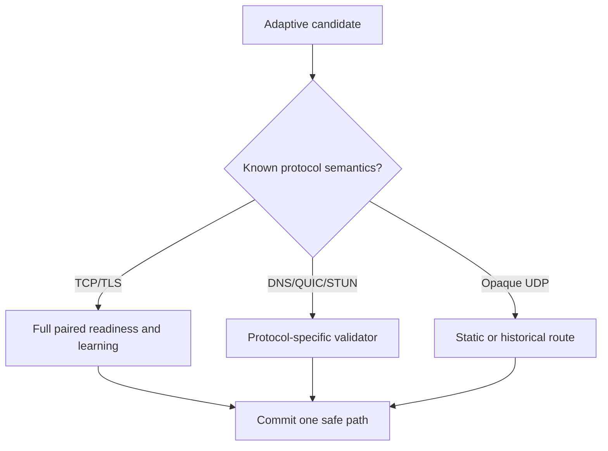

# Protocol Capability Matrix

Version: v0.1
Purpose: prevent the TCP/TLS learning model from being incorrectly generalized to all traffic.

## 1. Capability overview

| Traffic | Can route Direct/Proxy | Can learn | Generic first-session race | Phase |
| --- | ---: | ---: | ---: | --- |
| TCP + TLS/HTTPS | Yes | Strong evidence through TCP/TLS readiness | Mostly, before application commit | Phase 1–2 |
| Generic TCP | Yes | TCP-level evidence; application semantics may remain unknown | Connection-level only | Phase 1–2 |
| DNS | Yes | Strong request/response semantics | Protocol-specific comparison | Phase 2+ diagnostic module |
| QUIC/HTTP3 | Yes | Possible with QUIC-aware state | No generic transparent race | Later |
| STUN | Yes | Protocol-specific response and NAT behavior | Not with the generic engine | Later |
| Game/voice UDP | Yes when upstream supports UDP | Passive or application-specific evidence | Usually no | Later/partner-specific |
| Unknown UDP | Yes | Weak passive evidence only | No | Static/historical policy |
| IP-only traffic | Yes | Network/IP evidence, high shared-host risk | Limited | Existing rules first |

## 2. Routing lanes

## 3. Safety rules by protocol

| Protocol condition | Allowed | Forbidden |
| --- | --- | --- |
| TCP before application bytes | Staggered candidate connection attempts | Treating TCP connect as proof of HTTPS success |
| TLS without early data | Buffer/parse complete ClientHello; compare safe handshake readiness | Assuming ClientHello arrives in one read |
| TLS 1.3 early data | Use history or one selected path | Duplicating early application data |
| Plain HTTP | Connection-level routing; explicit application integration may add safe methods | Generic payload replay based only on method name |
| DNS | Compare resolver/path outcomes with user consent | Calling a domain hash anonymous or probing denied domains |
| QUIC | Historical route; future QUIC-aware handshake implementation | Blindly cloning UDP packets across egress identities |
| Unknown UDP | Observe selected-path response patterns | Promoting a permanent rule from silence alone |

## 4. Upstream capability checks

Before enabling adaptive UDP for any path, verify:

- The selected proxy leaf actually supports UDP; a selector containing `DIRECT` is not a guaranteed Proxy counterfactual.
- The application protocol exposes a success signal that SmartRoute can validate.
- Duplicated requests cannot create multiple sessions, NAT mappings, or side effects.
- The loser path can be canceled without corrupting the surviving session.
- Network-profile and address-family changes invalidate old observations appropriately.
