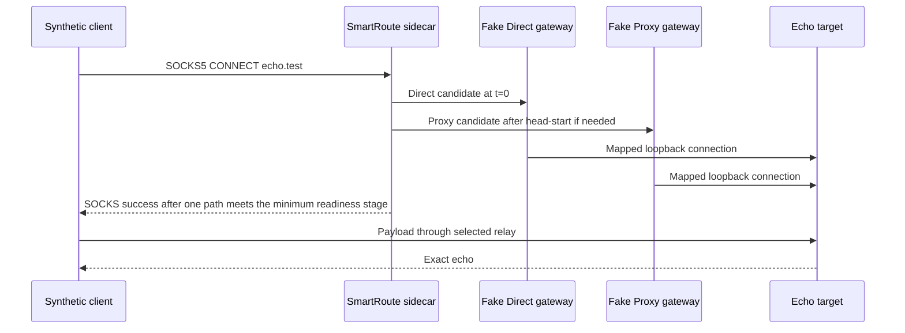
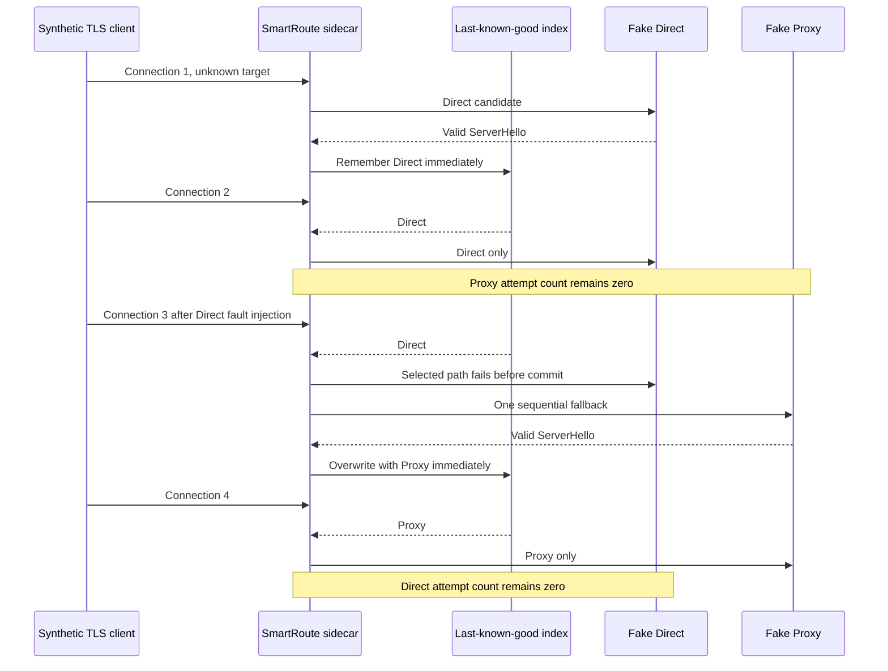
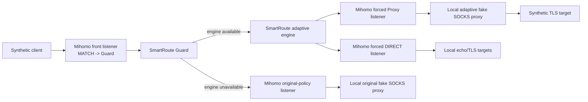
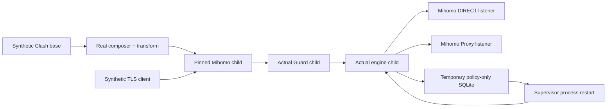
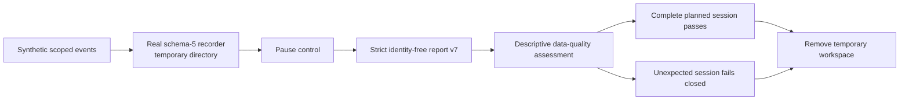

# Isolated Test Lab

Version: v0.8
Status: in-process, pinned-Mihomo, full runtime-process, and network-free trial-control tiers implemented

## 1. Safety boundary

The default SmartRoute test path is deliberately unable to operate the user's active Clash Verge Rev installation.

| Resource | Default Test Lab behavior |
| --- | --- |
| Listener addresses | Literal `127.0.0.1` only |
| Ports | `127.0.0.1:0`; assigned ephemerally by the operating system |
| External destinations | None |
| Test target | In-process TCP echo and structurally valid synthetic TLS server |
| Direct and Proxy paths | In-process fake gateways, or dedicated Mihomo forced listeners |
| Clash configuration/API | Not discovered, read, written, or reloaded |
| System proxy and TUN | Not changed |
| Persistent state | Default Test Lab: none. Runtime Lab: private temporary SQLite removed after restart verification |

The Test Lab does not assume that ports such as `7890`, `9090`, or the example SmartRoute ports are available. It does not use them.

The separate Trial Lab opens no socket at all. It creates one private temporary observation directory, exercises the actual recorder/report/assessment packages with synthetic metadata, and removes the directory before reporting success.

## 2. Current topology



The gateways map the reserved test hostname `echo.test` to the local echo target only after recording the domain-form request. This verifies that the sidecar preserves the hostname without relying on DNS.

## 3. Implemented scenarios

| Scenario | Injected behavior | Required result |
| --- | --- | --- |
| `direct_candidate_before_head_start` | Direct immediately reaches the fake gateway's declared L2 contract | Direct selected; Proxy never contacted; payload echoed |
| `proxy_recovers_slow_direct` | Direct stalls; Proxy becomes ready after stagger | Proxy selected; Direct canceled; payload echoed |
| `both_paths_fail` | Both gateways reject CONNECT | Client receives failure; no route is promoted |

The same executable then keeps one Sidecar and one bounded HMAC index alive for a four-connection TLS readiness sequence:



| Scenario | Required result |
| --- | --- |
| `auto_first_ready_remembered` | Direct reaches ServerHello, Proxy is never opened, learned path becomes Direct |
| `auto_reuses_direct_without_proxy` | Reason is `durable_policy_selected`, Direct attempts = 1, Proxy attempts = 0 |
| `auto_fallback_overwrites_proxy` | Direct rejects before commit, Proxy reaches ServerHello, reason is `durable_policy_fallback`, learned path becomes Proxy |
| `auto_reuses_proxy_without_direct` | Reason is `durable_policy_selected`, Direct attempts = 0, Proxy attempts = 1 |

Additional in-memory TLS tests use `net.Pipe`: one completes a real Go `crypto/tls` 1.3 handshake and encrypted echo through the Proxy winner; another proves an `early_data` ClientHello opens zero candidates. Privacy tests prove exact/suffix-denied, privacy-first, invalid-target, and missing-policy paths open zero Direct candidates while a selected Proxy must still return a valid ServerHello.

Run the lab:

```bash
make testlab
```

or:

```bash
go run ./cmd/smartroute-testlab
```

The command prints report version 2 with UTC `generated_at`, isolation claims, per-step attempts, selected and learned paths, reason codes, domain preservation, TCP payload or TLS ServerHello readiness verification, and elapsed time. A later trial preflight validates the timestamp and the exact seven-scenario field contract; it never trusts `passed` alone and rejects omitted, duplicated, renamed, or internally inconsistent results.

## 4. Implemented isolated Mihomo tier

Prepare the ignored upstream worktree once, then run the lab:

```bash
bash scripts/prepare-upstreams.sh mihomo
make mihomo-lab
```

The command builds the exact locked Mihomo v1.19.29 source and launches it as a child process. The implementation enforces these controls:

1. Generate its configuration under `t.TempDir()` or a task-specific temporary directory.
2. Allocate dedicated loopback ports before writing the configuration.
3. Use a separate Mihomo home/data directory and no controller exposure.
4. Disable system proxy changes and TUN by default.
5. Track and terminate only the child PID created by the test.
6. Never inspect or write Clash Verge Rev's application-support directory from this automated tier; read-only compatibility inspection is a separate manual lane.
7. Capture child logs for sanitized error reporting and delete the temporary directory after the run.



| Scenario | Verified contract |
| --- | --- |
| `forced_direct_loopback` | Forced Direct listener reaches the local target without touching Proxy |
| `forced_proxy_preserves_domain` | Forced Proxy preserves `echo.test` and returns the synthetic ServerHello |
| `mihomo_socks_ack_is_not_target_readiness` | Forced Direct ACK remains L1 and no ServerHello arrives |
| `tls_proxy_recovers_unreachable_direct` | Front adaptive flow rejects Direct as unready, commits Proxy at `StageTLS`, and replays ServerHello |
| `guard_falls_back_when_engine_unavailable` | Lab stops only the adaptive engine; Guard sends the same client connection to the independent original-policy listener before payload |
| `guard_returns_to_adaptive_after_restart` | Lab rebinds the engine port; the next connection returns to adaptive TLS selection without restarting Mihomo or Guard |

The negative L1 scenario and positive L3 recovery are both required. The two Guard scenarios additionally distinguish engine availability from Guard availability and assert that the original path does not recursively enter the adaptive engine.

The Mihomo report uses the same version/time envelope and also records the exact version output. Trial preflight requires `v1.19.29` plus the `SmartRoute-isolated-lab` build marker, every topology/readiness/Guard boolean, every scenario, and all negative isolation assertions.

Evidence status:

| Slice | Current evidence |
| --- | --- |
| Forced listeners, L1 gap, TLS L3 recovery | Passed on macOS arm64 and Linux amd64 with v1.19.29 |
| Guard unit semantics | Passed with `net.Pipe`, including refused, wedged and dual-failure cases |
| Guard engine stop/fallback/restart through Mihomo | Passed on macOS arm64/v1.19.29 on 2026-08-02: adaptive → original on engine stop → adaptive after rebind |
| Guard/engine supervisor lifecycle | In-memory lifecycle tests plus actual `smartroute supervise` children behind transformed pinned Mihomo pass; Sidecar/Guard cancellation and drain remain race-tested |

## 5. Full transformed Runtime Lab

Run:

```bash
make runtime-lab
```

This is the closest automated rehearsal to the future live installation while remaining unable to discover it. The command supplies explicit SmartRoute, Mihomo, Node, composer, and apply-script paths; creates a private temporary workspace; asks the real composer to use OS-assigned loopback ports; applies the composed script to a synthetic `MATCH,ROOT` configuration; validates and starts pinned Mihomo; and then starts the actual `smartroute supervise` executable.



The report requires four connections across three supervisor process lifetimes:

| Scenario | Required result |
| --- | --- |
| `first_ready_direct` | Unknown target selects Direct and writes one exact mapping |
| `restart_reuses_direct` | Restart reloads Direct; Proxy gateway remains untouched |
| `direct_failure_overwrites_proxy` | Direct becomes silent; half-budget timeout leaves time for one Proxy fallback and persists Proxy |
| `restart_reuses_proxy` | Restart reloads Proxy; a Direct tripwire receives zero connections |

The SQLite status must contain exactly one automatic policy and zero evidence/session rows. All four requests must traverse the adaptive Guard lane. The report explicitly asserts no external network, active Clash read/write, TUN, or system-proxy mutation. Its output is integration evidence, not application success or authorization to install the private candidate.

`make active-candidate-test` separately builds a synthetic Clash app directory, allocates five ephemeral loopback ports, prepares a checksum-gated candidate, rehearses exact install/rollback, then prepares the private runtime workspace. It requires the generated config and pinned binary to validate, observations to begin paused, a random trial session, private permissions, and the exact `baseline → start → armed → install/reload → running → restore/reload → armed → stop → baseline` order. The synthetic test never opens the user's active Clash directory and can run while the fixed live-trial ports are occupied; the actual `doctor` phase matrix is covered with separate ephemeral listeners in `internal/runtimecheck`.

The first Runtime Lab run exposed two real defects that narrower tests missed: a silent Mihomo-selected path consumed the full timeout and left no fallback budget; then the recovered Proxy result invoked a typed-nil legacy evidence writer and crashed `auto`. ADR-0039 reserves half the total readiness deadline for fallback and runtime attachment now installs only non-nil writers.

## 6. Network-free trial-control rehearsal

Run:

```bash
make trial-lab
```

or:

```bash
go run ./cmd/smartroute-trial-lab
```



The output explicitly sets `synthetic_inputs=true`, `preflight_evidence=false`, `authorizes_live_trial=false`, and `authorizes_policy_change=false`. Its schema is not `testlab.Report`, so it cannot replace either the loopback Test Lab report or the pinned-Mihomo report consumed by preflight. It validates analysis plumbing, not real network quality or user experience.

## 7. Paired sidecar overhead benchmark

Run:

```bash
make benchmark-lab
make benchmark-tls
make benchmark-mihomo
make benchmark-mihomo-tls
```

The benchmark alternates two fresh-connection paths to the same local gateway and target: client → gateway, and client → SmartRoute → gateway. The gateway axis is fake SOCKS or an explicit locked Mihomo binary with generated private home, forced-DIRECT loopback listener and synthetic DNS. The protocol axis is one-byte echo or `-tls`: a fragmented, parsed no-early-data ClientHello followed by exact structural ServerHello validation. TLS target accounting includes measured and warmup connections, while its report remains explicitly below full-handshake/application success. Default output contains five runs of 200 measured pairs, per-run and aggregate nearest-rank distributions, signed deltas, exact response/selection checks, and the worst run's p95. Fake gateway attempts are counted directly; Mihomo marks that internal counter unavailable. The 5ms gate is report-only unless `-enforce` is supplied.

The explicitly enforced 2026-08-02 macOS/arm64 TCP fake/Mihomo cells produced aggregate/worst-run paired p95 246/256µs and 200/231µs. TLS ServerHello cells produced 228/249µs and 230/254µs. Every cell used 1000 pairs, verified 2000/2000 responses and 1100/1100 Direct selections, and observed zero Proxy attempts; TLS cells also accepted 2200/2200 ClientHellos including warmups. See `docs/09-sidecar-overhead-benchmark.md` and ADR-0029–0031 for the contract and limits.

System-proxy and TUN validation will be a distinct, manual opt-in suite because those operations can affect the host network even when a separate config is used.

## 8. Concurrent relay Load Lab

Run:

```bash
make load-lab
make load-mihomo
make load-sweep
make load-sweep-mihomo
make capacity-lab
make capacity-mihomo
```

This is a separate executable and report schema from `smartroute-benchmark-lab`. Each of three default runs alternates which arm goes first, then starts 16 fresh concurrent connections per arm. Every connection transfers and exactly echoes 1 MiB in 32 KiB chunks. Four shorter warmup connections per arm/run are included in selection/attempt correctness but excluded from measured throughput bytes.

On 2026-08-02 both fake and pinned-Mihomo default cells completed 48/48 measured connections and 50,331,648/50,331,648 one-way bytes per arm, with zero Proxy attempts. Median sidecar throughput was 891.81 and 939.24 MiB/s respectively. Worst per-run sidecar/baseline ratios were 0.668 and 0.677, so both missed the provisional 0.70 gate.

The separate fixed sweep repeats six concurrency/payload cells and adds current-Go-process allocation/CPU deltas. Its 16 × 8 MiB fake and pinned-Mihomo cells both converged near a 0.665 median ratio while allocation totals stayed payload-size-independent at fixed concurrency. The gate remains report-only and unchanged. `io.Copy` is retained because the evidence points to the extra relay boundary, not a demonstrated buffer-allocation throughput defect; see `docs/10-concurrent-relay-load-lab.md` and ADR-0032–0033.

The capacity command applies an absolute client-side cumulative-byte schedule rather than emulating a network. On the same host, fake and pinned-Mihomo tiers both met every 100–5000 Mbps deadline and exposed a baseline-attributable sidecar miss at 8000 Mbps. The result remains report-only and does not represent RTT, loss, congestion, TUN, or application success; see `docs/11-offered-load-capacity-lab.md` and ADR-0034.

## 8. Separate read-only and live-trial lanes

The owner permits scoped, redacted read-only inspection of the active Clash Verge Rev environment. This does not weaken the Test Lab: its code and CI still perform zero active-environment reads. Configuration writes, reloads, system-proxy changes, and TUN changes remain reserved for a later coordinated live trial with backup and rollback controls. See `docs/08-observation-and-live-trial.md` and ADR-0003.

## 9. Limitations

- Fake gateways that connect before replying can explicitly claim L2 `StageTCP`; Mihomo SOCKS listeners claim only L1 `StageOutbound`.
- The isolated Mihomo lab covers startup listener semantics, not active selectors, Fake-IP/TUN capture, reload behavior, or operating-system integration.
- The TLS parser is bounded and structural: it does not validate certificates, Finished, ALPN, application success, or every real-world TLS fingerprint.
- ClientHello duplication can expose the same handshake fingerprint from Direct and Proxy egresses; privacy-denied targets must never enter this mode.
- A stopped adaptive engine is covered only before Guard commits a lane. Failure after payload commitment is not replayed. The local supervisor shortens Guard/engine process failure windows, but a connection inside a Guard-down window still fails and supervisor/host-process failure needs an OS service boundary.
- No lab observation survives workspace cleanup or is promoted into learned policy.
- Chunked echo load is not simultaneous full duplex, maximum WAN throughput, CPU/energy efficiency, or application success. Its initial 0.70 throughput-ratio gate is currently missed. Client-paced capacity cells are not bandwidth, RTT, loss, or congestion emulation.
