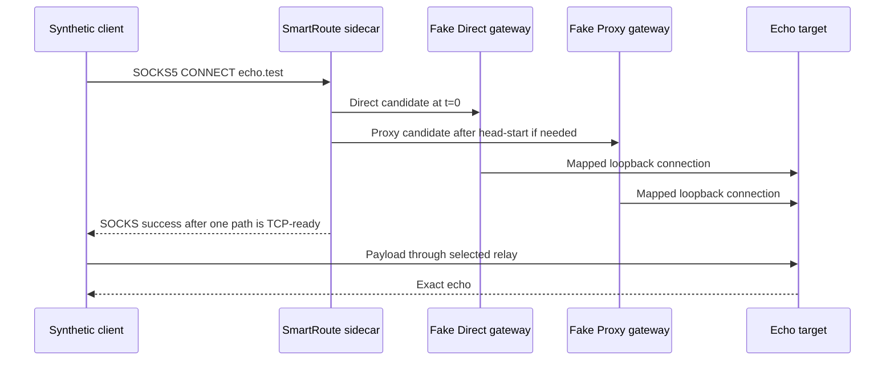

# Isolated Test Lab

Version: v0.1
Status: implemented for the first TCP/SOCKS5 scenarios

## 1. Safety boundary

The default SmartRoute test path is deliberately unable to operate the user's active Clash Verge Rev installation.

| Resource | Default Test Lab behavior |
| --- | --- |
| Listener addresses | Literal `127.0.0.1` only |
| Ports | `127.0.0.1:0`; assigned ephemerally by the operating system |
| External destinations | None |
| Test target | In-process TCP echo server |
| Direct and Proxy paths | In-process fake SOCKS5 gateways |
| Clash configuration/API | Not discovered, read, written, or reloaded |
| System proxy and TUN | Not changed |
| Persistent state | None |

The Test Lab does not assume that ports such as `7890`, `9090`, or the example SmartRoute ports are available. It does not use them.

## 2. Current topology



The gateways map the reserved test hostname `echo.test` to the local echo target only after recording the domain-form request. This verifies that the sidecar preserves the hostname without relying on DNS.

## 3. Implemented scenarios

| Scenario | Injected behavior | Required result |
| --- | --- | --- |
| `direct_ready_before_head_start` | Direct immediately ready | Direct selected; Proxy never contacted; payload echoed |
| `proxy_recovers_slow_direct` | Direct stalls; Proxy becomes ready after stagger | Proxy selected; Direct canceled; payload echoed |
| `both_paths_fail` | Both gateways reject CONNECT | Client receives failure; no route is promoted |

Run the lab:

```bash
make testlab
```

or:

```bash
go run ./cmd/smartroute-testlab
```

The command prints a machine-readable JSON report containing isolation claims, attempts, selected paths, reason codes, domain preservation, payload verification, and elapsed time.

## 4. Planned isolated Mihomo tier

The next integration tier will launch the locked Mihomo version as a child process. It must satisfy all of these controls before implementation is accepted:

1. Generate its configuration under `t.TempDir()` or a task-specific temporary directory.
2. Allocate dedicated loopback ports before writing the configuration.
3. Use a separate Mihomo home/data directory and controller secret.
4. Disable system proxy changes and TUN by default.
5. Track and terminate only the child PID created by the test.
6. Never inspect or write Clash Verge Rev's application-support directory.
7. Save sanitized logs under the test's temporary artifact directory.

System-proxy and TUN validation will be a distinct, manual opt-in suite because those operations can affect the host network even when a separate config is used.

## 5. Limitations

- Current readiness is TCP/SOCKS CONNECT, not TLS validity.
- Fake gateways simulate path behavior; they do not reproduce Mihomo selectors, Fake-IP, DNS, or TUN semantics.
- The lab validates safe path commitment before application bytes, but TLS ClientHello and 0-RTT handling are not implemented.
- No observations are persisted or promoted into learned policies yet.
