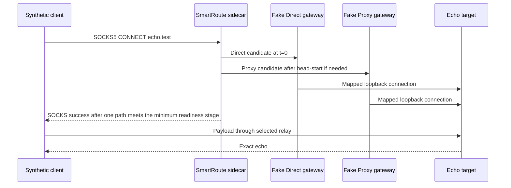
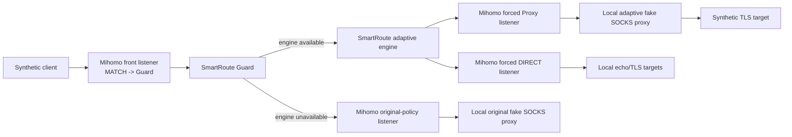

# Isolated Test Lab

Version: v0.3
Status: in-process and pinned-Mihomo tiers implemented

## 1. Safety boundary

The default SmartRoute test path is deliberately unable to operate the user's active Clash Verge Rev installation.

| Resource | Default Test Lab behavior |
| --- | --- |
| Listener addresses | Literal `127.0.0.1` only |
| Ports | `127.0.0.1:0`; assigned ephemerally by the operating system |
| External destinations | None |
| Test target | In-process TCP echo and structurally valid synthetic TLS server |
| Direct and Proxy paths | In-process fake gateways, or dedicated Mihomo forced listeners |
| Clash configuration/API | Not discovered, read, written, or reloaded |
| System proxy and TUN | Not changed |
| Persistent state | None |

The Test Lab does not assume that ports such as `7890`, `9090`, or the example SmartRoute ports are available. It does not use them.

## 2. Current topology



The gateways map the reserved test hostname `echo.test` to the local echo target only after recording the domain-form request. This verifies that the sidecar preserves the hostname without relying on DNS.

## 3. Implemented scenarios

| Scenario | Injected behavior | Required result |
| --- | --- | --- |
| `direct_candidate_before_head_start` | Direct immediately reaches the fake gateway's declared L2 contract | Direct selected; Proxy never contacted; payload echoed |
| `proxy_recovers_slow_direct` | Direct stalls; Proxy becomes ready after stagger | Proxy selected; Direct canceled; payload echoed |
| `both_paths_fail` | Both gateways reject CONNECT | Client receives failure; no route is promoted |

Additional in-memory TLS tests use `net.Pipe`: one completes a real Go `crypto/tls` 1.3 handshake and encrypted echo through the Proxy winner; another proves an `early_data` ClientHello opens zero candidates.

Run the lab:

```bash
make testlab
```

or:

```bash
go run ./cmd/smartroute-testlab
```

The command prints a machine-readable JSON report containing isolation claims, attempts, selected paths, reason codes, domain preservation, payload verification, and elapsed time.

## 4. Implemented isolated Mihomo tier

Prepare the ignored upstream worktree once, then run the lab:

```bash
bash scripts/prepare-upstreams.sh mihomo
make mihomo-lab
```

The command builds the exact locked Mihomo v1.19.29 source and launches it as a child process. The implementation enforces these controls:

1. Generate its configuration under `t.TempDir()` or a task-specific temporary directory.
2. Allocate dedicated loopback ports before writing the configuration.
3. Use a separate Mihomo home/data directory and no controller exposure.
4. Disable system proxy changes and TUN by default.
5. Track and terminate only the child PID created by the test.
6. Never inspect or write Clash Verge Rev's application-support directory from this automated tier; read-only compatibility inspection is a separate manual lane.
7. Capture child logs for sanitized error reporting and delete the temporary directory after the run.



| Scenario | Verified contract |
| --- | --- |
| `forced_direct_loopback` | Forced Direct listener reaches the local target without touching Proxy |
| `forced_proxy_preserves_domain` | Forced Proxy preserves `echo.test` and returns the synthetic ServerHello |
| `mihomo_socks_ack_is_not_target_readiness` | Forced Direct ACK remains L1 and no ServerHello arrives |
| `tls_proxy_recovers_unreachable_direct` | Front adaptive flow rejects Direct as unready, commits Proxy at `StageTLS`, and replays ServerHello |
| `guard_falls_back_when_engine_unavailable` | Lab stops only the adaptive engine; Guard sends the same client connection to the independent original-policy listener before payload |
| `guard_returns_to_adaptive_after_restart` | Lab rebinds the engine port; the next connection returns to adaptive TLS selection without restarting Mihomo or Guard |

The negative L1 scenario and positive L3 recovery are both required. The two Guard scenarios additionally distinguish engine availability from Guard availability and assert that the original path does not recursively enter the adaptive engine.

Evidence status:

| Slice | Current evidence |
| --- | --- |
| Forced listeners, L1 gap, TLS L3 recovery | Passed on macOS arm64 and Linux amd64 with v1.19.29 |
| Guard unit semantics | Passed with `net.Pipe`, including refused, wedged and dual-failure cases |
| Guard engine stop/fallback/restart through Mihomo | Scenario code implemented; current sandbox blocked loopback bind before config validation, so a permitted macOS/Linux run is still required |

System-proxy and TUN validation will be a distinct, manual opt-in suite because those operations can affect the host network even when a separate config is used.

## 5. Separate read-only and live-trial lanes

The owner permits scoped, redacted read-only inspection of the active Clash Verge Rev environment. This does not weaken the Test Lab: its code and CI still perform zero active-environment reads. Configuration writes, reloads, system-proxy changes, and TUN changes remain reserved for a later coordinated live trial with backup and rollback controls. See `docs/08-observation-and-live-trial.md` and ADR-0003.

## 6. Limitations

- Fake gateways that connect before replying can explicitly claim L2 `StageTCP`; Mihomo SOCKS listeners claim only L1 `StageOutbound`.
- The isolated Mihomo lab covers startup listener semantics, not active selectors, Fake-IP/TUN capture, reload behavior, or operating-system integration.
- The TLS parser is bounded and structural: it does not validate certificates, Finished, ALPN, application success, or every real-world TLS fingerprint.
- ClientHello duplication can expose the same handshake fingerprint from Direct and Proxy egresses; privacy-denied targets must never enter this mode.
- A stopped adaptive engine is covered only before Guard commits a lane. Failure after payload commitment is not replayed, and failure of the Guard process itself still needs an outer supervisor/health boundary.
- No observations are persisted or promoted into learned policies yet.
