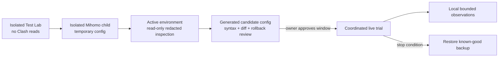

# Observation and Live-Trial Plan

Version: v0.1
Status: design accepted; persistent recorder and live configuration writes are not implemented

## 1. Read-only baseline found on 2026-08-02

A redacted structural inspection of the current Clash Verge Rev application directory confirmed these layers without outputting configuration values:

| Artifact | Observed role |
| --- | --- |
| `profiles.yaml` | Registry with `current` and `items` structure |
| `profiles/*.yaml` | Remote/local and merge profile material; 16 files observed |
| `profiles/*.js` | Script profile material; 4 files observed |
| `verge.yaml` | Clash Verge application and integration settings |
| `config.yaml` | Core listener/controller/TUN settings |
| `dns_config.yaml` | DNS settings layer |
| `clash-verge.yaml` | Generated effective runtime configuration |
| `clash-verge-rev-backup/` | Existing backup archives |
| `logs/` and `service-logs/` | Application and service runtime logs |

This inventory proves that a durable integration cannot assume `clash-verge.yaml` is the only source of truth. Before a future write, the active entry in `profiles.yaml` and its merge/script bindings must be resolved read-only.

No subscriptions, proxy nodes, secrets, controller credentials, rule contents, or log contents were printed or copied into this repository.

## 2. Operational lanes

The first two lanes remain the default development path. Read-only inspection may happen earlier to discover compatibility constraints, but it does not authorize configuration replacement or reload.

## 3. Proposed observation schema

| Field | Default | Purpose | Privacy treatment |
| --- | --- | --- | --- |
| `timestamp` | On | Order events and measure duration | Timezone-independent timestamp |
| `trial_session_id` | On | Group one controlled trial | Random per trial; no account identifier |
| `network_profile_id` | On | Separate home/campus/hotspot behavior | Locally derived pseudonymous ID |
| `target_id` | On | Join repeated observations | Local keyed digest by default |
| `hostname` | Off | Human diagnosis when digest is insufficient | Cleartext only with explicit diagnostic switch |
| `destination_port` / `transport` | On | Scope learned policy correctly | Required routing metadata |
| `current_rule_lane` | On | Compare static baseline and SmartRoute | Category/reason, not full rule-provider content |
| Candidate path/stage/latency/failure | On | Explain Direct/Proxy evidence | Structured enum and duration |
| Selected path/reason code | On | Audit automatic decisions | Structured enum |
| Client-visible outcome | On when measurable | Detect refresh/retry/regression | Success/failure/timing only |
| Process identity | Off | Diagnose application-specific behavior | Separate opt-in; normalize locally |
| Aggregate byte counts | Off initially | Estimate avoidable proxy traffic | Enable only after validation |

Never record:

- Application payloads or packet captures.
- URL paths, query strings, HTTP headers, cookies, form data, or credentials.
- Subscription URLs, proxy credentials, controller secrets, or TLS session secrets.
- Full DNS cache dumps or unrelated Clash logs.

## 4. Storage and retention requirements

The first recorder should use local JSONL for schema iteration before SQLite migrations are frozen.

| Control | Initial requirement |
| --- | --- |
| Default state | Off |
| Storage | Git-ignored local runtime directory |
| Default retention | 7 days for diagnostic records |
| Rotation | Size and day limits |
| User controls | Pause, resume, clear, export redacted summary |
| Export | Aggregate or explicitly reviewed rows only |
| Failure behavior | Recorder failure must not interrupt routing |

Raw observations must never be committed to GitHub. Analysis artifacts intended for the repository must contain aggregates or synthetic fixtures only.

## 5. Coordinated replacement procedure

The isolated Mihomo listener topology has passed on macOS/v1.19.29, but it also exposed the L1/L2 readiness gap. Configuration replacement will begin only after TLS readiness, sidecar-unavailable fallback, and rollback tests pass.

1. Agree on the trial network, time window, target traffic, and stop conditions.
2. Resolve the active profile plus merge/script layers read-only.
3. Create a fresh full backup without deleting existing backups.
4. Generate candidate files outside the Clash application directory.
5. Validate syntax and topology using the pinned isolated Mihomo process.
6. Present a redacted before/after diff and exact affected paths.
7. After owner confirmation, replace only the approved durable layer and reload once.
8. Run a short connectivity smoke test and begin bounded local recording.
9. Roll back immediately on connectivity loss, recursive routing, abnormal CPU, unexpected domain exposure, or sidecar instability.
10. Stop recording, preserve a sanitized analysis bundle, and remove expired raw observations.

Until this procedure reaches step 7 with explicit confirmation, SmartRoute must not write to or reload the active Clash environment.
