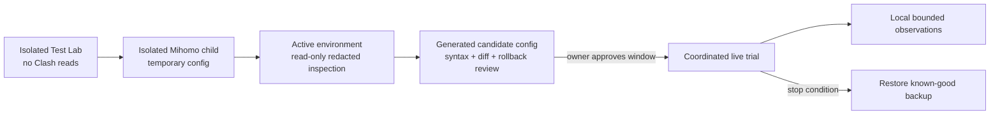

# Observation and Live-Trial Plan

Version: v0.1
Status: bounded recorder implemented; live configuration writes are not implemented

## 1. Read-only baseline found on 2026-08-02

A redacted structural inspection of the current Clash Verge Rev application directory confirmed these layers without outputting configuration values:

| Artifact | Observed role |
| --- | --- |
| `profiles.yaml` | Registry with `current` and `items` structure |
| `profiles/*.yaml` | Remote/local and merge profile material; 16 files observed |
| `profiles/*.js` | Script profile material; 4 files observed |
| `verge.yaml` | Clash Verge application and integration settings |
| `config.yaml` | Core listener/controller/TUN settings |
| `dns_config.yaml` | DNS settings layer |
| `clash-verge.yaml` | Generated effective runtime configuration |
| `clash-verge-rev-backup/` | Existing backup archives |
| `logs/` and `service-logs/` | Application and service runtime logs |

This inventory proves that a durable integration cannot assume `clash-verge.yaml` is the only source of truth. Before a future write, the active entry in `profiles.yaml` and its merge/script bindings must be resolved read-only.

No subscriptions, proxy nodes, secrets, controller credentials, rule contents, or log contents were printed or copied into this repository.

## 2. Operational lanes



The first two lanes remain the default development path. Read-only inspection may happen earlier to discover compatibility constraints, but it does not authorize configuration replacement or reload.

## 3. Proposed observation schema

| Field | Default | Purpose | Privacy treatment |
| --- | --- | --- | --- |
| `timestamp` | On | Order events and measure duration | Timezone-independent timestamp |
| `trial_session_id` | Planned | Group one controlled trial | Random per trial; no account identifier |
| `network_profile_id` | Implemented | Separate home/campus/hotspot behavior | HMAC with local salt; cleartext never persisted |
| `target_id` | Implemented | Join repeated observations | HMAC with the same local salt |
| `hostname` | Off by default; implemented switch | Human diagnosis when digest is insufficient | Cleartext only with `include_cleartext_hostname=true` |
| `destination_port` / `transport` | On | Scope learned policy correctly | Required routing metadata |
| `current_rule_lane` | Planned | Compare static baseline and SmartRoute | Category/reason, not full rule-provider content |
| Candidate path/stage/latency/failure | Implemented for emitted decision events | Explain Direct/Proxy evidence | Structured enum and duration |
| Selected path/reason code | Implemented | Audit automatic decisions | Structured enum |
| Privacy policy reason | Implemented when policy changes candidate set | Prove why Direct was skipped | Structured enum; never include the configured pattern text |
| Client-visible outcome | Planned | Detect refresh/retry/regression | Success/failure/timing only |
| Process identity | Off | Diagnose application-specific behavior | Separate opt-in; normalize locally |
| Aggregate byte counts | Off initially | Estimate avoidable proxy traffic | Enable only after validation |

Never record:

- Application payloads or packet captures.
- URL paths, query strings, HTTP headers, cookies, form data, or credentials.
- Subscription URLs, proxy credentials, controller secrets, or TLS session secrets.
- Full DNS cache dumps or unrelated Clash logs.

## 4. Storage and retention requirements

The Phase 0 recorder uses local JSONL for schema iteration before learned-policy SQLite migrations are frozen.

| Control | Initial requirement |
| --- | --- |
| Default state | Off |
| Storage | Git-ignored local runtime directory |
| Default retention | 7 days for diagnostic records |
| Rotation | Per-source size/count limits plus age pruning at rotation |
| User controls | `observations status`, `pause`, `resume`, paused plus confirmed `clear`, and `export` |
| Export | Already-pseudonymized JSONL only; excludes salt, markers and symlinks |
| Failure behavior | Recorder failure must not interrupt routing |

Raw observations must never be committed to GitHub. Analysis artifacts intended for the repository must contain aggregates or synthetic fixtures only.

The Phase 0 stdout `DecisionEvent` and `DiagnosticEvent` gained an optional `policy_reason` field in ADR-0007. This is an additive experimental-schema change; consumers must tolerate its absence on non-TLS or pre-policy failures. JSONL schema v1 stores the bounded form. It is not a learned-policy database and has no SQLite migration.

ADR-0008 adds an independent `supervisor` lifecycle event. It contains service state, attempt, bounded failure class and backoff only—never a target, hostname or child error string—and is not part of learned routing evidence.

ADR-0009 implements the recorder. When enabled, raw runtime events are not duplicated to stdout; target and network-profile identity default to HMAC-SHA-256 with a local random salt. The salt remains local and is excluded from export. A later write failure emits at most one warning per process and routing continues.

ADR-0010 adds optional `other_observation` to successful runtime decisions and JSONL v1. It is present only when the opposite path completed before the winner was selected. An absent value means the candidate was still running, never started, or unavailable under single-path policy; absence must never be converted into a failure counter.

ADR-0011 adds optional `learning_reason` and `policy_state` to the same decision row. The default `shadow` mode records state changes without changing candidate order. `ephemeral-auto` may apply a process-local preferred order, but it still races/falls back to the opposite path and loses all preference state on restart. These fields are diagnostic evidence, not durable exported rules.

ADR-0012 adds a separate SQLite schema for cross-session strong evidence. It stores an HMAC target key, safe session ID, direction, readiness stages, bounded failure class and timestamp—never cleartext hostname/profile.

ADR-0013 connects that schema to `serve` only when `learning.persistence.enabled` is explicitly true. Strong pairs enter a non-blocking bounded queue; `durable_reason` reports queued/full/closed status, and write errors never change the connection. Startup integrity/pruning failures are explicit before the listener opens. This is evidence collection only: the runtime never loads a route from SQLite. Before a live trial enables it, backup/restore must be rehearsed; until destructive clear exists, any deletion of the database, WAL/SHM files, and `.key` requires a separately approved exact manual scope.

ADR-0014 implements read-only status plus a verified snapshot lifecycle. `learning backup` uses SQLite online backup and includes the HMAC key; the result is recoverable but not redacted and must be protected like the live store. `verify-backup` checks the manifest/checksums and SQLite contents without modifying the source. `restore` writes only to a new database path and never changes configuration. Before a live trial, run status, create and verify a fresh backup, restore it to a disposable new path, validate that restored status matches, then remove the disposable copy through a separately approved cleanup action. Destructive clear remains intentionally unimplemented.

ADR-0015 adds `durable_learning_assessment` after a strong row is written. Its target follows the recorder's HMAC/optional-cleartext policy; its body contains only aggregate wins, distinct sessions, thresholds, state, reason, and optional suggested path. Both-direction evidence is always conflicting. Trial analysis may measure suggestion coverage and contradiction rate, but must not label a suggestion as an applied route or claim latency improvement from it. `learning evaluate` accepts an exact hostname locally and does not echo it, but command-line history/process-list exposure must be considered.

ADR-0016 adds identity-free `learning report`. It groups inside SQLite and never returns target keys. Record `generated_at`, `since`, retention and thresholds with every captured report. The trial worksheet must label `targets_with_evidence` as a selected strong-pair sample; do not divide it by all visited domains unless an independently measured total-target denominator exists. Report suggestion/conflict counts alongside connection success, latency and proxy-usage baselines, never as a substitute for them.

Operational commands:

```bash
smartroute observations status -config PATH
smartroute observations pause -config PATH
smartroute observations resume -config PATH
smartroute observations export -config PATH -destination NEW_DIRECTORY
smartroute observations clear -config PATH -confirm-clear
```

## 5. Coordinated replacement procedure

The isolated Mihomo listener topology and minimal L3 TLS readiness recovery have passed on macOS/v1.19.29. Runtime Direct-probe privacy enforcement, shadow/ephemeral learning, preferred-order recovery, independent Guard/engine supervision, and recorder privacy/lifecycle controls are implemented and tested locally. The new Mihomo stop/restart scenarios still need a permitted platform run, and supervisor failure itself still requires an OS service boundary. Configuration replacement will begin only after those availability checks, rollback tests, and a broader real-TLS compatibility matrix pass.

1. Agree on the trial network, time window, target traffic, and stop conditions.
2. Resolve the active profile plus merge/script layers read-only.
3. Create a fresh full backup without deleting existing backups.
4. Generate candidate files outside the Clash application directory.
5. Validate syntax and topology using the pinned isolated Mihomo process.
6. Present a redacted before/after diff and exact affected paths.
7. After owner confirmation, replace only the approved durable layer and reload once.
8. Run a short connectivity smoke test and begin bounded local recording.
9. Roll back immediately on connectivity loss, recursive routing, abnormal CPU, unexpected domain exposure, or sidecar instability.
10. Stop recording, preserve a sanitized analysis bundle, and remove expired raw observations.

Until this procedure reaches step 7 with explicit confirmation, SmartRoute must not write to or reload the active Clash environment.
