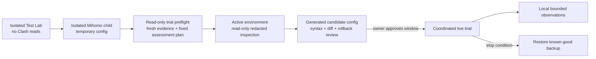

# Observation and Live-Trial Plan

Version: v0.11
Status: first coordinated bounded live trial active; initial readiness and automatic-policy reuse verified

## 1. Read-only baseline found on 2026-08-02

A redacted structural inspection of the current Clash Verge Rev application directory confirmed these layers without outputting configuration values:

| Artifact | Observed role |
| --- | --- |
| `profiles.yaml` | Registry with `current` and `items` structure |
| `profiles/*.yaml` | Remote/local and merge profile material; 16 files observed |
| `profiles/*.js` | Script profile material; 4 files observed |
| `verge.yaml` | Clash Verge application and integration settings |
| `config.yaml` | Core listener/controller/TUN settings |
| `dns_config.yaml` | DNS settings layer |
| `clash-verge.yaml` | Generated effective runtime configuration |
| `clash-verge-rev-backup/` | Existing backup archives |
| `logs/` and `service-logs/` | Application and service runtime logs |

This inventory proves that a durable integration cannot assume `clash-verge.yaml` is the only source of truth. Before a future write, the active entry in `profiles.yaml` and its merge/script bindings must be resolved read-only.

No subscriptions, proxy nodes, secrets, controller credentials, rule contents, or log contents were printed or copied into this repository.

## 2. Operational lanes



The first two lanes remain the default development path. Read-only inspection may happen earlier to discover compatibility constraints, but it does not authorize configuration replacement or reload.

## 3. Proposed observation schema

| Field | Default | Purpose | Privacy treatment |
| --- | --- | --- | --- |
| `timestamp` | On | Order events and measure duration | Timezone-independent timestamp |
| `trial_session_id` | Implemented | Group supervisor, Guard, engine and child restarts within one controlled trial | Random `trial-` + 128-bit hex; arbitrary labels rejected; aggregate reports omit IDs |
| `connection_id` | Implemented for Sidecar terminal/relay events | Join one adaptive connection's decision or diagnostic to its relay outcome | Fresh random `conn-` + 128-bit hex; never a learning/identity key; aggregate reports omit IDs and expose completeness counts only |
| `declared_baseline_path` | Implemented for Sidecar terminal/relay events | Compare adaptive selection with the operator-declared original `Other/MATCH` Direct/Proxy category | Enum only; preflight requires separate confirmation; explicitly not a live rule trace or executed counterfactual |
| `network_profile_id` | Implemented | Separate home/campus/hotspot behavior | HMAC with local salt; cleartext never persisted |
| `target_id` | Implemented | Join repeated observations | HMAC with the same local salt |
| `hostname` | Off by default; implemented switch | Human diagnosis when digest is insufficient | Cleartext only with `include_cleartext_hostname=true` |
| `destination_port` / `transport` | On | Scope learned policy correctly | Required routing metadata |
| `current_rule_lane` | Planned | Later verify an actual static rule-lane result rather than a declaration | Category/reason, not full rule-provider content; requires active-integration contract |
| Candidate path/stage/latency/failure | Implemented for emitted decision events | Explain Direct/Proxy evidence | Structured enum and duration |
| Adaptive decision-to-readiness latency | Implemented for successful TLS decisions | Include stagger and fallback time from post-ClientHello decision start to L3 | Integer milliseconds; no wall-clock correlation |
| Selected path/reason code | Implemented | Audit automatic decisions | Structured enum |
| Privacy policy reason | Implemented when policy changes candidate set | Prove why Direct was skipped | Structured enum; never include the configured pattern text |
| Client-visible outcome | Planned | Detect refresh/retry/regression | Success/failure/timing only |
| Process identity | Off | Diagnose application-specific behavior | Separate opt-in; normalize locally |
| Post-commit adaptive relay byte counts | Implemented with recorder | Measure observed Direct/Proxy relay volume and cancellation | Directional integer counts only; no payload; not total wire/system traffic |
| Post-commit direction end reasons | Implemented with recorder | Distinguish bounded EOF/timeout/reset/closed/I/O-error/canceled endings per copy direction | Fixed enum only; raw errors discarded; not application success or learned path failure |

Never record:

- Application payloads or packet captures.
- URL paths, query strings, HTTP headers, cookies, form data, or credentials.
- Subscription URLs, proxy credentials, controller secrets, or TLS session secrets.
- Full DNS cache dumps or unrelated Clash logs.

## 4. Storage and retention requirements

The Phase 0 recorder uses local JSONL for schema iteration before learned-policy SQLite migrations are frozen.

| Control | Initial requirement |
| --- | --- |
| Default state | Off |
| Storage | Git-ignored local runtime directory |
| Default retention | 7 days for diagnostic records |
| Rotation | Per-source size/count limits plus age pruning at rotation |
| User controls | `observations status`, paused `report`, `pause`, `resume`, paused plus confirmed `clear`, and `export` |
| Export | Already-pseudonymized JSONL only; excludes salt, markers and symlinks |
| Failure behavior | Recorder failure must not interrupt routing |

Raw observations must never be committed to GitHub. Analysis artifacts intended for the repository must contain aggregates or synthetic fixtures only.

The Phase 0 stdout `DecisionEvent` and `DiagnosticEvent` gained an optional `policy_reason` field in ADR-0007. Observation JSONL schema 1 stored that bounded decision-era form. Schema 2 adds `relay_outcome`, schema 3 adds a random per-connection correlation scope, schema 4 adds the declared original-policy path category, and schema 5 adds two bounded relay direction-end tokens. The report reader accepts all five versions, while new recorders write version 5. This remains separate from the learned-policy SQLite database.

ADR-0008 adds an independent `supervisor` lifecycle event. It contains service state, attempt, bounded failure class and backoff only—never a target, hostname or child error string—and is not part of learned routing evidence.

ADR-0009 implements the recorder. When enabled, raw runtime events are not duplicated to stdout; target and network-profile identity default to HMAC-SHA-256 with a local random salt. The salt remains local and is excluded from export. A later write failure emits at most one warning per process and routing continues.

ADR-0010 adds optional `other_observation` to successful runtime decisions and JSONL v1. It is present only when the opposite path completed before the winner was selected. An absent value means the candidate was still running, never started, or unavailable under single-path policy; absence must never be converted into a failure counter.

ADR-0011 adds optional `learning_reason` and `policy_state` to the same decision row. ADR-0036 establishes the exact last-known-good mapping, and ADR-0037 makes canonical `auto` the default: the first path to reach TCP/TLS readiness is remembered immediately, without approval, repeat counters, session promotion, tiers, or TTL. A hit opens one candidate; selected-path pre-commit failure triggers one sequential opposite fallback, and opposite readiness overwrites the mapping. The old Shadow/ephemeral engine is not instantiated in `auto`.

ADR-0012 adds a separate SQLite schema for cross-session strong evidence. It stores an HMAC target key, safe session ID, direction, readiness stages, bounded failure class and timestamp—never cleartext hostname/profile.

ADR-0013 connects that schema to `serve`; default `auto` enables local persistence. Changed mappings enter a non-blocking bounded queue; `durable_reason` reports queued/full/closed status, and write errors never change the current connection. Startup loads a bounded HMAC policy index and connection lookup never queries SQLite. Before a live trial, backup/restore must be rehearsed; automatic policies have a dedicated evidence-retaining clear command.

ADR-0014 implements read-only status plus a verified snapshot lifecycle. `learning backup` uses SQLite online backup and includes the HMAC key; the result is recoverable but not redacted and must be protected like the live store. `verify-backup` checks the manifest/checksums and SQLite contents without modifying the source. `restore` writes only to a new database path and never changes configuration. Before a live trial, run status, create and verify a fresh backup, restore it to a disposable new path, validate that restored status matches, then remove the disposable copy through a separately approved cleanup action. Destructive clear remains intentionally unimplemented.

ADR-0015 adds `durable_learning_assessment` after a strong row is written. Its target follows the recorder's HMAC/optional-cleartext policy; its body contains aggregate wins, sessions, thresholds, state, reason, and optional path. Both-direction evidence is conflicting. The raw event remains diagnostic; ADR-0036 independently lets global `durable-auto` remember the actual ready winner immediately, without using that assessment as a gate. Trial analysis must still distinguish analytical suggestion, last-known-good selection, readiness, and application outcome. `learning evaluate` accepts an exact hostname locally and does not echo it, but shell history/process-list exposure must be considered.

ADR-0016 adds identity-free `learning report`. It groups inside SQLite and never returns target keys. Record `generated_at`, `since`, retention and thresholds with every captured report. The trial worksheet must label `targets_with_evidence` as a selected strong-pair sample; do not divide it by all visited domains unless an independently measured total-target denominator exists. Report suggestion/conflict counts alongside connection success, latency and proxy-usage baselines, never as a substitute for them.

ADR-0017's process-local systemic-health transitions remain part of the legacy diagnostic path. ADR-0037 excludes them from `auto`: a both-path failure cannot write a mapping, so the default path needs no separate freeze lifecycle. Historical `learning_health` rows remain diagnostic and never mean the current route changed.

ADR-0018 introduced paused `observations report` with readiness counts, ratios, p50/p95/p99 timing, distinct target/profile counts, and explicit interpretation flags—never hashes. `readiness_success_ratio` is the fraction of recorded adaptive attempts reaching the current TCP/TLS commit gate, not application or client-visible success. `decision_readiness_latency_ms` starts after the safe ClientHello and privacy decision; `winner_candidate_latency_ms` starts later at the winner candidate itself. ADR-0022 subsequently adds bounded post-commit adaptive relay bytes, and ADR-0024 adds a declared original-policy comparison. The report still has no verified runtime rule lane, client outcome, wire overhead, or executed baseline byte denominator, so it cannot calculate `avoidable_proxy_ratio`, end-to-end success, or counterfactual/total traffic savings.

ADR-0019 adds random trial scoping. When recording is enabled, `supervise` generates one `trial-<128-bit hex>` identifier and passes it to Guard and engine; restarts retain it. Human-readable labels are rejected. The ID remains in pseudonymous JSONL/export for within-trial joining, but aggregate reports output only `trial_sessions_observed` and `unscoped_events`. It is not the network profile and is not the SQLite evidence session. Standalone Guard/engine processes generate separate IDs unless the operator explicitly passes one shared generated-format value.

ADR-0020 adds `trial preflight`. Both lab reports carry a schema version and UTC generation time. Preflight strictly validates their isolation/scenario evidence, requires observation recording to be enabled and paused, applies separate Direct/cleartext/ephemeral-auto/durable-auto acknowledgments, and matches a verified backup to any existing durable store. ADR-0024 adds a separate acknowledgment for the declared original-policy listener. ADR-0027 additionally fixes the random trial session, decoded-config fingerprint, assessment window, and thresholds in a digested plan before activation. Warnings do not block readiness; failures do. The command does not pause/resume, run a lab, inspect Clash, or authorize active Clash changes.

ADR-0021 makes runtime shutdown ordering deterministic. Sidecar and Guard close pending handshakes and both relay endpoints when canceled, then wait for every accepted handler before returning. Only after that return may the supervisor-side process close its recorder and durable writer. This is an explicit stop-window interruption: it is not a route failure, must not enter learning, and cannot be transparently replayed.

ADR-0039 closes the remaining process-level fallback gap. A remembered TLS path can consume at most half the total readiness timeout, preserving the rest for one opposite attempt. `make runtime-lab` verifies this through the real composer, pinned Mihomo, actual `supervise` children and policy-only SQLite across process restarts. It also verifies that `auto` attaches no typed-nil legacy evidence writer. This lab is required before a live candidate install but does not authorize it.

ADR-0040 requires the runtime to reach `armed` before the candidate is installed and reloaded. `smartroute doctor` verifies only local port availability and SOCKS5 method negotiation: `baseline` means all five ports are free, `armed` means Engine/Guard are ready while forced listeners remain free, and `running` means all five are SOCKS-ready. Rollback restores and reloads the original script while Engine/Guard are still running, checks `armed`, and only then stops the supervisor.

ADR-0041 makes automatic effect visible in the maintained aggregate. Report v7 counts `automatic_*` learning results, durable policy queue results, and fixed-path selected/fallback route reasons without returning target, connection, or session identity. Unknown reason tokens fail closed without echoing their contents.

ADR-0022 adds one engine `relay_outcome` after a committed relay ends. It stores only HMAC-scoped target metadata, selected path, post-commit directional byte counts, duration, and `ended`/`canceled`; it never stores copied bytes or raw errors. The report aggregates these values by Direct/Proxy and rejects counter overflow. Remote bytes may include replayed TLS ServerHello and are not application success. Client→remote excludes the TLS ClientHello sent during readiness. The totals omit static-rule connections, Guard-original traffic and wire overhead, so they cannot by themselves prove `avoidable_proxy_ratio` or total proxy savings.

ADR-0023 adds `connection_id` to schema 3. One fresh random non-semantic scope is shared by a Sidecar connection's `decision` or `diagnostic` and its eventual `relay_outcome`. Exact target/path contradictions and duplicate scoped rows make reporting fail, while window-truncated outcomes or decisions are counted as unmatched/missing. Those counts are completeness signals, never route failures. Generation failure leaves rows explicitly unscoped without affecting the connection. Local raw debug output when persistence is disabled, JSONL and export retain the pseudonymous scope for authorized joins; report v3 emits only scoped/unscoped/paired/missing counts and never an ID. Guard correlation remains out of scope.

ADR-0024 adds `declared_baseline_path` to schema 4. It copies validated `original_fallback` as the operator-declared category behind `original_endpoint`; it is not read from a live Clash rule trace. Report v4 counts baseline-scoped committed selections, same/changed decisions, Direct-instead-of-Proxy and Proxy-instead-of-Direct, plus the actual post-commit bytes carried by changed winners. Those bytes are not what the unexecuted baseline would have transferred and must never be labeled savings. Schema-1/2/3 rows remain baseline-unscoped. Controlled-trial preflight now requires explicit confirmation that the declaration matches the planned original-policy listener.

ADR-0025 adds schema-5 `client_to_remote_end` and `remote_to_client_end`. `netrelay` maps copy completion to only `eof`, `timeout`, `reset`, `closed`, `io_error`, or explicit lifecycle `canceled`, then discards the raw error. Recorder/report validation refuses arbitrary strings and inconsistent canceled state without echoing the rejected value. Report v5 aggregates each direction separately; schema-2/3/4 relay rows are `unclassified`. EOF does not mean the TLS/HTTP/application operation succeeded, and timeout/reset/I/O-error does not become learning evidence.

ADR-0026 adds read-only `trial assess` after a trial is stopped and recording is paused. ADR-0027 removes post-trial window/threshold selection: assessment must strictly load a successful current preflight report, validate its plan digest and current config fingerprint, and build the current report for the planned session from the later of preflight time and the planned rolling-window lower bound. ADR-0041 advances that aggregate to report v7 with bounded automatic learning/writer reason counts. It fail-closes on missing/unexpected/unscoped sessions, insufficient committed sample, low connection/baseline scope, incomplete terminal/relay pairs, excessive lifecycle cancellation, contradictions, or missing interpretation flags. A pass is `ready_for_descriptive_analysis` only; static baseline verification, client outcome, policy change, and active Clash authorization remain false.

Test Lab report v2 is now the local data-plane prerequisite. Preflight requires all three base routing rows plus the four-step last-known-good sequence and validates selected/learned paths, stable reason codes, exact Direct/Proxy attempt counts, domain preservation, and TCP/TLS verification fields. A forged top-level `passed: true` or correct scenario names with inconsistent fields are rejected.

Operational commands:

```bash
smartroute observations status -config PATH
smartroute observations pause -config PATH
smartroute observations report -config PATH -hours 168
smartroute observations resume -config PATH
smartroute observations clear -config PATH -confirm-clear
smartroute trial preflight -config PATH \
  -testlab-report TESTLAB_JSON \
  -mihomo-lab-report MIHOMO_LAB_JSON \
  -acknowledge-direct-probes \
  -acknowledge-original-baseline \
  -assessment-window 168h > PREFLIGHT_JSON
smartroute supervise -config PATH -trial-session SESSION_FROM_PREFLIGHT -acknowledge-direct-probes
smartroute trial assess -config PATH -preflight-report PREFLIGHT_JSON
```

## 5. Coordinated replacement procedure

The isolated Mihomo listener topology, minimal L3 TLS readiness recovery, Guard engine-stop/original-fallback/rebind recovery, and full transformed `supervise`/SQLite restart contract have passed on macOS arm64/v1.19.29. Runtime Direct-probe privacy enforcement, automatic last-known-good overwrite, independent Guard/engine supervision, and recorder privacy/lifecycle controls are implemented and tested locally. The first live window demonstrated that a terminal-owned Supervisor can disappear while the durable Clash transform remains; the macOS trial now uses a user LaunchAgent generated from the exact pinned runbook. Configuration replacement remains a coordinated action with an exact private backup and rollback command.

1. Agree on the trial network, target traffic, stop conditions, assessment window/thresholds, and manually confirm `original_fallback` matches the planned `original_endpoint` policy; capture and locally protect a successful fresh `trial preflight` report.
2. Resolve the active profile plus merge/script layers read-only.
3. Create a fresh full backup without deleting existing backups.
4. Run `make runtime-lab`, then generate or re-verify candidate files outside the Clash application directory.
5. Validate syntax and topology using the pinned isolated Mihomo process.
6. Present a redacted before/after diff and exact affected paths.
7. Prepare a private runtime workspace, require `doctor -phase baseline`, and keep its exact reverse-order runbook.
8. Resume bounded recording, start `supervise` with the fixed random session, require `doctor -phase armed`, then transfer top-level ownership to the verified OS-service boundary before any active reload.
9. After owner confirmation, replace only the approved durable layer and reload once; require `doctor -phase running` immediately.
10. Run local Guard plus normal TUN connectivity smokes, then begin the short normal-use window.
11. Roll back immediately on connectivity loss, recursive routing, abnormal CPU, unexpected domain exposure, or sidecar instability. Restore the original script and reload while Guard is still alive, require `armed`, then stop/drain the supervisor and require `baseline`.
12. Pause recording, run `trial assess` with the same preflight report, and only if the window is ready for descriptive analysis generate/preserve both observation and learning reports; configuration or plan drift requires a new trial. Remove expired raw observations under the existing retention/clear controls.

Until this procedure reaches step 9 with explicit confirmation, SmartRoute must not write to or reload the active Clash environment.
