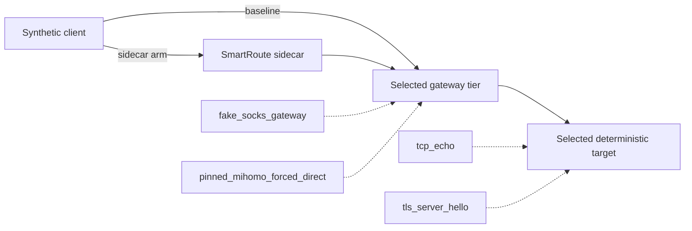

# Sidecar Overhead Benchmark

Version: v0.3
Status: fake/pinned-Mihomo gateway tiers and TCP-echo/TLS-ServerHello protocol cells implemented; TUN/full-handshake validation pending

## 1. Measurement contract

`smartroute-benchmark-lab` compares two alternating paths to the same loopback gateway and deterministic target. The gateway is either an in-process fake SOCKS server or an explicitly supplied pinned Mihomo forced-DIRECT listener. The protocol is either a one-byte exact echo or an exact parsed ClientHello-to-valid-ServerHello readiness exchange.



| Property | Contract |
| --- | --- |
| Default repetitions | 5 runs × 200 measured pairs |
| Warmup | 20 unreported pairs before every run |
| Ordering | Alternating baseline-first and sidecar-first pairs |
| Statistics | Nearest-rank p50/p95/p99 in microseconds; signed paired delta |
| Gate | Worst run's paired p95 ≤ 5000µs |
| Default exit behavior | Correctness enforced; latency reported but not enforced |
| Explicit enforcement | `-enforce` |
| Proxy path | Must receive zero attempts |
| External/active environment | No external network, Clash, system proxy, or TUN access |

| Tier | Baseline | Additional contract |
| --- | --- | --- |
| `fake_socks_gateway` | Client → in-process Direct SOCKS gateway | Exact gateway attempt count and domain preservation are observable |
| `pinned_mihomo_forced_direct` | Client → pinned Mihomo forced-DIRECT listener | Explicit binary, version/config validation, dedicated healthy child, temporary home, synthetic DNS, domain-form target |

| Protocol | Timed completion boundary | Correctness evidence |
| --- | --- | --- |
| `tcp_echo` | Exact one-byte echo returned | Measured responses plus all gateway attempts where observable |
| `tls_server_hello` | Parsed ClientHello sent and exact structurally valid ServerHello returned | Measured responses plus every measured/warmup ClientHello accepted by the target; no `early_data` |

Run:

```bash
make benchmark-lab
make benchmark-tls
```

Run the isolated pinned-Mihomo tier after preparing the locked upstream:

```bash
make benchmark-mihomo
make benchmark-mihomo-tls
```

For an explicitly enforced local gate:

```bash
go run ./cmd/smartroute-benchmark-lab \
  -mihomo .cache/tools/mihomo-v1.19.29 \
  -runs 5 -samples 200 -warmup 20 \
  -max-p95-overhead 5ms -enforce
```

## 2. Current TCP echo results

### Fake SOCKS gateway

Verified command on 2026-08-02:

```bash
GOCACHE=/tmp/smartroute-go-cache \
  go run ./cmd/smartroute-benchmark-lab \
  -runs 5 -samples 200 -warmup 20 \
  -max-p95-overhead 5ms -enforce
```

Environment and aggregate result:

| Field | Result |
| --- | ---: |
| Platform | macOS / arm64 |
| Go | 1.26.5 |
| GOMAXPROCS | 14 |
| Measured pairs | 1000 |
| Baseline p50 / p95 / p99 | 180 / 262 / 333µs |
| Sidecar p50 / p95 / p99 | 298 / 436 / 507µs |
| Paired overhead p50 / p95 / p99 | 117 / 246 / 313µs |
| Worst per-run paired p95 | 256µs |
| Maximum single paired delta | 408µs |
| Payloads verified | 2000 / 2000 |
| Direct selections | 1100 / 1100 including warmups |
| Proxy attempts | 0 |
| Explicitly enforced provisional 5ms gate | Passed |

This isolates the current empty-load local SmartRoute hop from Mihomo. It is not evidence for active Mihomo, TUN, TLS, real destinations, loaded-system tails, energy use, or user-visible application latency.

### Pinned-Mihomo forced-DIRECT

Verified command on 2026-08-02:

```bash
GOCACHE=/tmp/smartroute-go-cache \
  go run ./cmd/smartroute-benchmark-lab \
  -mihomo .cache/tools/mihomo-v1.19.29 \
  -runs 5 -samples 200 -warmup 20 \
  -max-p95-overhead 5ms -enforce
```

| Field | Result |
| --- | ---: |
| Platform | macOS / arm64 |
| Go / Mihomo | Go 1.26.5 / Mihomo v1.19.29 isolated build |
| GOMAXPROCS | 14 |
| Measured pairs | 1000 |
| Baseline p50 / p95 / p99 | 176 / 275 / 324µs |
| Sidecar p50 / p95 / p99 | 287 / 408 / 484µs |
| Paired overhead p50 / p95 / p99 | 109 / 200 / 270µs |
| Worst per-run paired p95 | 231µs |
| Maximum single paired delta | 1132µs |
| Payloads verified | 2000 / 2000 |
| Direct selections | 1100 / 1100 including warmups |
| Proxy attempts | 0 |
| Mihomo config / child health | Validated / healthy at measurement completion |
| Explicitly enforced provisional 5ms gate | Passed |

`direct_gateway_attempts_available=false` is intentional for this tier: Mihomo does not expose the fake gateway's in-process attempt counter. Exact echoes prove the requested domain-form path reached the synthetic target, but zero is not presented as a measured Direct attempt count.

The incremental sidecar p95 remained sub-millisecond across both TCP echo gateway tiers on this machine.

## 3. Current TLS ServerHello readiness results

Both commands use the same structurally validated fragmented ClientHello without `early_data`, and stop only after `tlsinspect.ReadServerHello` accepts the exact expected ServerHello.

### Fake SOCKS gateway

```bash
GOCACHE=/tmp/smartroute-go-cache \
  go run ./cmd/smartroute-benchmark-lab -tls \
  -runs 5 -samples 200 -warmup 20 \
  -max-p95-overhead 5ms -enforce
```

| Field | Result |
| --- | ---: |
| Baseline p50 / p95 / p99 | 179 / 273 / 350µs |
| Sidecar p50 / p95 / p99 | 308 / 431 / 569µs |
| Paired overhead p50 / p95 / p99 | 129 / 228 / 303µs |
| Worst per-run paired p95 | 249µs |
| Maximum single paired delta | 467µs |
| ServerHello responses verified | 2000 / 2000 |
| ClientHellos accepted including warmups | 2200 / 2200 |
| Direct selections | 1100 / 1100 |
| Direct gateway attempts | 2200 / 2200 |
| Proxy attempts | 0 |
| Explicitly enforced provisional 5ms gate | Passed |

### Pinned Mihomo forced-DIRECT

```bash
GOCACHE=/tmp/smartroute-go-cache \
  go run ./cmd/smartroute-benchmark-lab \
  -mihomo .cache/tools/mihomo-v1.19.29 -tls \
  -runs 5 -samples 200 -warmup 20 \
  -max-p95-overhead 5ms -enforce
```

| Field | Result |
| --- | ---: |
| Baseline p50 / p95 / p99 | 172 / 248 / 318µs |
| Sidecar p50 / p95 / p99 | 304 / 426 / 536µs |
| Paired overhead p50 / p95 / p99 | 132 / 230 / 300µs |
| Worst per-run paired p95 | 254µs |
| Maximum single paired delta | 1378µs |
| ServerHello responses verified | 2000 / 2000 |
| ClientHellos accepted including warmups | 2200 / 2200 |
| Direct selections | 1100 / 1100 |
| Proxy attempts | 0 |
| Mihomo config / child health | Validated / healthy at measurement completion |
| Explicitly enforced provisional 5ms gate | Passed |

These results include SmartRoute's ClientHello parsing, candidate write, L3 ServerHello gate, and exact prefetched-byte replay. They do not complete TLS Finished, validate a certificate, negotiate HTTP, or observe application success.

## 4. Required follow-up before a product claim

Repeat the same pre-registered command on permitted macOS and Linux machines, then add:

- full TLS handshake and HTTP/client-visible completion;
- concurrent connection and sustained relay throughput tiers;
- idle versus controlled CPU/load conditions;
- system-proxy and TUN entry paths in a user-coordinated test window.

Do not combine this microbenchmark with route-quality observations to claim end-to-end benefit. Those are separate denominators and experiments.
