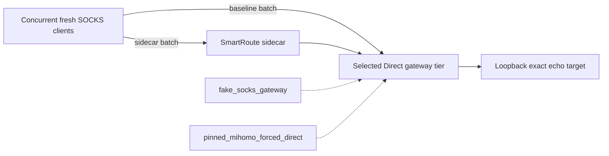

# Concurrent Relay Load Lab

Version: v0.3
Status: fixed fake and pinned-Mihomo sweep implemented; provisional throughput-ratio gate remains missed

## 1. Scope

`smartroute-load-lab` measures concurrent, sustained chunked echo relay separately from the fresh-connection latency benchmark.



| Property | Default |
| --- | ---: |
| Runs | 3 |
| Concurrent measured connections per arm | 16 |
| Verified one-way payload per connection | 1 MiB |
| Chunk size | 32 KiB |
| Warmup per arm and run | 4 connections × 64 KiB |
| Arm ordering | Baseline-first, sidecar-first, baseline-first |
| Provisional minimum sidecar/baseline ratio | 0.70 |
| Default gate behavior | Report-only |

Each connection writes one deterministic chunk, reads and verifies the exact echo, then continues. `one_way_payload_bytes` is the throughput numerator. `bidirectional_relay_bytes` is twice that value because the same bytes travel to the target and back; it does not mean simultaneous full-duplex transmission.

This contract is intentionally not maximum throughput, WAN behavior, application success, CPU/energy efficiency, or authorization for an active trial.

## 2. Commands

```bash
make load-lab
make load-mihomo
make load-sweep
make load-sweep-mihomo
```

Explicit enforcement is optional:

```bash
go run ./cmd/smartroute-load-lab \
  -runs 3 -concurrency 16 \
  -bytes-per-connection 1048576 -chunk-bytes 32768 \
  -warmup-connections 4 \
  -min-throughput-ratio 0.70 -enforce
```

Because the current machine misses 0.70, that command is expected to exit non-zero while still printing its complete JSON report. Correctness failures always exit non-zero even without `-enforce`.

`smartroute-load-sweep` runs a fixed six-cell matrix: concurrency 1/4/16/64 at 1 MiB, plus concurrency 16 at 64 KiB and 8 MiB. It deliberately does not accept arbitrary cells so repeated evidence remains comparable. Every cell retains the exact correctness contract and report-only 0.70 threshold.

The runner also samples Go runtime allocation, GC, and user-CPU counters around each arm. These counters cover only the current Go process; they exclude kernel work and the separately owned Mihomo child. Allocation deltas are useful for shape diagnosis. CPU deltas over these short intervals are scheduler-sensitive diagnostics and must not become a gate.

Load report schema 2 adds the measured-arm `pacing` object and optional aggregate offered load used by the Capacity Lab. Existing unpaced commands keep the same workload and expose `pacing.enabled=false`; schema 1 readers must be updated if they reject unknown fields. No stored production data uses this report schema.

## 3. macOS arm64 results

Verified on 2026-08-02 with Go 1.26.5 and GOMAXPROCS 14.

| Field | Fake SOCKS | Pinned Mihomo v1.19.29 |
| --- | ---: | ---: |
| Measured connections per arm | 48 / 48 | 48 / 48 |
| Verified one-way bytes per arm | 50,331,648 | 50,331,648 |
| Bidirectional relay bytes per arm | 100,663,296 | 100,663,296 |
| Baseline throughput median | 1326.37 MiB/s | 1366.12 MiB/s |
| Sidecar throughput median | 891.81 MiB/s | 939.24 MiB/s |
| Throughput ratio median | 0.672 | 0.688 |
| Worst per-run ratio | 0.668 | 0.677 |
| Direct selections including warmups | 60 / 60 | 60 / 60 |
| Fake Direct attempts | 120 / 120 | unavailable by contract |
| Proxy attempts | 0 | 0 |
| Correctness | Passed | Passed |
| Provisional 0.70 ratio gate | Missed | Missed |

The first run in both tiers showed a cold/scheduler outlier that made sidecar appear faster than baseline. Alternating order and a worst-run gate keep that outlier visible rather than treating it as improvement. The two later runs converged near 0.67–0.69.

The result establishes two things only: the current relay remains byte-correct under this load, and an additional local hop has measurable cost at loopback speeds. At approximately 0.9 GiB/s sidecar payload throughput, this may be immaterial on ordinary Internet links, but that is an inference to test—not a product conclusion.

### Fixed sweep evidence

The same machine then ran every fixed cell for three alternating-order runs. All connection, byte, Direct-selection, target, and Proxy-zero checks passed in both tiers. Selected stable cells are below; the ratio is sidecar divided by baseline.

| Gateway | Cell | Baseline median | Sidecar median | Median ratio | Worst ratio | Allocation ratio |
| --- | --- | ---: | ---: | ---: | ---: | ---: |
| Fake SOCKS | 16 × 1 MiB | 1347.26 MiB/s | 890.97 MiB/s | 0.667 | 0.633 | 1.40 |
| Pinned Mihomo | 16 × 1 MiB | 1406.10 MiB/s | 957.91 MiB/s | 0.681 | 0.681 | 1.67 |
| Fake SOCKS | 16 × 8 MiB | 1544.79 MiB/s | 1028.62 MiB/s | 0.665 | 0.661 | 1.41 |
| Pinned Mihomo | 16 × 8 MiB | 1593.98 MiB/s | 1063.73 MiB/s | 0.665 | 0.663 | 1.69 |
| Fake SOCKS | 64 × 1 MiB | 1441.93 MiB/s | 936.40 MiB/s | 0.649 | 0.630 | 1.41 |
| Pinned Mihomo | 64 × 1 MiB | 1458.69 MiB/s | 965.37 MiB/s | 0.657 | 0.651 | 1.68 |

The 16 × 8 MiB cell is the strongest sustained-relay evidence: both gateway tiers independently converge to a 0.665 median ratio with narrow per-run ranges. Allocation totals remain nearly constant between 64 KiB, 1 MiB, and 8 MiB at the same concurrency, while increasing with connection count. This localizes most extra allocation to per-connection setup and copy buffers, not payload-size growth. It does not explain away the stable throughput ratio: an additional TCP relay still adds another user-space copy and scheduling boundary on macOS.

ADR-0033 therefore retains `io.Copy` for now. A buffer pool might reduce allocation count, but it would retain application bytes across connection lifetimes unless explicitly cleared and is not supported by evidence as a fix for sustained throughput. Linux may also use `splice` through the current standard-library path, so a global buffered replacement could regress another platform.

## 4. Follow-up matrix

| Follow-up | Purpose |
| --- | --- |
| Repeat fixed sweep on controlled/idle hosts | Quantify run-to-run and machine variance |
| Chunk sweep | Quantify request/echo pacing overhead |
| Long unidirectional stream | Estimate a different upper-bound shape without echo RTT pacing |
| Differential profiles, RSS, energy | Attribute costs that short process-runtime deltas cannot |
| Controlled link RTT/bandwidth/loss | Evaluate whether local overhead remains material below loopback speed |
| TUN/system-proxy paths | Measure real entry boundaries only in a coordinated opt-in window |

Do not lower the provisional gate based only on these results. Profile and repeat under declared conditions first.
