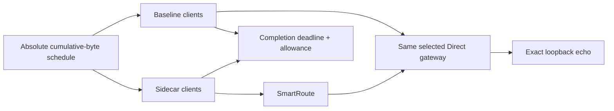

# Offered-Load Capacity Lab

Version: v0.1
Status: fixed fake and pinned-Mihomo loopback matrices implemented; 8 Gbps cell exposes the current local capacity boundary

## 1. Question and non-claim

The unpaced Load Lab shows the maximum shape of this particular loopback request/echo workload. It does not answer the more useful question: when application demand is below that ceiling, does the extra SmartRoute hop still delay completion?

`smartroute-capacity-lab` answers that narrower question with a fixed client-paced offered-load matrix. It is not a network emulator and does not claim to model bandwidth queues, congestion control, RTT, loss, Wi-Fi, TUN, or application success.



Each measured connection has an equal share of the aggregate one-way demand. After every verified echo, the client waits until its absolute cumulative-byte deadline. If the path falls behind, the wait becomes zero and the final `deadline_overrun_us` exposes the deficit. Warmups are deliberately unpaced and excluded from measured bytes.

## 2. Fixed contract

| Field | Default |
| --- | ---: |
| Runs per cell | 2, alternating arm order |
| Concurrent measured connections | 16 |
| Verified one-way bytes per connection | 1 MiB |
| Chunk size | 32 KiB |
| Aggregate offered-load cells | 100, 500, 1000, 5000, 8000 Mbps |
| Relative deadline allowance | 3% |
| Minimum absolute allowance | 1 ms |
| Performance enforcement | Never; report-only |

The allowance is `max(target_duration × 3%, 1 ms)`. A cell is comparable only when baseline meets its deadline. A sidecar miss in a cell where baseline also misses is not attributed to SmartRoute. Correctness remains mandatory; performance results never authorize a live trial or policy change.

Commands:

```bash
make capacity-lab
make capacity-mihomo
```

## 3. Initial macOS arm64 evidence

Verified on 2026-08-02 with Go 1.26.5, GOMAXPROCS 14, and pinned Mihomo v1.19.29.

| Tier | Offered load | Deadline allowance | Baseline worst overrun | Sidecar worst overrun | Result |
| --- | ---: | ---: | ---: | ---: | --- |
| Fake SOCKS | 100 Mbps | 40,265 µs | 1,999 µs | 1,374 µs | Both meet |
| Fake SOCKS | 500 Mbps | 8,053 µs | 4,290 µs | 1,410 µs | Both meet |
| Fake SOCKS | 1,000 Mbps | 4,026 µs | 1,431 µs | 895 µs | Both meet |
| Fake SOCKS | 5,000 Mbps | 1,000 µs | 280 µs | 274 µs | Both meet |
| Fake SOCKS | 8,000 Mbps | 1,000 µs | 164 µs | 1,937 µs | Baseline meets; sidecar misses |
| Pinned Mihomo | 100 Mbps | 40,265 µs | 1,887 µs | 2,032 µs | Both meet |
| Pinned Mihomo | 500 Mbps | 8,053 µs | 1,343 µs | 1,355 µs | Both meet |
| Pinned Mihomo | 1,000 Mbps | 4,026 µs | 1,285 µs | 453 µs | Both meet |
| Pinned Mihomo | 5,000 Mbps | 1,000 µs | 168 µs | 181 µs | Both meet |
| Pinned Mihomo | 8,000 Mbps | 1,000 µs | 161 µs | 1,410 µs | Baseline meets; sidecar misses |

Every cell completed 32/32 measured connections per arm, exact byte counts, all expected Direct selections, and zero Proxy attempts. All ten baseline cells met their deadlines, so every comparison is attributable under this contract.

The evidence supports a bounded conclusion: on this machine and workload, SmartRoute keeps pace through 5 Gbps of aggregate verified one-way demand, and its local capacity boundary becomes visible at 8 Gbps. This explains why an unpaced loopback ratio near 0.665 does not translate into a proportional slowdown at 100 Mbps, 500 Mbps, or 1 Gbps demand. It does not establish performance on a real network or guarantee all applications below 5 Gbps.

## 4. Follow-up gates

| Follow-up | Missing evidence addressed |
| --- | --- |
| Repeat matrix across idle/load states and machines | Stability and host dependence |
| Add a framed, pipelined unidirectional workload | Remove request/echo turn-taking shape |
| Controlled RTT/bandwidth/loss environment | Actual transport behavior rather than client pacing |
| Real TUN/system-proxy entry | OS integration overhead in an explicit live window |
| Application-level success and QoE | Whether routing benefit outweighs admission and relay cost |
