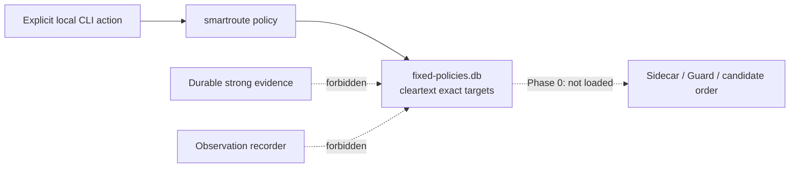

# Fixed Policy Management Plane

Version: v0.1
Status: manual exact-target lock/list/revoke implemented; runtime activation deliberately not implemented

## 1. Boundary

The fixed-policy management plane gives the user a durable place to express exact Direct/Proxy intent without converting SQLite Shadow suggestions into routes.



This manual database is intentionally not an active runtime input. ADR-0036 implements a separate automatic last-known-good layer inside the HMAC durable-evidence store; it does not copy rows into this cleartext user-authored database. Manual-lock activation remains a separate future decision because explicit user intent and precedence differ from an automatically self-overwriting mapping.

## 2. Rule scope and lifecycle

| Field | Phase 0 contract |
| --- | --- |
| Network profile | Exact, required |
| Hostname/IP | Exact cleartext value, normalized locally |
| Port | Exact, 1–65535 |
| Transport | TCP only |
| Path | Direct or Proxy |
| Source | Always `manual` |
| Expiration | Optional; omitted means a permanent user lock |
| Replacement | New explicit lock revokes the prior active rule for the same scope in one transaction |
| Revocation | By random non-semantic `policy-...` ID; retained as history |

Automatic suggestions, suffix rules, process scope, UDP/QUIC activation, imports, and Clash exports are not implemented.

## 3. Commands

Listing is read-only and does not create a missing database:

```bash
go run ./cmd/smartroute policy list \
  -config configs/smartroute.example.json
```

Create a permanent manual Proxy lock:

```bash
go run ./cmd/smartroute policy lock \
  -config configs/smartroute.example.json \
  -network-profile manual-experimental \
  -hostname api.example.com -port 443 -transport tcp \
  -path proxy
```

Use `-expires-in 72h` for an expiring lock. Revoke by the returned identifier:

```bash
go run ./cmd/smartroute policy revoke \
  -config configs/smartroute.example.json \
  -id policy-0123456789abcdef0123456789abcdef
```

`policy list -all` includes expired and revoked history. Every output is local JSON. The lock command prints an explicit warning that runtime activation is not implemented.

## 4. Storage, privacy, and failure

Unlike the HMAC-pseudonymous evidence database, this store contains user-authored cleartext exact targets so they can be reviewed and edited. The database is created with mode `0600` under a `0700` parent directory where possible. SQLite transactions, WAL, `quick_check`, strict schema versioning, constraints, and a single active rule per exact scope protect consistency.

| Condition | Behavior |
| --- | --- |
| Missing database during list | Return `database_exists=false`; create nothing |
| Corrupt/unreadable database | Return an error; never replace or delete it |
| Future schema | Reject; do not migrate or downgrade |
| Invalid hostname/scope/path | Reject before writing |
| Existing active exact scope | Revoke it and insert the explicit replacement transactionally |
| Runtime startup | Does not inspect the policy database |

Backup/restore/export and destructive clear are not yet implemented. Until lifecycle tooling exists, this database and its WAL/SHM files must be handled as one sensitive local unit.

## 5. Activation gate

Runtime integration must prove all of the following before this status changes:

1. Privacy-first and `never_direct_probe` still prevent a Direct lock from opening a Direct candidate.
2. A fixed Direct/Proxy lock has a machine-readable decision source and never masquerades as learned evidence.
3. Single-path failure never triggers transparent application-data replay.
4. A corrupt or unavailable policy store fails to the original-policy Guard boundary, not to an undocumented route.
5. Revocation and expiration take effect predictably across supervisor restarts.
6. Durable `direct_suggested`/`proxy_suggested` remain diagnostic until a separately authorized promotion flow exists.
