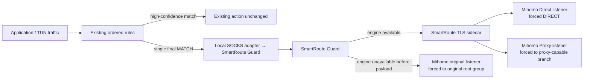

# Active Clash Verge Rev read-only compatibility snapshot

Version: v0.2
Status: verified read-only snapshot; transform candidate validated in isolation; no candidate applied
Inspected: 2026-08-03

## 1. Scope and redaction

This snapshot records only the structure needed to design SmartRoute's integration with the user's active Clash Verge Rev installation. The inspection read these application-support artifacts:

| Artifact | Read-only purpose |
| --- | --- |
| `verge.yaml` | Identify enabled runtime surfaces and whether TUN/system proxy are in use |
| `profiles.yaml` | Identify the active profile type and selected merge/script/rules/proxies/groups layers |
| `config.yaml` | Distinguish application/runtime overrides from the generated full configuration |
| `clash-verge.yaml` | Count rules/groups and resolve the final catch-all graph |
| Active merge/script/rules/proxies/groups profile files | Determine which layer owns DNS/TUN, rules, groups, and final transformation behavior |
| Local Unix controller `GET /proxies` | Classify the current final-group selection without returning any names |

No subscription URL, profile identifier, profile/group/node name, controller path, controller secret, server address, credential, complete rule, domain list, browsing record, or log line was printed or copied. No file, controller state, system proxy, TUN setting, or process was changed.

## 2. Verified active structure

| Property | Redacted result | Integration consequence |
| --- | --- | --- |
| Active base profile | Remote profile | Candidate integration must survive subscription refresh |
| Selected enhancement layers | Merge + script + rules + proxies + groups are all active | Editing generated output or replacing one layer blindly would discard existing behavior |
| Generated mode | `rule` | Final rule action is the correct interception boundary |
| Generated rules | 1,286 total; exactly one `MATCH`; `MATCH` is last | SmartRoute can replace one unambiguous catch-all without moving higher-confidence rules |
| Final action | A two-member `select` group | Existing catch-all is complete; nothing falls through beyond it |
| Catch-all branch 0 | Proxy-capable selector tree, including current proxy nodes and an optional Direct descendant | Use this branch as SmartRoute's Proxy candidate, not as the original-policy fallback |
| Catch-all branch 1 | Direct-only group | Existing user choice remains available inside the original root group |
| Current live selection | Root branch 0 → nested proxy selector → proxy node | At inspection time, every unmatched target is effectively proxied |
| Proxy graph | 39 proxy entries; 6 groups; 5 select + 1 fallback | Integration must reference existing groups, never copy node definitions |
| TUN | Enabled, system stack, auto-route enabled | A live trial is system-wide and must use the coordinated rollback procedure |
| DNS | Enabled, fake-IP mode | SmartRoute Phase 0 still evaluates TCP/TLS routing; DNS remains an existing Mihomo responsibility |
| Active merge | Owns `dns`, `profile`, and `tun` | Do not overload it with final-rule replacement logic |
| Active script | Has `main`, transforms rules and proxy groups, returns the config | SmartRoute must run after this existing transform |
| Active rules/proxies/groups layers | All selected | A generated composite must preserve all three layers and subscription refresh semantics |

This directly resolves the earlier “Other already catches everything” question: the concern is real in the current environment. SmartRoute must intercept the existing final `MATCH`; it cannot wait for traffic to escape it.

## 3. Minimal integration topology



The four Mihomo objects required by a candidate configuration are:

| Object | Purpose | Must reference |
| --- | --- | --- |
| Guard adapter proxy | Send the final catch-all into SmartRoute | Loopback Guard port |
| Direct listener | Candidate used for Direct readiness | `DIRECT` |
| Proxy listener | Candidate used for Proxy readiness | The discovered proxy-capable child of the original catch-all group |
| Original listener | Availability fallback when SmartRoute cannot accept a connection | The untouched original catch-all root group |

The final rule changes from `MATCH,<original-root>` to `MATCH,<guard-adapter>`. The original root and both child branches remain in the generated config and remain user-selectable; no node is copied or renamed.

## 4. Correct layer and generation order

The active script already mutates both rules and proxy groups, so SmartRoute must be applied after that script's current `main(config)` result:

```text
remote subscription
  → selected merge/rules/proxies/groups layers
  → existing active script main(config)
  → SmartRoute compatibility transform
  → isolated Mihomo syntax/topology validation
  → candidate file outside the application directory
```

Editing `clash-verge.yaml` is rejected because it is generated and would be overwritten. Replacing the active script outright is also rejected because it would silently drop current transformations. The candidate must be a generated composite that preserves the current script, fingerprints its inputs, and then applies one idempotent SmartRoute transform.

## 5. Candidate transform requirements

Before producing any live candidate, the transform must fail closed unless all of these are true:

1. Mode is `rule`.
2. Exactly one `MATCH` exists and it is the last rule.
3. Its action resolves to one existing root group.
4. Exactly one root child is Direct-only.
5. Exactly one other root child is proxy-capable.
6. Reserved SmartRoute proxy/listener names do not collide with existing objects.
7. Guard, Direct, Proxy, and Original ports are distinct literal loopback endpoints.
8. Reapplying the transform produces the same configuration rather than duplicate objects.
9. The result passes pinned Mihomo `-t` validation and the isolated full topology test.

Configuration drift in the active script, selected profile references, final rule, root group, or candidate branch graph invalidates the candidate and requires regeneration. No profile name or target identity is needed for this check.

## 6. Rollback boundary

The repository now contains `integrations/clash-verge/smartroute-transform.js` and a non-overwriting composer. Synthetic graph tests prove final-MATCH replacement, branch classification, collision rejection, and idempotency. The generated synthetic candidate also passes pinned Mihomo v1.19.29 `-t` validation through `make clash-transform-mihomo`.

A fresh read-only resolution of `profiles.yaml` also found the currently bound script item, composed that script into a private temporary file, and passed `node --check`. The temporary candidate was removed immediately. This checked compatibility with the active script's declaration shape without printing or copying its content into the repository. The active application directory was not written, and Clash was not reloaded. None of these checks authorize a live write or reload.

The stronger package flow in [Live-trial candidate package](14-live-trial-candidate-package.md) subsequently executed the composed script against the current generated configuration, proved the 1,285-rule high-confidence prefix unchanged, retained the original 1,286 total rule count, added one adapter and three listeners with zero group changes, and passed pinned-Mihomo validation. The active script remains in its original checksum state.

No rollback action is required for this snapshot because nothing was changed. A later coordinated trial must prepare, before writing:

- a fresh full Clash Verge Rev backup;
- the exact original selected script/profile references;
- a redacted semantic diff;
- a candidate generated outside the application directory;
- pinned-Mihomo syntax and topology results;
- a one-command restoration of the original selected layer plus one reload;
- stop conditions for Guard/engine failure, DNS regression, elevated latency, and widespread connection failure.

This document authorizes none of those writes. It only fixes the verified compatibility model used to build the isolated candidate.
