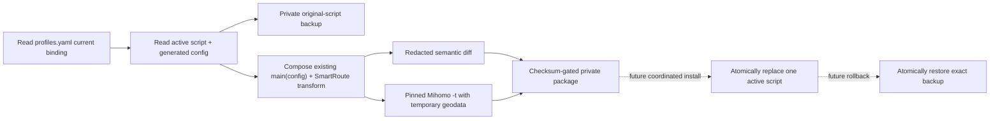

# Live-trial candidate package

Version: v0.2
Status: first coordinated live trial active; candidate installed and runtime topology verified
Last verified: 2026-08-04

## 1. Purpose

The candidate package converts the currently bound Clash Verge script into a recoverable SmartRoute trial artifact without editing the application directory. It is local and sensitive because it contains the original and composed scripts plus exact rollback paths and checksums.



## 2. Package contents

| Relative path | Sensitivity | Purpose |
| --- | --- | --- |
| `manifest.json` | Private metadata | Source/candidate SHA-256, redacted semantic counts, validation and safety claims |
| `private-rollback.json` | Sensitive | Exact active paths, expected binding/script hashes, original mode, relative candidate/backup paths |
| `backup/original-script.js` | Sensitive | Byte-exact source for rollback |
| `candidate/composed-script.js` | Sensitive | Existing script followed by the idempotent SmartRoute final-MATCH transform |

The manifest also records the exact five-address runtime topology. A candidate prepared before that field existed must be regenerated rather than guessed.

The package directory is mode `0700`; files are `0600`. It must remain outside the repository and active Clash directory. The full transformed configuration is used only in a removed temporary directory because it contains nodes and credentials; it is not retained in the package.

## 3. Commands

Synthetic package, install and rollback rehearsal:

```bash
make active-candidate-test
```

Prepare a read-only package from the current installation:

```bash
ruby scripts/prepare-active-clash-candidate.rb \
  --app-dir "$HOME/Library/Application Support/io.github.clash-verge-rev.clash-verge-rev" \
  --output /private/tmp/smartroute-live-candidate-YYYYMMDD-NN \
  --mihomo .cache/tools/mihomo-v1.19.29
```

Read-only verification:

```bash
ruby scripts/manage-active-clash-candidate.rb \
  --package /private/tmp/smartroute-live-candidate-YYYYMMDD-NN
```

Prepare a private runtime workspace while the active script is still original:

```bash
ruby scripts/prepare-live-trial-runtime.rb \
  --package /private/tmp/smartroute-live-candidate-YYYYMMDD-NN \
  --output /private/tmp/smartroute-live-runtime-YYYYMMDD-NN \
  --smartroute ./bin/smartroute \
  --network-profile live-current-network
```

The workspace pins the binary, generates absolute-path local state, starts observations paused with 3×1MiB per-source caps and 24-hour retention, preallocates a random session, and stores the exact activation/rollback sequence in `private-runbook.json`.

The following write commands are implemented and tested only against synthetic directories. Do not run them against the active package until the coordinated trial window:

```bash
ruby scripts/manage-active-clash-candidate.rb \
  --package PACKAGE --action install --confirm-write

ruby scripts/manage-active-clash-candidate.rb \
  --package PACKAGE --action rollback --confirm-write
```

Both actions atomically replace only the bound script and verify the resulting hash. They do not reload Clash, change controller state, system proxy, or TUN. The manager re-resolves `profiles.yaml` current profile → script UID → script file on every action and requires it to be the package's exact active path. Unrelated Verge metadata changes are allowed; a different current profile/script binding, escaped path, malformed binding, or script-content drift is rejected rather than overwritten. Rollback additionally requires the active script to match the exact candidate.

## 4. Current verified snapshot

The active trial uses private candidate `~/Library/Application Support/SmartRoute/live-candidate` and runtime `~/Library/Application Support/SmartRoute/live-runtime`, owned by the user LaunchAgent. The original `/private/tmp` candidate and stopped runtime remain untouched fallbacks for the current window. The durable runbook points install/rollback to the durable candidate, which re-verifies against the current binding before every action. The candidate must not be reused after subscription/profile/script/generated-config drift. Older package `-03` predates the exact topology/runtime-workspace contract and is not accepted by the new preparer.

| Check | Result |
| --- | --- |
| Active directory write/reload | One checksum-gated script install and one owner-confirmed Clash reactivation |
| Original rule count | 1,286 |
| Candidate rule count | 1,286 |
| High-confidence rule prefix | Byte-for-byte structured equality |
| Final MATCH | Replaced with local Guard adapter |
| Proxies | Exactly one adapter added |
| Proxy groups | Zero changes |
| Listeners | Exactly three forced loopback listeners added |
| Pinned Mihomo v1.19.29 | Configuration accepted |
| Full Runtime Lab | Real transform, Mihomo, `supervise`, policy-only persistence, restart reuse and opposite overwrite passed |
| Temporary validation dependencies | Read-only copies of standard GeoIP/MMDB files; removed with temporary home |
| Manager state | `candidate`; exact original backup retained |
| Runtime topology | `baseline` → `armed` → `running` all passed |
| Top-level owner | User LaunchAgent running from private Application Support; forced Supervisor termination produced a new PID and all five endpoints recovered |
| Initial live data | 34/34 readiness; 22 Direct, 12 Proxy; 20 target scopes; 20 new mappings; 14 same-path observations |

The first attempted active package correctly failed and removed itself because an empty Mihomo home lacked the active configuration's standard GeoIP/MMDB data. The generator now copies only recognized geodata files into the temporary validation home. Superseded `-01` and `-02` were removed; topology-less `-03` remains private but is obsolete and must not be used for another trial.

## 5. Live-trial state and rollback gate

Before installation, rerun `make runtime-lab`, verify the package, prepare a runtime workspace, and require `doctor -phase baseline`. Resume bounded recording, start `supervise`, and require `armed` before installing/reloading the candidate. After reload require `running`, verify normal Guard/DNS/TUN behavior, then begin the short traffic window.

Rollback is deliberately reversed: restore the original script and reactivate Clash while Engine/Guard remain alive, require `armed` to prove the forced listeners disappeared, then stop/drain the supervisor, pause recording, and require `baseline`. Any binding drift, parse failure, Guard/engine failure, DNS regression, or broad reachability regression triggers that sequence immediately.

The current install/reactivation was separately confirmed by the owner. This record does not authorize another install, reload, or future trial.
