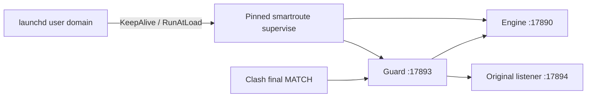

# macOS LaunchAgent runtime boundary

Version: v0.1
Status: experimental live-trial integration
Last verified: 2026-08-05

## 1. Problem and boundary

An active Clash transform is durable beyond the terminal that started SmartRoute. If a terminal-owned Supervisor disappears, the final `MATCH` still reaches the Guard adapter but `127.0.0.1:17893` has no listener. The user LaunchAgent makes the top-level Supervisor independent of the terminal while leaving Mihomo and Clash Verge Rev under their existing owners.



| Layer | Owns | Does not own |
| --- | --- | --- |
| LaunchAgent | Exact pinned Supervisor command and private process logs | Clash, Mihomo, TUN, profiles, subscriptions |
| Supervisor | Guard and Engine child restart/backoff | Its own OS lifetime, Mihomo |
| Guard | Pre-payload adaptive/original lane selection | Recovery when the Guard process itself is absent |

## 2. Safe generator

Default isolated validation:

```bash
make macos-launch-agent-test
```

The test uses a removed temporary runtime, does not call `launchctl`, does not bind a port, and does not inspect active Clash.

Generate a plist for a previously verified private runtime:

```bash
ruby scripts/prepare-macos-launch-agent.rb \
  --runtime /private/tmp/smartroute-live-runtime-YYYYMMDD-NN \
  --output /private/tmp/smartroute-live-runtime-YYYYMMDD-NN/service/io.github.firfisa.smartroute.plist \
  --label io.github.firfisa.smartroute
```

The generator requires and checks:

| Input | Gate |
| --- | --- |
| Runtime directory | Existing private directory with no group/other permissions |
| Binary | Exact executable under `bin/smartroute` |
| Config | Exact runtime `config.json`, accepted by the pinned binary |
| Runbook | Schema 1 with exactly one `start_supervisor` step |
| Arguments | Direct pinned-binary `supervise` invocation with exact config and random runbook session |
| Output | New linted plist; no overwrite |
| Logs | Private `service-logs/stdout.log` and `stderr.log` paths under the runtime |

Before long-running activation, a stopped temporary runtime can be moved without deleting its source:

```bash
ruby scripts/relocate-live-runtime.rb \
  --source /private/tmp/smartroute-live-runtime-YYYYMMDD-NN \
  --output "$HOME/Library/Application Support/SmartRoute/live-runtime"
```

The relocator requires Engine and Guard ports to be free, copies the private runtime, rebases every source-root path in config/runbook metadata, validates the pinned config and learning database, removes stale copied plists, and leaves the source intact for recovery.

## 3. Coordinated live lifecycle

Installing and loading the plist is a live operation and requires an explicit trial window. The generic macOS commands are:

```bash
cp RUNTIME/service/io.github.firfisa.smartroute.plist \
  "$HOME/Library/LaunchAgents/io.github.firfisa.smartroute.plist"
launchctl bootstrap "gui/$(id -u)" \
  "$HOME/Library/LaunchAgents/io.github.firfisa.smartroute.plist"
launchctl print "gui/$(id -u)/io.github.firfisa.smartroute"
smartroute doctor -phase running -config RUNTIME/config.json
```

Do not load it concurrently with another Supervisor using the same ports. During a foreground-to-launchd handoff, install the verified plist first, drain the foreground Supervisor, bootstrap immediately, and require `doctor -phase running`. If bootstrap or doctor fails, restart the verified foreground Supervisor or execute the candidate rollback sequence.

To end the trial safely:

1. Restore the original script using the verified candidate manager.
2. Reload/reactivate Clash while Guard remains alive.
3. Require `doctor -phase armed`.
4. Run `launchctl bootout "gui/$(id -u)/io.github.firfisa.smartroute"`.
5. Require `doctor -phase baseline`.
6. Only then remove the installed plist if desired.

Never boot out or delete the service first while the active final `MATCH` still targets Guard.

## 4. Current evidence and limitations

On 2026-08-05 the live runtime was moved to `~/Library/Application Support/SmartRoute/live-runtime`, and the user LaunchAgent entered `running` with one Supervisor plus Guard and Engine children. A deliberate `SIGTERM` changed the Supervisor PID, increased the LaunchAgent run count from 1 to 2, and all five `running` topology checks passed afterward. The migration and restart test did not write or reload Clash.

The sensitive candidate and original-script backup were also copied to `~/Library/Application Support/SmartRoute/live-candidate`. The durable runbook contains no remaining reference to the temporary candidate and the copied package verifies against the current active `candidate` script state.

The v0.1.0 archive supplies a versioned standalone binary, but this is not yet a production installer:

- the runtime is durable user storage assembled from the packaged binary plus private local config/state;
- full logout/reboot validation has not yet been exercised;
- systemd and Windows service definitions are not implemented;
- LaunchAgent availability still cannot replay a connection that hit an outage window.
