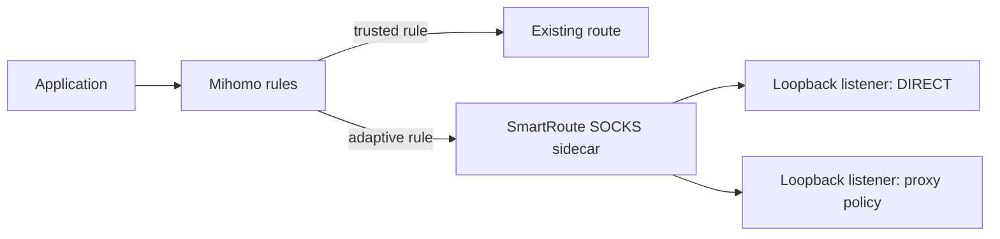

# ADR-0001: Sidecar-first architecture

- Status: Accepted
- Date: 2026-08-02
- Owners: SmartRoute maintainers

## Context

SmartRoute needs to compare Direct and Proxy paths for traffic selected by low-confidence rules or the final catch-all. A controller that only observes Mihomo after routing cannot reliably recover the first connection, while a full Mihomo or Clash Verge Rev fork would introduce large maintenance costs before the product hypothesis is validated.

Mihomo supports local SOCKS outbounds and listeners with a forced proxy target. At the locked v1.19.29 source, `listener/inbound/base.go` decodes `proxy` into `SpecialProxy`, `listener/inbound/mixed.go` passes that addition into the mixed listener, and `tunnel/tunnel.go` resolves `SpecialProxy` before normal rule matching. Its SOCKS inbound/outbound utilities preserve a domain-form target through `metadata.Host`. This source evidence permits an experimental topology in which Mihomo sends adaptive traffic to a local SmartRoute SOCKS sidecar, and the sidecar opens candidates through two loopback-only Mihomo listeners: one forced to `DIRECT`, one forced to the user's proxy policy. End-to-end runtime behavior remains unverified.

## Decision

Phase 0–2 will implement SmartRoute as a separate Go process.

Runtime learned policy remains inside the sidecar initially. Rule-provider export is optional and must not be required for correctness.

## Alternatives considered

| Alternative | Reason not selected now |
| --- | --- |
| External controller plus synthetic probes | Cannot reliably rescue the first real connection and may not reproduce application behavior |
| Fork Mihomo immediately | Best long-term data-plane access, but too costly before validating routing benefit |
| Fork Clash Verge Rev immediately | Improves UI integration but does not create the required data-plane semantics |
| Browser extension | Easier, but cannot cover system-level TUN traffic |

## Consequences

Positive:

- The core hypothesis can be tested without modifying proxy protocols or TUN code.
- The decision engine remains independently testable and upstream-compatible.
- Failure can fall back to the user's original routing policy.

Negative:

- A local SOCKS hop adds overhead.
- Some process, DNS, or TUN metadata may be lost at the sidecar boundary.
- The listener topology and loop prevention require version-specific integration tests.
- Generic UDP/QUIC support remains out of scope.

## Validation and rollback

- Validate the topology on each supported Mihomo version and operating system.
- Measure known-policy sidecar p95 overhead; the initial gate is below 5ms.
- If the sidecar is unavailable, restore the original `MATCH` route.
- Move logic into a Mihomo fork only after the migration conditions in `docs/02-technical-design.md` are met.
