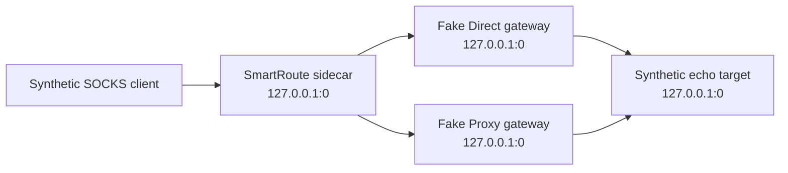

# ADR-0002: Isolated-by-default network test lab

- Status: Accepted
- Date: 2026-08-02
- Owners: SmartRoute maintainers

## Context

SmartRoute must eventually integrate with Mihomo, but development occurs on machines where Clash Verge Rev may be carrying the user's active network traffic. Reusing the active profile, controller, TUN, ports, or application data would make a failed test capable of disrupting normal connectivity. Tests based on public websites would also be nondeterministic and would turn real censorship, DNS, or routing behavior into an unstable fixture.

## Decision

Automated SmartRoute tests are isolated by default and use a layered test model.

| Tier | Environment | Default automation | Purpose |
| --- | --- | ---: | --- |
| 1 | Pure unit tests and `net.Pipe` | Yes | Protocol parsing, decisions, cancellation, state transitions |
| 2 | In-process loopback Test Lab on OS-assigned ports | Yes | End-to-end SOCKS, racing, relay, deterministic faults |
| 3 | Separate pinned Mihomo process with generated temporary home/config | Explicit `make mihomo-lab` | Validate listener topology, hostname preservation, and readiness semantics |
| 4 | User's active Clash/Mihomo environment | Never | Manually authorized compatibility investigation only |

Tier 2 binds only literal loopback addresses with port `0`, makes no external network connection, and does not discover, read, or write Clash files. Tier 3 must use a temporary directory, newly allocated ports, a separately owned process, and no system proxy/TUN changes by default. Tier 4 requires explicit user authorization for the exact action and is never part of CI.

## Consequences

Positive:

- Routine development cannot overwrite or reload the user's active Clash profile.
- Timeout, reset, delay, and path-failure cases are deterministic.
- CI can validate real sockets and byte relay without depending on public websites.
- Domain-form SOCKS targets can be checked without leaking browsing history.

Negative:

- Fake gateways cannot prove all Mihomo and operating-system behavior.
- The isolated Mihomo tier cannot model active TUN, system proxy, selectors, sleep/wake, or real network changes.
- Loopback tests do not model real packet loss, TUN capture, sleep/wake, or network changes.

## Validation and rollback

- `go run ./cmd/smartroute-testlab` must report the isolation claims and scenario results as JSON.
- `go test -race ./...` must cover the Test Lab and candidate cancellation.
- CI runs the standalone Test Lab as a named step.
- The pinned Mihomo lab remains an explicit integration command and may run in a separately named workflow.
- If a future test needs non-loopback access or a Clash file, it must move to a separately named opt-in tier and supersede or amend this decision through an ADR.
