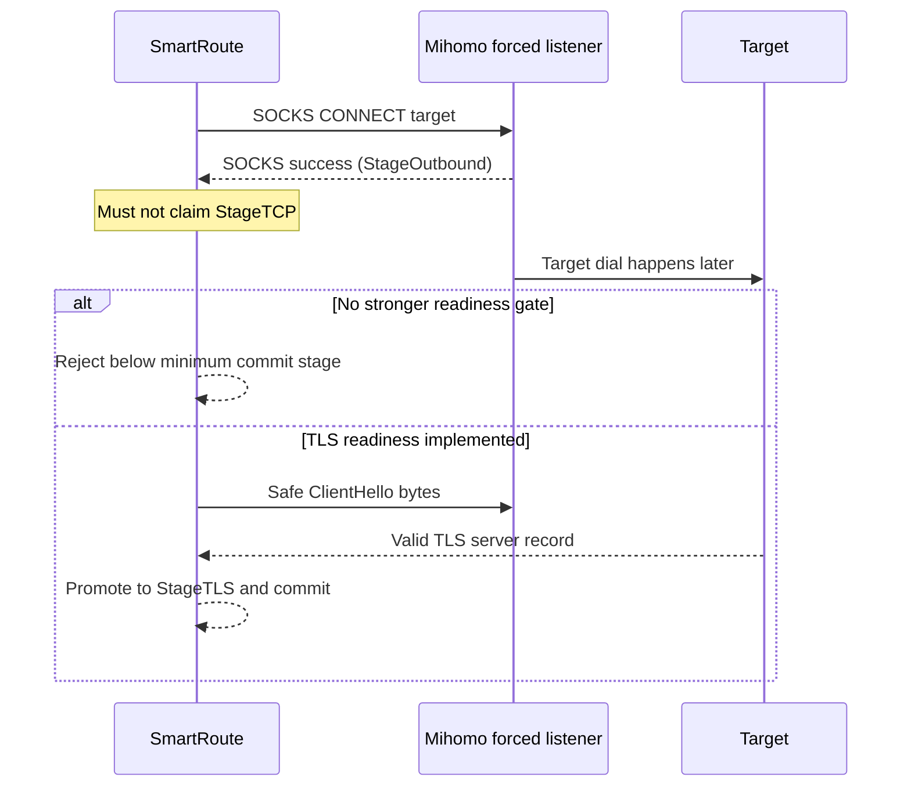

# ADR-0004: Mihomo SOCKS success is outbound admission, not target readiness

- Status: Accepted
- Date: 2026-08-02
- Owners: SmartRoute maintainers

## Context

The initial sidecar spike assumed that a successful SOCKS5 CONNECT reply from a Mihomo forced listener meant the listener had established the requested target TCP connection. The isolated v1.19.29 runtime lab disproved that assumption.

Mihomo's `transport/socks5.ServerHandshake` writes a successful CONNECT reply before `tunnel.HandleTCPConn` resolves and dials the selected outbound. In the runtime lab, a Direct listener returned SOCKS success for a synthetic domain whose Direct destination was unreachable. SmartRoute selected that apparent winner, after which the client received EOF. The forced Proxy listener independently routed the same domain correctly and preserved its domain form.

## Decision

1. A SOCKS CONNECT success from Mihomo is classified as `StageOutbound`, not `StageTCP`.
2. The sidecar's default minimum commit stage is `StageTCP`.
3. A candidate below the minimum stage is closed and reported as `candidate_below_commit_stage`; it is not committed or used as route-learning evidence.
4. A dialer may declare a stronger stage only when the endpoint contract is independently verified. The in-process fake gateways use `StageTCP` because they connect the synthetic target before replying.
5. Mihomo adaptive routing remains gated unless a protocol-aware layer proves stronger readiness. ADR-0005 now defines and implements the first HTTPS/TLS L3 path.

## Consequences

- The plain TCP path still fails safely with Mihomo candidate endpoints; experimental `serve` now admits only parsed TLS first flights and requires L3.
- The simple TCP Test Lab remains useful because its fake SOCKS gateways have a stronger, explicit connect-before-reply contract.
- The earlier phrase “first TCP-ready candidate” is removed from runtime documentation.
- Generic client-first TCP cannot be adaptively raced through these listeners without protocol semantics or historical policy.

## Evidence

- Locked source: `.upstream/mihomo/transport/socks5/socks5.go` writes the success reply inside `ServerHandshake` before passing the connection to the tunnel.
- Isolated runtime: `make mihomo-lab` verifies Direct, forced Proxy, domain preservation, loop prevention, the L1 gap, and ADR-0005 TLS recovery.
- The runtime uses a temporary Mihomo home, random loopback ports, local synthetic DNS, and no active Clash files or external network.
