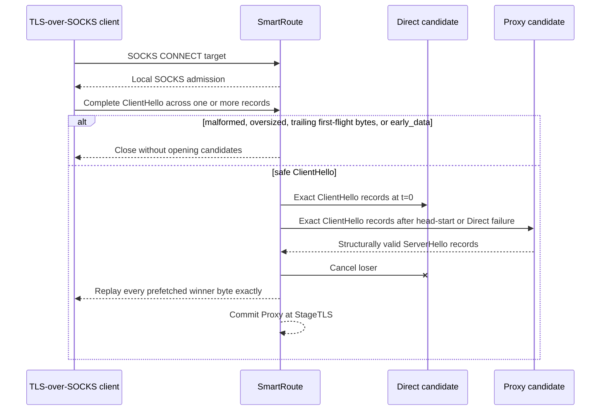

# ADR-0005: Race only a parsed TLS first flight without early data

- Status: Accepted
- Date: 2026-08-02
- Owners: SmartRoute maintainers

## Context

ADR-0004 proves that Mihomo's inbound SOCKS success is only L1 outbound admission. A SOCKS client, however, waits for CONNECT success before sending its TLS ClientHello. SmartRoute must therefore acknowledge the local SOCKS connection before it can inspect the first TLS flight, while avoiding any claim that a remote route is already ready.

TLS handshake messages may span records and transport reads. TLS 1.3 clients that offer `early_data` may send replay-sensitive application data before receiving ServerHello. A readiness gate that copies an arbitrary first read, ignores record fragmentation, or loses bytes read from the winner would violate the project's replay and correctness invariants.

## Decision

The experimental TLS sidecar uses this sequence:

1. `internal/tlsinspect` reads bounded TLS records until exactly one complete ClientHello is assembled.
2. Coalesced trailing first-flight bytes are rejected conservatively. The `early_data` extension is rejected before any candidate dial.
3. Only the validated ClientHello record sequence may be duplicated to Direct and Proxy.
4. A candidate succeeds only after a complete, structurally valid ServerHello. TLS alerts are classified as TLS-stage failures.
5. All ServerHello record bytes consumed by the gate are wrapped back onto the winner connection and replayed exactly to the client.
6. L3 means ServerHello readiness, not certificate validation, Finished verification, or application success.
7. Non-TLS and generic client-first TCP remain outside this adaptive mode.

## Alternatives considered

| Alternative | Why not selected |
| --- | --- |
| Commit on Mihomo SOCKS ACK | Proven false by ADR-0004 |
| Duplicate the first socket read | Breaks on fragmentation and may copy early application data |
| Complete two full TLS handshakes inside SmartRoute | Would terminate or interfere with end-to-end TLS state |
| Wait for full client TLS success before selecting | The client must already be bound to one path by then |
| Use only background synthetic probes | Cannot recover the first real HTTPS connection |

## Consequences

- HTTPS can recover its first connection when Direct accepts locally but never returns ServerHello and Proxy does.
- A duplicated ClientHello can make the same handshake fingerprint visible from two egress paths; this remains explicit-opt-in behavior and is forbidden for privacy-denied targets.
- The parser is deliberately bounded and conservative. Unusual but valid coalesced first flights may fall back rather than race.
- HelloRetryRequest uses the ServerHello structure and can select a path; subsequent client handshake bytes then stay on that single winner.
- Full certificate, ALPN, ECH, uTLS, middlebox-compatibility, and real-site coverage remain validation work, not completed claims.

## Evidence

- Unit tests cover fragmented ClientHello and ServerHello, malformed/truncated input, early-data rejection before dialing, TLS alerts, loser cancellation, and prefetched-byte replay.
- Sidecar `net.Pipe` tests cover local SOCKS admission, Proxy L3 commitment, early-data rejection with zero candidate attempts, and a complete Go `crypto/tls` 1.3 handshake plus encrypted echo through the winner.
- `make mihomo-lab` verifies macOS/v1.19.29 recovery from a Direct path with no ServerHello to a forced Proxy path with `stage_reached=tls`.
- The isolated run uses only temporary files, synthetic TLS/DNS services, and random loopback ports; it does not read or write active Clash state.
