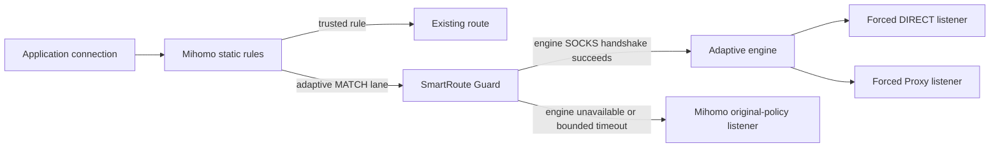

# ADR-0006: Put a small availability guard in front of the adaptive engine

- Status: Accepted
- Date: 2026-08-02
- Owners: SmartRoute maintainers

## Context

ADR-0001 requires traffic to return to the user's original routing policy when SmartRoute is unavailable. Pointing Mihomo `MATCH` directly at the adaptive sidecar does not satisfy that invariant: if the sidecar process is stopped, a new connection fails at the local SOCKS hop.

Mihomo's `fallback` group is useful for health-based selection, but the locked v1.19.29 implementation cannot rescue this exact first connection. `adapter/outboundgroup/fallback.go` calls `findAliveProxy`, dials that one selected proxy, and returns its dial error. `onDialFailed` schedules health handling; `DialContext` does not dial the next member for the same connection.

## Decision

Run a small, separate Guard process between Mihomo's adaptive `MATCH` lane and the adaptive engine.

The Guard owns only availability selection:

1. Parse the inbound SOCKS target without forwarding application payload to either lane. Mihomo's earlier inbound ACK may allow bytes to buffer locally, but does not commit them to a remote route.
2. Attempt the loopback adaptive-engine SOCKS handshake with a short bounded timeout.
3. If that handshake fails, attempt the separately configured original-policy SOCKS listener for the same inbound connection.
4. Send SOCKS success to the immediate upstream (normally Mihomo) only after one lane accepts the target.
5. Emit a structured `guard_decision` event and relay bytes without interpreting or persisting payloads.

The adaptive engine remains responsible for Direct/Proxy evidence, TLS safety, and future learning. The original listener is owned by Mihomo and must be forced to the user's pre-SmartRoute catch-all policy so it cannot recurse through the Guard.

## Failure boundaries

| Failure | Current behavior | Transparent replay? |
| --- | --- | --- |
| Adaptive engine refuses or times out before its SOCKS handshake completes | Guard uses the original listener for the same client connection | No application payload has been forwarded to either lane |
| Adaptive engine fails after Guard committed the connection | Connection fails; record evidence for a later connection | No; post-commit payload is never replayed |
| Guard process is unavailable | Not yet protected by this change | No; needs supervisor and/or outer Mihomo health fallback |
| Adaptive and original listeners both fail | Guard returns SOCKS connection refused | No route promotion |

## Alternatives considered

| Alternative | Why not selected as the primary boundary |
| --- | --- |
| Mihomo `fallback` group only | Chooses before dialing and does not retry the current TCP connection after a selected member's dial failure |
| Rewrite `MATCH` dynamically when the sidecar fails | Reload timing cannot guarantee the first failed connection and creates a larger configuration mutation surface |
| Put fallback inside the adaptive engine | Cannot help when that process is stopped, wedged, or cannot bind its listener |
| Move everything into a Mihomo fork | Larger maintenance and GPL distribution boundary before the product hypothesis is validated |

## Consequences

Positive:

- A stopped or locally wedged adaptive engine can be bypassed before application payload is committed.
- The original catch-all policy remains an explicit independent lane rather than being reconstructed by SmartRoute.
- Engine crash/restart can be fault-tested without touching the active Clash installation.

Negative:

- There are now two SmartRoute processes and one additional loopback SOCKS hop.
- Guard availability itself becomes a separate residual risk.
- The short engine-handshake timeout must avoid both false fallback during startup pressure and long user-visible stalls.
- This mechanism covers TCP CONNECT only; it does not add UDP/QUIC adaptive semantics.

## Validation and rollback

- Unit tests verify adaptive selection, same-connection original fallback, bounded recovery from a wedged engine handshake, and dual failure.
- The isolated Mihomo Lab contains engine stop, fallback, restart, and adaptive-return scenarios. A platform run with loopback-process permission is required before this topology is called runtime-verified.
- Rollback removes the Guard adapter and restores the original `MATCH` destination; it does not require learned-state conversion.
- A coordinated live trial remains blocked until Guard-process failure protection, privacy enforcement, candidate-config rollback, and real TLS compatibility checks are complete.
