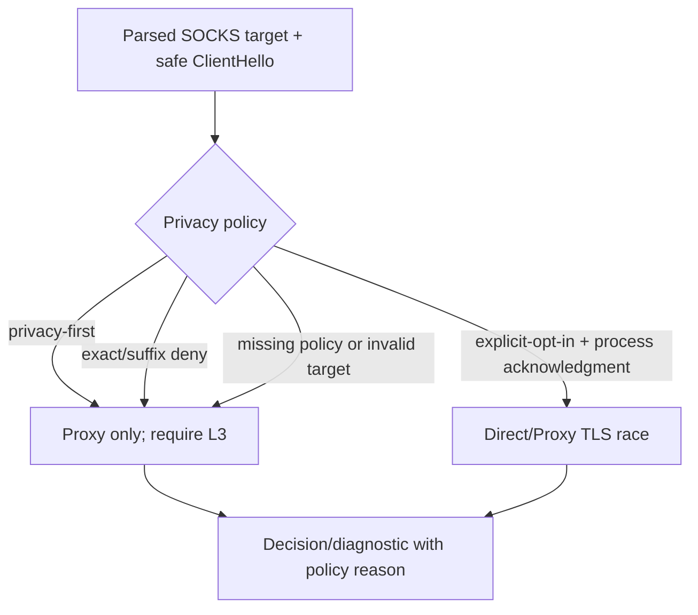

# ADR-0007: Enforce Direct-probe privacy before opening candidates

- Status: Accepted
- Date: 2026-08-02
- Owners: SmartRoute maintainers

## Context

The configuration already exposed `privacy.mode` and `privacy.never_direct_probe`, while the runtime still opened both Direct and Proxy candidates for every accepted TLS target. Validation without enforcement created a dangerous false sense of protection and contradicted the invariant that privacy-denied targets must never enter ClientHello duplication.

TLS L3 readiness remains useful for a forced Proxy path: the sidecar can send one parsed ClientHello to Proxy, require a structurally valid ServerHello, and replay every prefetched byte without creating a Direct observation.

## Decision

Compile a local privacy policy before `smartroute serve` binds its listener, then evaluate every parsed target before opening a TLS candidate.

### Matching contract

| Pattern | Meaning |
| --- | --- |
| `login.example` | Exact hostname only |
| `.private.example` | Apex plus every label-boundary subdomain |
| `*.private.example` | Same suffix semantics as the leading-dot form |
| `127.0.0.1` or an IPv6 literal | Exact IP only; suffix IP patterns are invalid |

Hostname comparison is ASCII case-insensitive and ignores one terminal DNS root dot. Suffix matching always uses a label boundary, so `.example` does not match `notexample`. Invalid configured patterns reject the entire configuration. An invalid runtime target, missing runtime policy, or unknown mode fails closed to Proxy-only.

### Mode behavior

1. `privacy-first` never opens Direct and does not require the CLI Direct-probe acknowledgment.
2. `explicit-opt-in` requires `-acknowledge-direct-probes`; matching deny entries still override that process-level acknowledgment.
3. A denied target uses `TLSRacer.ConnectPath(..., proxy)`, which preserves the same timeout, ClientHello safety, ServerHello L3 gate, and exact prefix replay as the paired race.
4. A Proxy-only success emits the privacy reason as the decision reason. A failure emits `privacy_proxy_path_failed`, the policy reason, `direct_failure=skipped_by_privacy`, and the classified Proxy failure.
5. Denied or privacy-first traffic creates no Direct observation and cannot contribute Direct/Proxy counterfactual learning.

## Alternatives considered

| Alternative | Why not selected |
| --- | --- |
| Treat the fields as UI-only hints | Runtime could still expose a denied hostname through Direct egress |
| Reject denied connections entirely | The user's existing Proxy policy remains a safe and useful route |
| Use suffix matching for every plain entry | `login.example` could unexpectedly cover unrelated subdomains |
| Accept URL/CIDR/glob syntax implicitly | Ambiguous parsing is unsafe for a deny policy; new pattern types require explicit schema and tests |
| Skip TLS readiness on Proxy-only traffic | Mihomo SOCKS admission is still only L1 and cannot prove target readiness |

## Consequences

Positive:

- The documented privacy modes now control actual network effects.
- Denied targets never duplicate ClientHello across egress identities.
- Decisions remain machine-readable and locally testable without external destinations.

Negative:

- Privacy-only traffic cannot produce a Direct counterfactual and therefore cannot learn that Direct later became viable.
- Conservative hostname validation sends unusual names to Proxy-only unless a future normalized identity layer explicitly supports them.
- Cleartext target fields are still present in experimental stdout events; persistent live recording remains disabled until hashing/redaction controls are implemented.

## Validation and rollback

- Policy tests cover exact, suffix, apex, boundary, case, root-dot, IP, invalid-pattern, privacy-first, invalid-target, and missing-policy behavior.
- Transport tests prove a single selected Proxy path still reaches L3 and replays prefetched ServerHello bytes while Direct remains unopened.
- Sidecar tests prove privacy-denied success, Proxy-only failure diagnostics, and missing-policy fail-closed behavior.
- Rollback may set `privacy.mode=privacy-first` to disable Direct globally. Removing runtime enforcement requires a superseding ADR and explicit privacy review.
