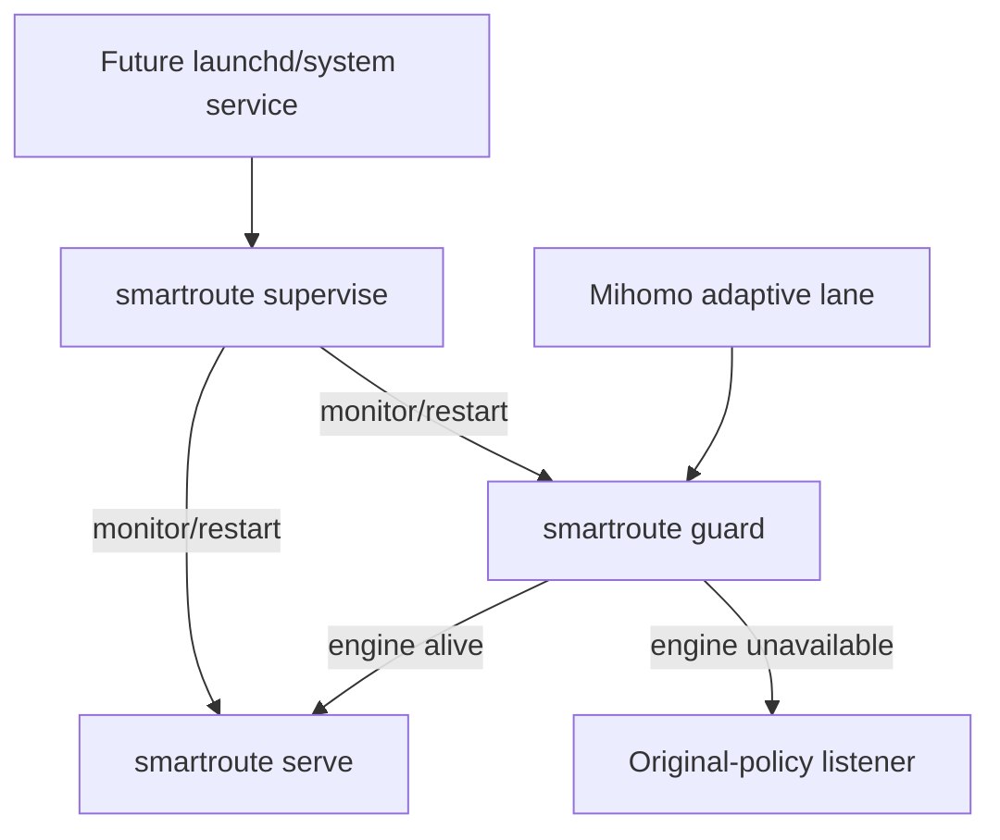

# ADR-0008: Supervise Guard and adaptive engine as independent child processes

- Status: Accepted
- Date: 2026-08-02
- Owners: SmartRoute maintainers

## Context

ADR-0006 protects a connection when the adaptive engine is unavailable but the Guard is alive. If Guard itself exits, Mihomo's front adapter cannot establish its local SOCKS hop. The locked Mihomo `fallback` implementation does not retry the next member for that already-failed connection, so health selection alone cannot make this window transparent.

Running Guard and engine in one process would remove process isolation: an engine panic or fatal runtime error could also remove the availability boundary. The two services therefore need separate lifecycles and a parent that can restore either one without restarting the other.

## Decision

Add `smartroute supervise`, which validates the config once and runs the current executable as two independently monitored child processes:

1. Guard and adaptive engine are separate operating-system processes.
2. Each service has an independent monitor loop. One child failing does not terminate or restart the other.
3. Restart delay begins at 100ms, doubles for consecutive failures, and caps at 5s by default. Surviving 30s resets the failure streak. All values are explicit CLI durations.
4. Lifecycle output is structured with `event_type=supervisor`, service, state, attempt, bounded failure class, and optional backoff. Raw child errors are not placed in structured events.
5. Child stdout/stderr share synchronized writers so line-oriented JSON events are not concurrently written through an unsafe buffer.
6. Parent cancellation sends an interrupt to both children; a 2s default grace period is followed by forced termination through `exec.Cmd.WaitDelay`.
7. The parent repeats config and Direct-probe acknowledgment validation before spawning, and resolves the config to an absolute path for both children.

## Failure boundaries

| Failure | Covered behavior | Residual behavior |
| --- | --- | --- |
| Adaptive engine exits | Guard remains alive and uses original policy; supervisor restarts engine | Connections committed to the engine before failure are not replayed |
| Guard exits | Engine remains alive; supervisor restarts Guard after bounded backoff | Connections arriving before Guard returns fail and are not replayed |
| One child enters a crash loop | Only that child backs off up to the cap | The affected availability lane remains degraded |
| Supervisor exits or host reboots | Not covered inside SmartRoute | Requires launchd/systemd/Windows service integration |
| Mihomo exits | Not managed by this command | Clash Verge Rev or the operating system remains Mihomo's owner |

## Alternatives considered

| Alternative | Why not selected |
| --- | --- |
| Run Guard and engine as goroutines in one daemon | A process-wide failure removes both layers |
| Make Guard spawn the engine | Couples the availability boundary to the component it protects |
| Let Mihomo `fallback` replace supervision | Does not retry the current connection and only reacts through health state |
| Supervise Mihomo too | Crosses the current ownership boundary and risks conflicting with Clash Verge Rev |
| Retry application payload after Guard restart | Violates the no-replay invariant |

## Consequences

Positive:

- Engine and Guard crashes have bounded, independently testable recovery loops.
- Engine restart does not interrupt the Guard's original-policy fallback lane.
- The supervisor emits no target/domain observations of its own.

Negative:

- One additional parent process is required.
- A Guard failure still creates a visible connection-failure window.
- Full host-level reliability needs a future native service definition and lifecycle tests.
- Repeated bind/config failures remain visible as capped restart loops rather than being silently ignored.

## Validation and rollback

- Race tests verify independent service starts, start-error retry, repeated exit restart, cancellation, lifecycle events, and backoff capping.
- CLI tests verify Guard and engine receive separate subcommands and only the engine receives Direct-probe acknowledgment.
- Child-process + loopback fault testing remains part of the isolated Mihomo Lab gate before a live trial.
- Rollback stops the supervisor and restores the original Mihomo catch-all. No learned or persistent data conversion is required.
