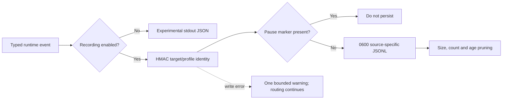

# ADR-0009: Use a bounded local observation recorder for live trials

- Status: Accepted
- Date: 2026-08-02
- Owners: SmartRoute maintainers

## Context

SmartRoute needs structured evidence before a real trial can establish whether adaptive routing improves success rate, latency, or proxy usage. Existing runtime JSON events contain cleartext target and network-profile fields and are written to stdout. Redirecting that stream would accidentally create an unbounded browsing-history file without pause, retention, deletion, or export controls.

ADR-0003 requires a local, opt-in, bounded recorder before live use. Recorder failure must never become a routing failure.

## Decision

Add a first-party JSONL recorder behind `observation.enabled`, which defaults to `false`.

### Data contract

| Field class | Default behavior |
| --- | --- |
| Hostname | HMAC-SHA-256 using a local random 256-bit salt; cleartext only with `include_cleartext_hostname=true` |
| Network profile | Always HMAC-SHA-256; no cleartext persistence switch in Phase 0 |
| Port and transport | Stored |
| Route/lane, stage, latency, reason and bounded failure class | Stored when supplied by the typed producer |
| Timestamp and source | Stored |
| Payload, URL path/query, headers, cookies, credentials, subscription data, TLS secrets, process identity | Never accepted by the recorder schema |

The salt is mode `0600`, stays local, and is excluded from export. HMAC pseudonymization prevents a copied JSONL file alone from supporting a simple hostname dictionary lookup; it is not anonymity while the salt and records coexist on the same device.

### Lifecycle controls

- `smartroute observations status` reports pause state, file count, and bytes.
- `pause` creates a shared marker checked before every record; `resume` removes it.
- `clear -confirm-clear` works only while paused and deletes JSONL records only under the managed `engine`, `guard`, and `supervisor` subdirectories, not arbitrary directory contents.
- `export -destination NEW_DIRECTORY` copies already-redacted JSONL files only, excludes salt/control files and symlinks, refuses an existing destination, and refuses a destination inside the observation tree.
- Engine, Guard, and supervisor use separate source directories and files.

When recording is enabled, the same raw event is not repeated on stdout. Recorder initialization failure aborts startup because the requested audit surface would be absent; a failure after startup produces at most one warning from each process and never interrupts routing.

## Alternatives considered

| Alternative | Why not selected |
| --- | --- |
| Redirect existing stdout | Cleartext, unbounded, and no lifecycle controls |
| Store plain hostnames by default | Creates unnecessary local browsing history |
| Unkeyed SHA-256 | Common domains can be recovered with a dictionary |
| SQLite immediately | Schema and learning model are not stable; JSONL is auditable and sufficient for the first bounded trial |
| Upload telemetry | Conflicts with local-first privacy and is unnecessary for owner-operated validation |
| Disable routing if a write later fails | Observability must not reduce connection reliability |

## Consequences

Positive:

- A future coordinated trial can collect bounded, inspectable evidence without default cleartext hostname history.
- Operational controls exist before active Clash integration.
- Per-source files avoid concurrent writers sharing one file.

Negative:

- A user who enables cleartext hostnames explicitly accepts a materially larger privacy risk.
- Count pruning is per process source; the configured total upper bound is approximately `sources × max_files_per_source × max_file_bytes`.
- JSONL is an observation surface, not the learned-policy store; it does not implement promotion, TTL, or network-profile state.
- Runtime stdout remains cleartext when persistent recording is disabled, for current experimental debugging. It must not be redirected as a live-trial history.

## Validation and rollback

Tests cover default pseudonymization, the explicit hostname switch, pause/resume, clear confirmation, rotation/count caps, oversized events, salt-free export, unsafe nested export, and stdout suppression while persistence is active.

Rollback sets `observation.enabled=false` and stops using the observation commands. Existing files remain local until the operator pauses and explicitly clears them.
