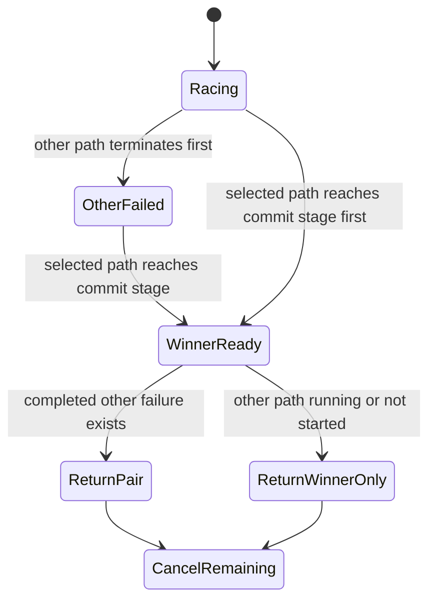

# ADR-0010: Preserve only completed counterfactual path evidence

- Status: Accepted
- Date: 2026-08-02
- Owners: SmartRoute maintainers

## Context

The staggered racer returns immediately after one path reaches the required readiness stage. Previously `RaceResult` retained only the selected observation. This discarded strong evidence when the other path had already failed—for example, Direct failed at TLS readiness and Proxy then produced a valid ServerHello.

Waiting for the remaining candidate would add connection latency. Treating the loser canceled after a winner as a failure would create false learning evidence. A candidate not started before a fast Direct winner is also not a failed Proxy observation.

## Decision

Add optional `OtherObservation` evidence to a successful race result and the resulting decision/JSONL event.

Rules:

1. `OtherObservation` exists only if the opposite candidate completed before the winner was selected.
2. The racer never waits after a winner is ready in order to manufacture a pair.
3. A candidate canceled because another path won is drained and closed but is not returned as evidence.
4. A candidate that was never started is not represented as a runtime failure.
5. Single-path privacy/manual routing has no counterfactual evidence.
6. Both-path failure continues to return `RaceError` with both terminal observations and produces no route promotion.

The current first-ready racer can therefore produce strong `Direct failed + Proxy succeeded` or `Proxy failed + Direct succeeded` pairs. It cannot honestly produce a two-success latency comparison because the first successful candidate commits immediately. That comparison remains synthetic/shadow-mode functionality until a separate non-blocking measurement design exists.

`Observation` JSON encoding is made round-trip safe so exported JSONL can restore `stage_reached`, `latency_ms`, path, success, and failure class with the same validation as in-memory observations.

## Alternatives considered

| Alternative | Why not selected |
| --- | --- |
| Keep winner only | Loses the strongest available promotion evidence |
| Wait for both candidates | Adds latency to the user's connection and may hang behind a slow loser |
| Mark canceled loser as failed | Cancellation is caused by SmartRoute, not path unavailability |
| Persist `not_started` as failure | Invents evidence for a path that had no network attempt |
| Run a background loser after commit | Extends duplicate exposure and resource use after the route is already chosen |

## Consequences

Positive:

- Future learning can consume strong pairs without changing connection latency.
- JSONL records explain when a proxy/direct preference has actual counterfactual support.
- Canceled and unstarted paths remain excluded from promotion.

Negative:

- Many successful races still contain winner-only evidence and must not update a paired promotion counter.
- Both-success latency learning still needs a separate shadow or historical design.
- The experimental decision and JSONL event schema gains optional `other_observation`; consumers must tolerate absence.

## Validation and rollback

Tests prove prior Direct and Proxy failures are preserved, an in-flight canceled Direct loser is absent, and observation JSON round-trips with invalid stages rejected.

Rollback consumers may ignore `other_observation`. Removing its production would discard evidence but would not change route selection; treating cancellation as evidence requires a superseding ADR and safety review.
