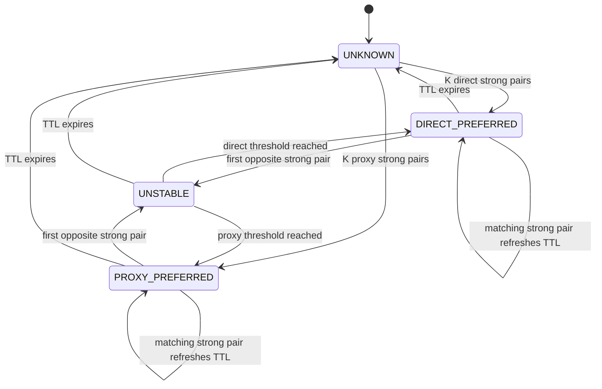
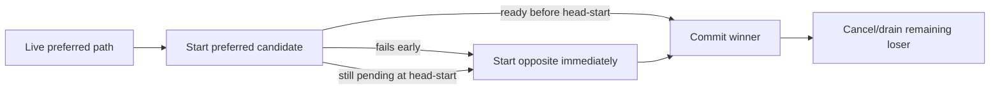

# ADR-0011: Learn ephemeral preferences and apply them through preferred racing

- Status: Accepted
- Date: 2026-08-02
- Owners: SmartRoute maintainers

## Context

ADR-0010 preserves strong paired evidence without delaying the selected connection. SmartRoute still had no runtime state machine and always launched Direct first. Merely counting evidence would not improve experience; applying a learned path as a single-path lock would reduce reliability when conditions change.

Durable promotion is not ready. The design requires evidence across independent sessions, crash-safe storage, migrations, user locks, and revocation. An in-memory process cannot honestly claim those properties.

## Decision

Implement an explicitly ephemeral learning engine keyed by:

```text
network_profile_id + normalized_hostname + destination_port + transport
```

It has two configuration modes:

| Mode | Evidence/state | Candidate order |
| --- | --- | --- |
| `shadow` | Updated in memory and emitted in decision metadata | Always Direct-first; safe default |
| `ephemeral-auto` | Updated in memory and emitted in decision metadata | Live preferred path starts first |

Missing mode in a legacy configuration becomes `shadow`. Process restart clears every learned preference.

The table is bounded by `learning.max_entries`. Before refusing a new target it removes expired entries; if still full, it emits `learning_capacity_reached_no_update` and leaves routing unchanged.

### Evidence gate

An update is applied only when:

1. The winner is Direct or Proxy, reports success, and reaches at least `StageTCP`.
2. `other_observation` is present, is the opposite path, failed before selection, and reached at least `StageOutbound`.
3. The other failure is not `canceled` or `not_started`.
4. Runtime Direct probing was allowed by privacy policy.

Winner-only evidence, local endpoint failures below outbound admission, canceled losers, and privacy-forced single-path traffic do not update counters.

### State transitions



Counters are consecutive by direction: a strong opposite pair resets the previous direction's count. Contradiction removes the applied preference immediately and enters `UNSTABLE`. Automatic policy never creates a locked state.

### Preferred racing

`ephemeral-auto` changes candidate launch order, not the readiness or replay contract.



If a preferred Proxy fails, Direct starts immediately instead of waiting for the head-start. If a preferred candidate succeeds before the other starts, no counterfactual is invented and the TTL is not refreshed. Expiry therefore returns the target to Direct-first observation naturally.

## Alternatives considered

| Alternative | Why not selected |
| --- | --- |
| Call in-memory state durable learning | Cannot satisfy cross-session evidence, crash recovery, locks, or migrations |
| Always enable automatic mode | A config upgrade could silently alter routing order |
| Use a learned path as a single-path lock | One stale preference could turn into a connection failure |
| Keep Direct-first after Proxy promotion | Learns a policy that cannot improve avoidable delay |
| Refresh TTL on winner-only traffic | A stale preference could perpetuate itself without counterfactual evidence |
| Treat local endpoint refusal as route evidence | SmartRoute/Mihomo topology faults could poison domain policy |

## Consequences

Positive:

- The project now has a complete process-local evidence → state → scheduling loop.
- Proxy-first removes repeated Direct timeout cost after repeated strong Proxy evidence.
- The opposite path remains available on every adaptive race.
- Network profile, hostname, port, and transport do not leak policy across scopes.

Negative:

- Restart loses all preferences; durable cross-session learning remains unimplemented.
- `shadow` state can recommend a preference but cannot measure actual preferred-order benefit.
- Requiring `StageOutbound` on the failed path is conservative and ignores some potentially valid earlier failures.
- Capacity exhaustion suppresses new learning until an entry expires or the process restarts; it never affects routing.
- Health controls beyond the readiness-stage gate remain necessary before durable promotion.

## Validation and rollback

Tests cover threshold promotion, shadow non-application, scope isolation, TTL expiry, immediate contradiction, weak/incomplete evidence rejection, Proxy-first success, early Proxy failure recovery, sidecar promotion across repeated connections, and routing continuity when learning update fails.

Rollback sets `learning.mode=shadow`. Removing the learning engine restores Direct-first behavior without touching observations or active Clash configuration.
