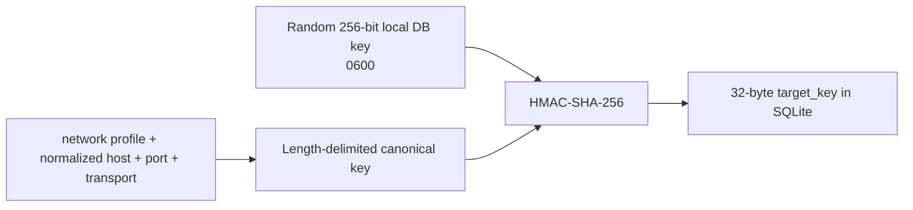

# ADR-0012: Persist strong evidence in a pseudonymous SQLite store

- Status: Accepted
- Date: 2026-08-02
- Owners: SmartRoute maintainers

## Context

ADR-0011 deliberately limits adaptive preferences to one process. Durable promotion needs evidence across independent sessions, migrations, retention, corruption handling, and a privacy boundary. The earlier technical sketch proposed cleartext hostnames in a local database, but local-only storage still creates recoverable browsing history and is unnecessary for exact target lookup.

The persistent schema is not yet authorized to change runtime routing. Its first role is durable shadow evidence.

## Decision

Add `internal/store` using `database/sql` and the CGo-free `modernc.org/sqlite v1.55.0` driver.

### Stored identity

The database never stores the cleartext network profile or hostname. The key is stored beside the database as `<database>.key`, excluded from Git, and never exported with a sanitized database bundle. If a database exists but its key is missing or malformed, SmartRoute refuses to create a replacement because it could no longer reproduce existing target identities.

HMAC is pseudonymization, not anonymity while the database and key coexist on the same device.

### Schema v1

| Table | Fields | Purpose |
| --- | --- | --- |
| `sessions` | safe random `session_id`, start timestamp | Establish independent runtime sessions |
| `strong_evidence` | target HMAC, session, Direct/Proxy direction, timestamp, winner/other readiness stages, bounded failure class | Preserve only evidence accepted by `learning.ClassifyStrongPair` |

The store exposes per-target ordered evidence and total/distinct-session summaries. It does not yet persist an applied policy, manual lock, raw observation, process identity, or export rule.

### Operational contract

- SQLite uses WAL, foreign keys, a bounded busy timeout, one process connection, and immediate write transactions.
- Database and key are mode `0600`; the parent data directory is expected to be private.
- Schema changes use `PRAGMA user_version` and transactional migrations.
- A schema newer than the binary is rejected without modification.
- `PRAGMA quick_check` runs before migration. A corrupt/unreadable existing database returns `store.ErrCorrupt`; it is never deleted or overwritten automatically.
- Evidence pruning is explicit and timestamp based.
- Failure classes accept only 1–64 lowercase token characters, preventing raw error strings or credentials from entering the database.
- Store errors must not affect the current route when runtime shadow integration is added.

## Dependency decision

`modernc.org/sqlite v1.55.0` is BSD-3-Clause and uses the public-domain SQLite engine. It supports the project's target darwin/arm64, linux/amd64, and Windows platforms without CGO. Its matching `modernc.org/libc v1.74.1` is resolved by `go.mod/go.sum`.

The tradeoff is a larger transitive dependency and generated platform code. Versions are pinned; upgrades require license review, migration/recovery tests, and clean-checkout builds.

## Alternatives considered

| Alternative | Why not selected |
| --- | --- |
| Cleartext hostname/profile columns | Creates unnecessary readable browsing history |
| Unkeyed hostname hash | Common domains are dictionary recoverable from a copied DB |
| Reuse observation recorder salt | Recorder may be disabled, cleared, or exported under a different lifecycle |
| JSON policy snapshots | Does not provide transactional migrations, indexed session summaries, or robust concurrent access |
| CGO SQLite driver | Complicates macOS/Windows builds and packaging |
| Automatically replace corrupt DB/key | Hides data loss and destroys forensic/rollback evidence |
| Persist applied auto policy immediately | Cross-session promotion and health gates are not implemented yet |

## Consequences

Positive:

- Cross-session strong evidence now has a migration-safe, exact-scope storage foundation.
- A copied database alone does not reveal cleartext target identity.
- Independent-session counts can be verified before durable promotion.
- Corruption and future-version behavior fail explicitly.

Negative:

- Losing the separate key makes existing target rows unusable; backup/restore must treat DB, WAL files, and key as one protected unit.
- Target HMAC prevents ad-hoc SQL inspection by hostname; a controlled local CLI will be needed.
- SQLite and modernc dependencies materially increase source/module cache size and build time.
- Runtime integration, durable policy evaluation, backups, and user controls remain pending.

## Validation and rollback

Tests cover initial/idempotent migration, file modes, reopen, concurrent writes, HMAC scope matching, raw-file cleartext scans, distinct-session summaries, weak evidence rejection, safe failure classes, pruning, cancellation, missing keys, corrupt databases, corrupt rows, and future schema rejection.

Rollback removes runtime use of `internal/store` while retaining the database for later inspection. Database deletion is always a separate explicit user action.

## Follow-up

ADR-0013 later authorized default-off asynchronous runtime collection into this schema. It did not authorize stored evidence to select routes; the durable-policy and user-control limitations in this ADR remain in force.
