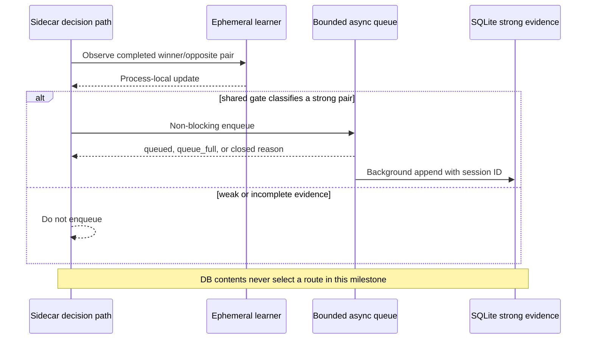

# ADR-0013: Wire durable shadow evidence through an opt-in asynchronous writer

- Status: Accepted
- Date: 2026-08-02
- Owners: SmartRoute maintainers

## Context

ADR-0012 created a privacy-bounded SQLite schema but deliberately left it outside the runtime. Writing SQLite synchronously from the TLS selection path would add storage latency to connection establishment and could turn a full, locked, or damaged database into a connectivity failure. Opening the store by default would also create local browsing-derived state without an explicit user choice.

The runtime needs cross-session evidence before durable promotion can be evaluated, but this milestone must not authorize stored evidence to change routing.

## Decision

`smartroute serve` may open the SQLite evidence store only when `learning.persistence.enabled` is true. The default remains false.

### Startup and shutdown

- Enabled startup opens and integrity-checks the database, creates a random safe session, and prunes evidence older than the configured retention period before opening the sidecar listener.
- Startup failure is explicit. In the supervised topology the separate Guard remains able to select the user's original-policy lane.
- Shutdown closes and drains the writer within a bounded timeout, checkpoints the WAL, then closes SQLite. A timed-out writer is not followed by an unsafe concurrent database close; process exit remains the final cleanup boundary.

### Data-path behavior

- The wrapper always updates the process-local learner first.
- Only a pair accepted by `learning.ClassifyStrongPair` is offered to the durable writer. A strong pair may still be durable even if the bounded ephemeral table cannot accept a new target.
- Enqueue is non-blocking and capacity bounded. Full or closed queues drop that durable row and expose a safe reason code; they do not reject, delay, replay, or reroute the connection.
- Individual write failures increment bounded statistics, warn at most once per process, and do not stop later writes or affect routing.
- SQLite evidence is shadow-only. No startup load, cross-session promotion, generated rule, suffix generalization, or automatic policy application is implemented.

### Configuration

| Field | Default | Purpose |
| --- | ---: | --- |
| `learning.persistence.enabled` | `false` | Explicitly create/open durable evidence state |
| `database_path` | `data/learning.db` | Database; its sibling `.key` is equally sensitive |
| `queue_size` | `256` | Maximum pending non-blocking writes |
| `retention_hours` | `720` | Startup pruning horizon |
| `shutdown_timeout_ms` | `2000` | Total bounded drain/checkpoint window |

## Alternatives considered

| Alternative | Why not selected |
| --- | --- |
| Synchronous SQLite append in `Observe` | Storage latency and locks would enter connection setup |
| Unbounded background queue | Converts a slow database into unbounded memory growth |
| Default-on persistence | Violates explicit local-data consent and creates files unexpectedly |
| Load summaries and promote on startup | Cross-session health gates, contradiction rules, backup/restore, and UI controls are not ready |
| Close SQLite after writer timeout | Risks concurrent use of a closed handle and misleading shutdown behavior |

## Consequences

Positive:

- Controlled trials can accumulate cross-session strong evidence without adding database I/O to the routing critical path.
- Decision events explain whether durable evidence was queued, dropped due to capacity, or rejected after writer closure.
- Disabled configurations create no database or key.

Negative:

- A bounded queue can intentionally lose evidence under sustained storage pressure.
- Startup pruning and integrity checks add work only when persistence is explicitly enabled.
- There is still no user-facing database inspection, backup, deletion, or durable-policy command.

## Validation and rollback

Race tests cover non-blocking capacity, close/enqueue synchronization, draining, write-error continuation, weak-evidence exclusion, disabled no-file behavior, enabled SQLite writing, session ID safety, and event metadata propagation.

Rollback sets `learning.persistence.enabled` to false and restarts the adaptive engine. Existing database, WAL/SHM files, and key remain untouched for explicit later handling; rollback never deletes evidence automatically.
