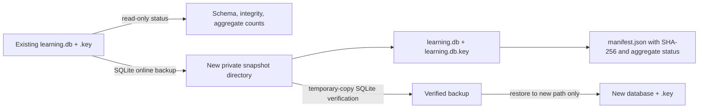

# ADR-0014: Manage durable evidence with read-only status and verified snapshots

- Status: Accepted
- Date: 2026-08-02
- Owners: SmartRoute maintainers

## Context

ADR-0013 allows explicitly enabled runtimes to collect pseudonymous strong evidence, but a live trial cannot safely depend on that store without an operator-visible health check and a rehearsable backup/restore path. Copying only the main SQLite file can miss committed WAL pages. Copying a database without its HMAC key makes target lookup impossible. Conversely, treating a backup containing the key as a redacted export would understate its privacy sensitivity.

Lifecycle commands must not silently create, migrate, overwrite, delete, or activate a policy database.

## Decision

Add local `smartroute learning` lifecycle commands and corresponding `internal/store` primitives.

### Status

- `learning status` does not create a missing database or key.
- Missing database, missing key, orphaned key, and healthy current-schema store are distinguished.
- An existing store is opened read-only, runs `quick_check`, and must match the current schema exactly. Status never runs migrations.
- Output contains only file presence/size, schema, session/evidence counts, Direct/Proxy totals, and oldest/newest timestamps. It contains no target HMAC, hostname, network profile, session ID, or failure class.

### Backup

- `learning backup` requires a source database that already exists and a destination directory that does not exist.
- SQLite's online-backup API captures a consistent database image while another process may use WAL.
- The snapshot contains `learning.db`, `learning.db.key`, and `manifest.json`, all mode `0600` in a mode `0700` directory.
- The manifest records managed filenames, format/schema version, aggregate status, timestamp, and SHA-256 for database and key.
- The command reopens and checks the snapshot before removing its `INCOMPLETE` marker.
- Any failure after destination creation leaves `INCOMPLETE`; such a directory must not be restored.

### Verify and restore

- `learning verify-backup` rejects an `INCOMPLETE` marker, unknown manifest fields, unsupported filenames/version, symlink/non-regular managed files, checksum mismatch, SQLite corruption, or aggregate-status mismatch.
- SQLite verification operates on a private temporary copy, so a successful or failed check does not modify the backup artifact.
- `learning restore` repeats verification and writes only to a brand-new database path. Existing database, key, or prior `.INCOMPLETE` marker causes refusal without overwrite.
- Restore rechecks hashes after copying, opens and integrity-checks the result, compares aggregate status, then removes the restore marker.
- Restore does not update SmartRoute configuration, start `serve`, load policy, or delete the source backup.

### Privacy interpretation

The snapshot is a recoverable backup, not a redacted export. It includes the HMAC key and therefore has the same privacy classification as the live store. SHA-256 detects accidental or uncoordinated modification relative to the manifest; because the manifest is not signed, it is not proof against an attacker who can replace both files and manifest.

## Alternatives considered

| Alternative | Why not selected |
| --- | --- |
| Copy `.db` only | Can omit committed WAL content and cannot reproduce target HMAC lookup without the key |
| Copy `.db`, `-wal`, and `-shm` directly | Race-prone while a writer is active and harder to validate as a coherent snapshot |
| Run status through normal `Open` | Could perform migration or permission changes during an inspection command |
| Restore over the configured database | Destructive, difficult to roll back, and unsafe while the runtime may be active |
| Call the backup redacted | The included key makes that privacy claim false |
| Sign the manifest now | Requires a separate trust/key-management design; checksums are adequate for the current local accidental-corruption boundary |

## Consequences

Positive:

- Operators can establish whether durable collection exists and is healthy without exposing target identities.
- Backups are SQLite-consistent, self-contained, checksum-manifested, and actually reopened before completion.
- Restore can be rehearsed safely to a new path before a live trial.
- Failed operations are visible and never overwrite existing evidence.

Negative:

- Backups contain the HMAC key and must be protected like the live browsing-derived store.
- Verification temporarily copies the database and key into a private local temporary directory.
- There is still no destructive clear command, redacted aggregate export, target-specific UI, or automatic durable-policy application.

## Validation and rollback

Tests cover absent non-creation, current-schema read-only status, no-migration refusal, aggregate privacy, online snapshot reopen, modes, manifest/checksums, source immutability during verification, tamper/incomplete rejection, restore-to-new-path, existing-path refusal, and failed-operation markers.

Rollback removes the lifecycle CLI surface. Existing stores and snapshots remain untouched; their deletion is always a separate explicitly confirmed operation.
