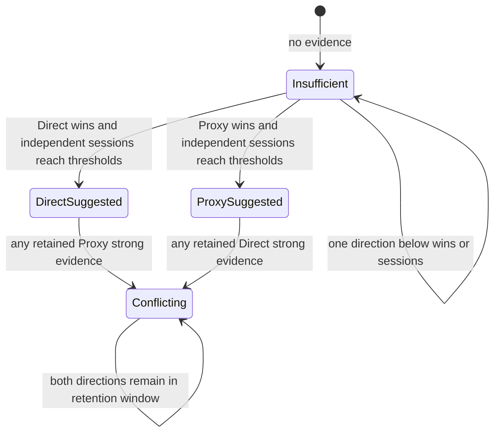
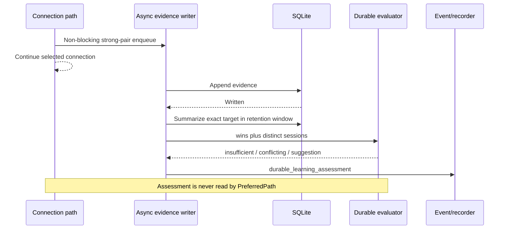

# ADR-0015: Evaluate cross-session evidence as shadow suggestions only

- Status: Accepted
- Date: 2026-08-02
- Owners: SmartRoute maintainers

## Context

ADR-0013 collects strong evidence across sessions and ADR-0014 makes the store inspectable and recoverable. The database still provides no interpretation of whether its evidence is sufficient or contradictory. A raw win count is not enough: many observations from one process session are correlated, and a majority vote can hide a real network-dependent contradiction.

The project needs to measure how often durable evidence would support a stable route before authorizing it to influence candidate order.

## Decision

Add a deterministic `learning.DurableEvaluator` and run it only as a shadow assessment after an asynchronous strong-evidence write succeeds.

### Evidence and thresholds

| Direction | Required strong wins | Required distinct sessions | Default rationale |
| --- | ---: | ---: | --- |
| Direct | `learning.direct_promotion_wins` (`5`) | `learning.persistence.direct_suggestion_sessions` (`3`) | Direct reliability needs broader confirmation before avoiding Proxy |
| Proxy | `learning.proxy_promotion_wins` (`3`) | `learning.persistence.proxy_suggestion_sessions` (`2`) | Repeated Direct failure plus Proxy TLS readiness is stronger asymmetric evidence |

The evaluator consumes only retained schema-v1 strong evidence scoped by network profile, normalized hostname, port, and transport. Session count can never substitute for the required number of wins, and repeated wins in one session can never substitute for independent sessions.

If both Direct and Proxy have any retained strong evidence, the result is `conflicting` with no suggested path. Phase 0 deliberately does not use dominance ratios, recency weighting, or “majority wins” to erase contradictions.

### Runtime behavior

- Assessment runs in the writer goroutine after persistence, never on the connection critical path.
- Query/evaluation/recording failure is counted and warned through the same bounded runtime error surface; it does not undo the evidence row or affect routing. A post-write callback panic is converted to a bounded error so later writes continue.
- The event contains aggregate counts, thresholds, reason, and optional suggested path. The recorder HMAC-transforms its target like other events.
- `smartroute learning evaluate` applies the same evaluator to one explicit exact target through a read-only store. Output omits the target identity, though operators should remember that shell arguments may be visible in shell history or a local process list.

### Explicit non-authorization

`direct_suggested` and `proxy_suggested` are analytical labels, not policies. They must not:

- feed `Engine.PreferredPath`;
- change Direct/Proxy candidate order;
- generate Clash/Mihomo rules;
- create suffix/generalized rules;
- persist an applied-policy row;
- override privacy, manual locks, administrative rules, or the original fallback.

## Alternatives considered

| Alternative | Why not selected |
| --- | --- |
| Promote directly from SQLite summary | Skips trial evidence, health gates, revocation and rollback design |
| Count wins without sessions | One unstable process/session could manufacture apparent confidence |
| Majority or dominance ratio | Can conceal a genuine network-dependent contradiction |
| Query SQLite synchronously during routing | Adds storage latency/failure to the connection critical path |
| Evaluate winner-only or canceled evidence | Violates the shared strong-pair gate |
| Generalize to domain suffix | Exact-host evidence cannot establish suffix-wide behavior |

## Consequences

Positive:

- Live trials can measure durable coverage, insufficiency, and contradiction rates before policy activation.
- Every suggestion is reproducible from exact aggregate evidence and explicit thresholds.
- Runtime assessment adds no database I/O to connection commitment.
- Offline inspection and runtime events share one evaluator.

Negative:

- A single retained opposite-direction strong observation suppresses suggestions until retention removes it.
- Repeated assessment events may add bounded diagnostic volume for frequently changing strong evidence.
- The evaluator does not yet model network-profile similarity, captive portals, proxy health, or time decay within the retention window.

## Validation and rollback

Tests cover the full no-evidence/insufficient/suggested/conflicting matrix, independent-session requirements, invalid summaries, writer callback error/panic isolation, cross-session SQLite integration, recorder pseudonymization, config defaults, and read-only CLI evaluation.

Rollback stops emitting assessments and removes the offline command. Evidence rows remain valid schema-v1 data; route behavior is unchanged because assessments were never consumers of `PreferredPath`.
