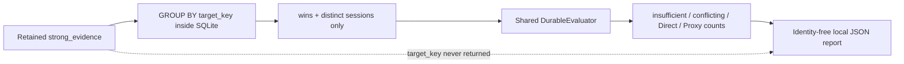

# ADR-0016: Aggregate Shadow assessments without exposing target identity

- Status: Accepted
- Date: 2026-08-02
- Owners: SmartRoute maintainers

## Context

ADR-0015 produces exact-target Shadow assessments, but deciding whether adaptive routing is worth pursuing requires population-level evidence: how many observed targets remain insufficient, conflict across sessions, or reach a Direct/Proxy suggestion. Exporting target HMAC keys would create stable linkable identifiers and is unnecessary for those metrics.

A report must also avoid overstating what the current sample proves. The durable database contains only targets that produced a strong paired outcome; it does not represent every connection or every target seen by the user.

## Decision

Add `smartroute learning report`, backed by a read-only grouped SQLite query and the same `DurableEvaluator` used for runtime and exact-target evaluation.

The store returns one `Summary` per exact target but never returns the target key, hostname, profile, port, transport, session IDs, timestamps per target, or failure classes. The evaluator produces aggregate counts only.

### Report contract

| Field group | Meaning |
| --- | --- |
| `targets_with_evidence` | Exact target scopes having at least one retained strong pair |
| `evidence_rows`, `direct_evidence`, `proxy_evidence` | Strong-pair row counts in the retention window |
| `insufficient_targets` | Targets missing a win or independent-session threshold |
| `conflicting_targets` | Targets with retained strong evidence in both directions |
| `direct_suggested_targets`, `proxy_suggested_targets` | Shadow-only suggestions from ADR-0015 |
| `reason_counts` | Exact evaluator reason distribution |
| threshold fields | Configuration used to make the report reproducible |
| wrapper timestamps | Generation time, lower cutoff, and configured retention hours |

The command opens the existing database read-only, does not migrate or create state, and emits no target identifiers. It does not persist the report automatically.

### Interpretation limits

- The denominator is targets with strong paired evidence, not all visited targets or all connections.
- A high suggestion fraction does not prove latency or reliability improvement because suggestions are not applied.
- Evidence rows are not independent users or independent targets.
- Per-target session counts are used for assessment but are not summed into a misleading global “session” total.
- Trial analysis must combine this report with connection-level baseline/success/latency/proxy-usage metrics before considering policy activation.

## Alternatives considered

| Alternative | Why not selected |
| --- | --- |
| Export target HMAC plus assessment | Creates unnecessary stable local identifiers and enables cross-report linking |
| Report only total evidence rows | Cannot measure coverage, conflict, or suggestion direction |
| Treat targets with evidence as all traffic | Produces a biased and false denominator |
| Reimplement assessment in SQL | Risks semantic drift from runtime/offline exact-target evaluation |
| Persist reports automatically | Adds another local history artifact without retention/clear controls |

## Consequences

Positive:

- Phase 0 can measure durable suggestion coverage and contradiction rate without revealing target identity.
- Reports are reproducible from explicit cutoff and threshold fields.
- One evaluator owns per-target and aggregate classification semantics.

Negative:

- The report cannot explain which target caused a category without a separate explicit exact-target evaluation.
- Selection bias remains until connection-level observation metrics are joined analytically.
- Historical reports are not automatically stored or compared.

## Validation and rollback

Tests cover grouped exact-target isolation, cutoff behavior, cancellation, absence of identities/target keys in JSON, every assessment category, empty stores, invalid summaries, and CLI output privacy.

Rollback removes the report command and grouped query. Durable evidence and per-target assessment behavior remain unchanged; no route behavior changes.
