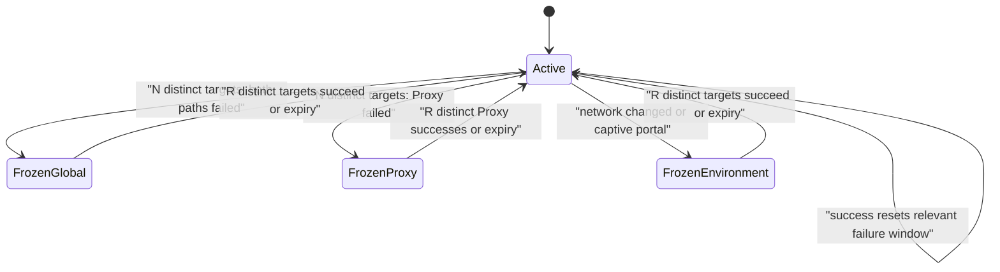

# ADR-0017: Freeze learning on systemic path failures

- Status: Accepted
- Date: 2026-08-02
- Owners: SmartRoute maintainers

## Context

A burst of failures may describe the local network, proxy service, or captive portal rather than each destination. Treating those failures as independent target evidence can rapidly promote incorrect Direct preferences, pollute the durable Shadow database, and keep stale process-local launch order after the environment changes.

A single failed destination is not sufficient proof of a systemic outage. Health handling also must not become a second routing engine: the connection that produced the signal has already been selected or failed, and SmartRoute's no-replay and original-policy Guard boundaries remain unchanged.

## Decision

Add a concurrent, deterministic `internal/health` gate before ephemeral and durable learning.

The defaults are `N=3`, `R=3`, a 30-second active failure window, and a 300-second freeze. Target identities are canonicalized, SHA-256 hashed, and held in memory only. Duplicate targets do not advance a threshold.

On a transition to frozen, runtime learning:

1. clears every process-local preference and counter;
2. returns no learned preference while frozen;
3. suppresses both ephemeral updates and new asynchronous SQLite writes;
4. emits a structured `learning_health` transition with a bounded evidence count.

The live winner still commits normally. The gate never changes candidate selection after the result, replays bytes, deletes durable rows, modifies Mihomo/Clash, or bypasses the availability Guard. Evidence accepted before the threshold-triggering event is not transactionally retracted; the database remains Shadow-only, and trial analysis must account for this boundary.

`Direct succeeded + Proxy failed` is both strong Direct evidence and a Proxy-health failure. The threshold-triggering pair freezes before that pair is written. A Proxy-only privacy-path failure contributes Proxy-health information but not route-learning evidence. Dual TLS failure contributes global-health information but promotes neither path.

Network-profile-change and captive-portal methods are explicit inputs. Automatic detection and control probes are separate future components; documentation must not imply they are currently wired.

## Alternatives considered

| Alternative | Why not selected |
| --- | --- |
| Freeze after one failed target | Confuses target-local outages with environmental failure |
| Count every failed connection | Retries and connection storms can manufacture confidence |
| Let Direct success recover a Proxy outage | Says nothing about whether the Proxy path recovered |
| Delete recent durable rows on freeze | Requires causal transaction boundaries the asynchronous writer does not provide and risks destructive overreach |
| Change the current connection to the original route | Violates post-commit/no-replay boundaries and duplicates Guard responsibility |
| Use public probe sites in default tests | Makes tests depend on external availability and leaks network activity |

## Consequences

Positive:

- Broad outages stop poisoning new learning after a small distinct-target threshold.
- Process-local preferences revert immediately to the safe unknown ordering.
- Recovery rules are path-aware, deterministic, and testable without external networking.
- Health transitions remain explainable and privacy-bounded.

Negative:

- Up to `N-1` earlier evidence rows from an outage may remain in the Shadow database.
- Time-based expiry can resume learning before an outage truly ends; new failures can freeze it again.
- Automatic network and captive-portal signals are not yet connected.
- Process restart resets health state, consistent with the current Phase 0 process-local contract.

## Validation and rollback

Pure tests cover duplicate suppression, success resets, global and Proxy thresholds, path-specific recovery, explicit environment signals, expiry, validation, and concurrent access. Runtime tests prove that freeze clears an existing preference and suppresses the threshold-triggering durable write. Sidecar tests prove that dual TLS and privacy Proxy-only failures reach the optional health observer.

Rollback disables `learning.health.enabled` or removes the runtime gate. Routing behavior is unchanged either way; only learning suppression and `learning_health` events disappear.
