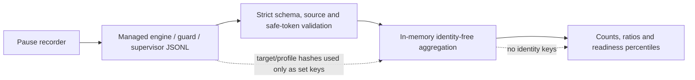

# ADR-0018: Report identity-free adaptive readiness metrics

- Status: Accepted
- Date: 2026-08-02
- Owners: SmartRoute maintainers

## Context

The durable `learning report` describes only targets that produced strong paired evidence. It cannot measure the whole recorded adaptive sample, route-selection proportions, Guard fallback frequency, or the time spent reaching the selected readiness gate. Without those denominators, suggestion coverage can be mistaken for an experience improvement.

The Phase 0 recorder intentionally has no application payload, URL, byte volume, or client-visible outcome. Any report over it must expose useful measurements without claiming capabilities the schema does not contain or returning stable target hashes.

## Decision

Add `smartroute observations report`, a paused-state, read-only aggregation over the configured bounded JSONL directory.

The report includes:

| Group | Meaning |
| --- | --- |
| scope | requested lower time bound, included files/events and actual first/last timestamps |
| readiness outcomes | committed `decision` rows versus terminal `diagnostic`/uncommitted decision rows |
| selected paths | Direct/Proxy counts and Proxy share among ready decisions |
| paired outcomes | strong `Direct failed + Proxy succeeded`, strong inverse pairs, and missing/other completed observations |
| timing | p50/p95/p99 adaptive decision-to-readiness and winner-candidate latency |
| availability | Guard adaptive/original/unavailable counts |
| learning | health-transition and durable-assessment event counts |
| privacy-safe scope | counts of exact target scopes, network profiles, trial sessions, and legacy unscoped events; never their identifiers |

`decision_latency_ms` is added to successful TLS decisions. It starts after a complete safe ClientHello and privacy-policy evaluation, immediately before runtime preference/health lookup and candidate selection, and ends when the winning path reaches the TLS ServerHello gate. It therefore includes stagger/fallback time. The existing winner observation latency begins at that candidate's own start and may exclude head-start delay.

### Interpretation boundary

`readiness_success_ratio` is not application success, page success, user-visible success, or a certificate-validated TLS handshake. It combines the implemented TCP/TLS commit gates. The report cannot compute:

- `avoidable_proxy_ratio` against the user's static configuration;
- proxy byte savings;
- end-to-end application latency;
- refresh/retry frequency;
- A/B improvement over a static baseline.

The JSON includes explicit interpretation flags for these absences. Future baseline-lane, client-outcome, and aggregate-byte fields require separate privacy and semantics review.

### Consistency and privacy

- CLI reporting requires recording to be paused; stopping the trial processes before the final report remains preferable.
- Unknown fields, event/reason codes outside the maintained allowlist, wrong schema/source bindings, malformed/oversized rows, and unsafe tokens fail the entire report rather than silently biasing it or becoming output map keys.
- Target/profile hashes are used only for in-memory distinct counts and never returned.
- The report is not persisted automatically and opens no network connection.
- `-since RFC3339` and `-hours N` are mutually exclusive; the default window is configured observation retention.

## Alternatives considered

| Alternative | Why not selected |
| --- | --- |
| Treat durable suggestion coverage as the experience metric | Strong-pair targets are a selected subset, not all connections |
| Export target hashes with per-target metrics | Creates unnecessary stable linkable identifiers |
| Report while recording without a consistency boundary | Can read a partial final row or a changing file set |
| Skip malformed rows | Silently changes denominators and can make a damaged trial look successful |
| Call readiness “connection success” | Overstates what TCP/ServerHello proves |
| Add payload or URL telemetry | Violates the local bounded observation contract |

## Consequences

Positive:

- Trials obtain honest readiness, selection and Guard-fallback denominators.
- Decision latency includes Proxy head-start and recovery delay, unlike candidate-only latency.
- Reports can be compared without exposing target identifiers.
- Corrupt or incompatible inputs fail visibly.

Negative:

- Reporting requires an explicit pause and remains a local snapshot operation.
- Current metrics cannot prove application experience or static-baseline improvement.
- Exact target/profile counts depend on the recorder's local pseudonymization continuity.
- JSONL remains an experimental additive schema rather than a migration-managed analytics database.

## Validation and rollback

Tests cover mixed engine/Guard aggregation, exact ratios and percentiles, time cutoff, zero samples, identity omission, unknown fields, source mismatch, CLI pause enforcement, conflicting window flags, and deterministic sidecar decision latency.

Rollback removes the report command and `decision_latency_ms`. Routing, learning, SQLite evidence, and existing JSONL rows remain valid; older rows simply have no decision-latency sample.
