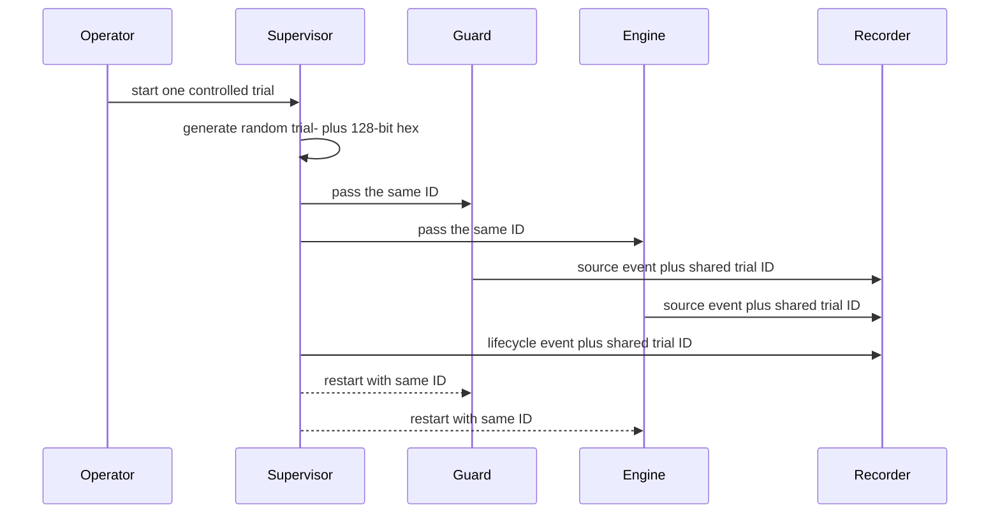

# ADR-0019: Scope observations with a random shared trial session

- Status: Accepted
- Date: 2026-08-02
- Owners: SmartRoute maintainers

## Context

Engine, Guard, and supervisor observations share timestamps and pseudonymous targets, but previously had no explicit boundary for one controlled trial. Time windows alone become ambiguous when processes restart, when multiple short experiments happen within the retention window, or when files from several sources are exported together.

The identifier must not become an account, device, Wi-Fi name, network fingerprint, or user-provided label. It must survive child restarts within one supervisor invocation without becoming a permanent cross-trial tracking key.

## Decision

Add optional `trial_session_id` to observation JSONL schema v1.

### Identity contract

- Generated IDs have exactly `trial-` plus 32 lowercase hexadecimal characters from 128 random bits.
- Arbitrary labels are rejected, preventing network names or personal text from entering the field.
- `trial_session_id` has no routing, learning, authentication, or network-profile meaning.
- It is local and may remain in already-pseudonymized JSONL exports so rows can be joined within the exported trial.
- `observations report` uses it only for an in-memory distinct count and outputs `trial_sessions_observed` plus `unscoped_events`; it never outputs the IDs.

### Runtime contract

- With `observation.enabled=true`, `supervise` generates one ID when `-trial-session` is absent and passes it to both children.
- Child restarts reuse the supervisor's ID.
- Standalone `serve` or `guard` generates its own ID unless a valid explicit random ID is supplied. Operators starting both manually must pass the same generated-format ID if they require one shared scope.
- Supplying `-trial-session` while observation recording is disabled is an error rather than implying that unrecorded events were scoped.
- Runtime recorder creation with recording enabled rejects an empty ID.
- Older schema-v1 rows without the additive field remain valid and are counted as unscoped.

This session is distinct from the SQLite durable-learning session. The latter represents independent evidence collection across process lifetimes and is intentionally not exported into JSONL as a join key.

## Alternatives considered

| Alternative | Why not selected |
| --- | --- |
| Use timestamps only | Process restarts and adjacent trials create ambiguous boundaries |
| Reuse network profile HMAC | Conflates environment scope with trial lifecycle and enables longer linking |
| Reuse durable SQLite session ID | Couples independent retention/privacy stores and exposes a cross-store join key |
| Accept a human-readable trial name | Can persist a person, place, SSID, or customer identifier |
| Generate independently in every child | Guard/engine/supervisor rows cannot be joined after restart |
| Return IDs in aggregate reports | Unnecessary for population-level metrics and creates linkable output |

## Consequences

Positive:

- One supervised trial has an explicit cross-source and cross-restart boundary.
- Exported pseudonymous rows can be joined without target/profile identity.
- Reports expose missing legacy scoping instead of silently treating it as one session.
- The field cannot contain operator identity text.

Negative:

- Manually launched independent processes need an explicitly shared generated-format ID for a common scope.
- Exported JSONL retains a linkable identifier within that exported bundle.
- A caller can deliberately reuse a valid random ID across trials; procedure and reports must treat that as operator error.
- Old rows remain unscoped.

## Validation and rollback

Tests cover generation uniqueness, exact validation, rejection of human labels, recorder stamping, supervisor child-argument sharing, disabled-recording rejection, runtime auto-generation, legacy unscoped rows, distinct-session counts, and aggregate omission of concrete IDs.

Rollback stops supplying the option and removes the additive JSON field. Existing files remain readable as schema v1; reports count those rows as unscoped. No route, learning policy, or SQLite evidence changes.
