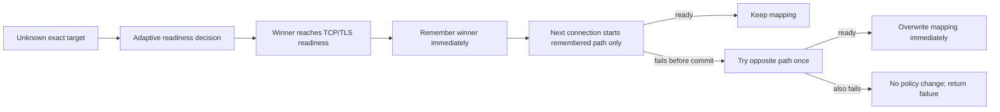

# ADR-0036: Remember the last ready path without per-target approval

Status: Superseded by ADR-0037 for naming/default/runtime composition; data-path semantics retained
Date: 2026-08-03
Supersedes: the no-runtime-application parts of ADR-0015 and ADR-0035

## Context

SmartRoute exists to remove manual rule maintenance and repeated probe delay. Requiring per-host approval, repeated wins, independent sessions, provisional states, or policy TTLs before using a result would move work back onto the user and postpone the main benefit.

We do not yet have real-use evidence that an exact target's Direct/Proxy requirement changes often enough to justify a policy lifecycle. The simpler useful assumption is that the most recent path which actually reached the protocol readiness gate is the best starting path for the next connection on the same network profile. If that assumption becomes stale, the connection path itself can detect and repair it before application data is committed.

## Decision

Add explicit global mode `learning.mode = "durable-auto"`. It requires durable persistence, remains off by default, and never asks for target-by-target approval.

The automatic mapping is exact to network profile, normalized hostname/IP, port, and TCP transport. It has no provisional/confirmed distinction, win counter, independent-session gate, or TTL. It changes only when:

- the opposite path subsequently reaches readiness after the remembered path fails before commit;
- capacity eviction removes the oldest mapping;
- the user clears automatic policies; or
- the target is observed under a different network-profile scope.

Cross-session strong-evidence assessment remains available for Shadow analysis and reports. It does not gate, create, refresh, or remove the automatic last-known-good mapping.

### Data path

- The first successful TCP/TLS readiness winner updates the bounded process-local index immediately.
- Persistence is queued asynchronously. Queue or database failure cannot delay or change the current connection.
- Startup loads at most `learning.max_entries` HMAC target keys into memory.
- A hit performs target normalization, HMAC, an `RWMutex` read, and a map lookup; it performs no SQLite call.
- A hit opens only the remembered candidate. If it fails before commitment, SmartRoute tries the opposite candidate once inside the same total timeout.
- A successful opposite fallback overwrites the in-memory mapping immediately and queues the new path for persistence.
- No committed application data is replayed. TLS 1.3 early data remains rejected from the adaptive path.
- Privacy policy is checked before Direct candidate creation. Systemic-health freeze temporarily suppresses index use and learning without deleting stored mappings.

### Resource bounds

| Resource | Bound |
| --- | --- |
| Runtime mapping memory | `learning.max_entries`, default 10,000 |
| Durable mapping rows | Same `learning.max_entries` ceiling; oldest row is replaced at capacity |
| Persistence queue | `learning.persistence.queue_size`, default 256 |
| Strong-evidence rows | `learning.persistence.max_evidence_rows`, default 100,000; exact on startup/shutdown and at most 255 over while running |
| Strong-evidence age | `learning.persistence.retention_hours`, default 720 hours |
| Observation files | Existing file-count, size, and retention bounds |

Repeated healthy connections do not queue another mapping write when the selected path is unchanged. On the reference Apple M4 Pro run, lookup measured about 299–301ns with 304B and 9 allocations per operation; construction of the default 10,000-entry index allocated about 1.84MB and took about 0.35ms. These are local engineering measurements, not total-process RSS or cross-platform guarantees.

### User controls

- `shadow`: observe only.
- `ephemeral-auto`: process-local candidate ordering from repeated strong pairs.
- `durable-auto`: immediate last-known-good mapping and sequential pre-commit fallback.
- `learning status`: identity-free evidence and Direct/Proxy mapping counts.
- `learning clear-policies -confirm-clear-policies`: clear automatic mappings while retaining analytical evidence; restart discards a running snapshot.

The separate manual fixed-policy database from ADR-0035 remains management-only. This ADR applies only to HMAC-keyed automatic mappings in the durable learning store.

## Alternatives

| Alternative | Reason rejected |
| --- | --- |
| Per-host user approval | Does not scale and contradicts automatic routing |
| Repeated-win or multi-session promotion | Delays the benefit without measured evidence that the delay improves user outcomes |
| Provisional/confirmed TTL tiers | Adds lifecycle states before target volatility has been demonstrated |
| SQLite lookup on every connection | Adds storage latency and failure to the hot path |
| Keep racing both paths after learning | Retains duplicate connection and CPU work |
| Remembered path with no fallback | Turns a stale decision into an avoidable outage |
| Unbounded mappings or evidence | Makes resource use grow with traffic history |

## Consequences

- One reliable first result is enough to remove repeated race delay for that exact target and network profile.
- A stale result repairs itself only when it matters: selected-path pre-commit failure followed by opposite-path readiness.
- The model is easy to explain as “last known good path,” with no hidden promotion lifecycle.
- The probability and causes of route volatility remain unmeasured. Real trial data should determine whether any future expiry or confidence mechanism is warranted; none is added speculatively.
- Raw Direct/Proxy suggestions remain analytical. Runtime selection comes from the last path actually committed at TCP/TLS readiness in explicit `durable-auto` mode.

## Validation and rollback

Tests cover first-result immediate memory, asynchronous persistence and reload, exact scoping, bounded oldest-entry replacement, unchanged-path write suppression, opposite-success overwrite, privacy precedence, selected-path-only success, sequential fallback, both-path failure, evidence trimming, identity-free status, explicit clear, allocation budget, and isolated loopback behavior. The standalone Test Lab report v2 runs an exact four-connection sequence—learn Direct, reuse Direct alone, fail Direct and overwrite with Proxy, reuse Proxy alone—and preflight validates every path, reason, attempt count, readiness, domain, and learned-path field rather than trusting `passed` alone.

Rollback changes the global mode to `shadow`, clears automatic policies, and restarts SmartRoute. Evidence remains available for analysis and no Clash profile is modified.
