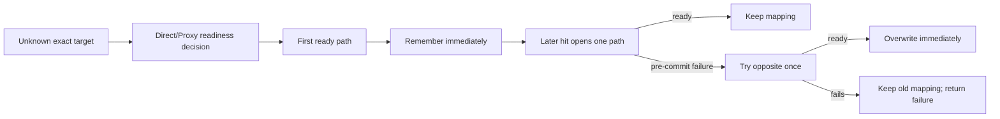

# ADR-0037: Make automatic last-known-good routing the product default

Status: Accepted
Date: 2026-08-03
Supersedes: the default-mode and automatic-runtime portions of ADR-0011, ADR-0017, and ADR-0036

## Context

The product exists to remove rule maintenance. The earlier design exposed `shadow`, `ephemeral-auto`, promotion counters, TTL, systemic learning freeze, cross-session suggestions, and a separate manual fixed-policy store before the core integration had been exercised in the user's real traffic path. That made the implementation and configuration harder to understand without measured evidence that route volatility required those mechanisms.

No live trial has measured a useful target-volatility rate. The only behavior currently justified by the product goal is: remember the first path that reaches the protocol readiness gate, reuse it, and repair it when it actually fails before application data is committed.

## Decision

`learning.mode = "auto"` is the canonical and default runtime mode. Local persistence is enabled by default. The older spelling `durable-auto` remains accepted only for configuration compatibility.

Automatic mappings:

- are exact to network profile, normalized target, port, and transport;
- have no approval, promotion counter, provisional state, confidence tier, session threshold, or TTL;
- remain until opposite-path fallback succeeds, bounded-capacity eviction occurs, or the user clears automatic mappings;
- use an in-memory HMAC-keyed index on the connection path and a dedicated bounded asynchronous policy writer;
- persist only the exact mapping, without creating evidence/session rows or running cross-session assessment;
- never replay committed application data.

The automatic path does not instantiate or consult the ephemeral promotion engine. Systemic-health freezing is not applied to automatic mapping lookup or updates: a both-path failure cannot change a mapping, so the freeze state machine is unnecessary for this path. Promotion, TTL, health-freeze, evidence-retention, and suggestion settings are neither validated nor consulted by `auto`. The existing Shadow, ephemeral, evidence-assessment, and manual-policy code is retained temporarily for diagnostics and compatibility, but it is not the MVP product path and receives no new feature work unless real trial evidence justifies it.

Direct-probe privacy policy, the original-policy Guard, readiness validation, TLS early-data rejection, bounded capacity, and explicit clear remain because they protect correctness or resource use rather than model hypothetical route volatility.

## Alternatives

| Alternative | Decision |
| --- | --- |
| Keep Shadow as the default | Rejected: it does not deliver the automatic-routing product behavior |
| Repeated wins or independent sessions | Rejected: delays value without measured benefit |
| Temporary then permanent layers | Rejected: duplicates state and user concepts |
| Automatic TTL or periodic re-probe | Deferred: add only if live data shows stale Proxy mappings are common enough to matter |
| No failure fallback | Rejected: a stale mapping would become an avoidable outage |
| Per-target approval | Rejected: recreates manual rule maintenance |

## Consequences

- A first transient Direct failure can leave a target on Proxy while Proxy remains healthy. This is a missed optimization, not an outage. The initial user control is a whole-profile or global relearn/clear action; periodic validation is not added speculatively.
- A Direct mapping that later fails repairs itself through one pre-commit Proxy fallback.
- New users see one routing model rather than three learning modes and several policy lifecycles.
- Legacy diagnostic code can be removed after the automatic integration and real trial no longer depend on it.

## Validation and rollback

The Test Lab must continue to prove the four-step sequence: first readiness remembered, same-path reuse with zero opposite attempts, selected-path failure followed by opposite overwrite, and final reuse of the new path. The runtime test must additionally prove that automatic updates have no expiry and do not require an ephemeral engine.

Rollback changes the mode to `shadow` and restarts SmartRoute. Clearing automatic mappings is a separate explicit operation and is not required merely to stop using them.
