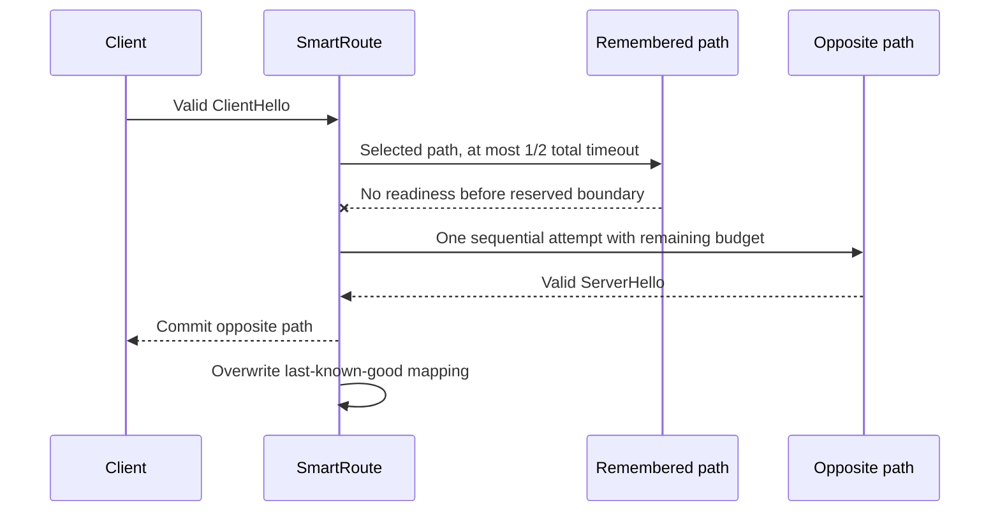

# ADR-0039: Reserve readiness time for automatic fallback

Status: Accepted
Date: 2026-08-04

## Context

An automatic last-known-good hit opens only the remembered path. If that path fails before commitment, SmartRoute promises one sequential attempt on the opposite path.

The first process-level Runtime Lab exposed a gap that unit dialers did not reproduce. A Mihomo forced listener can acknowledge SOCKS CONNECT before the remote target produces TLS readiness. When the selected target remains silent, the selected attempt previously consumed the entire candidate timeout. The opposite attempt was invoked with an already-expired context and therefore had no practical chance to recover the connection.

## Decision

`TLSRacer.ConnectPreferredWithFallback` keeps one total candidate timeout but gives the selected path at most half of that budget. The opposite path receives the remaining time. An immediate selected-path failure still leaves almost the full total timeout for fallback.

This is a fixed runtime rule rather than another user-facing tuning parameter. It exists only to make the already-promised fallback executable. It does not introduce TTL, promotion, repeated probing, or parallel work on healthy mapping hits.

The automatic runtime assembly must also register only non-nil writers. A typed nil legacy evidence writer must never be stored in an interface and invoked by `auto`; automatic mode registers only its dedicated policy writer.

## Alternatives

| Alternative | Decision |
| --- | --- |
| Let the selected path consume the total timeout | Rejected: makes the advertised opposite fallback ineffective for silent targets behind Mihomo |
| Start both paths immediately on every mapping hit | Rejected: removes the latency/resource benefit of the fixed layer |
| Add a configurable per-target timeout | Deferred: no live evidence yet justifies another product control |
| Retry after the total timeout | Rejected: exceeds the configured connection deadline and adds unbounded waiting |

## Consequences

- A healthy remembered path still opens exactly one candidate.
- A silent remembered path can consume no more than half the total readiness budget before fallback.
- A successful opposite path overwrites the mapping exactly as before.
- Very slow but ultimately healthy selected paths can now be replaced after half the total timeout. Real trial data may later justify a different fixed split, but changing it requires measured evidence and an ADR update.
- Automatic process startup no longer exposes a typed-nil evidence writer.

## Validation

- A deterministic transport test keeps the selected Direct connection silent, verifies a timeout observation, then requires Proxy readiness within the unchanged total timeout.
- `make runtime-lab` executes the real Clash composer, generated Mihomo config, pinned Mihomo child, actual `smartroute supervise` process, dedicated automatic policy writer, process restarts, and SQLite reload.
- The Runtime Lab requires: first Direct persistence; restarted Direct-only reuse; silent Direct timeout followed by Proxy overwrite; restarted Proxy-only reuse with a Direct tripwire remaining untouched; zero evidence/session rows; and zero access to the active Clash installation.
