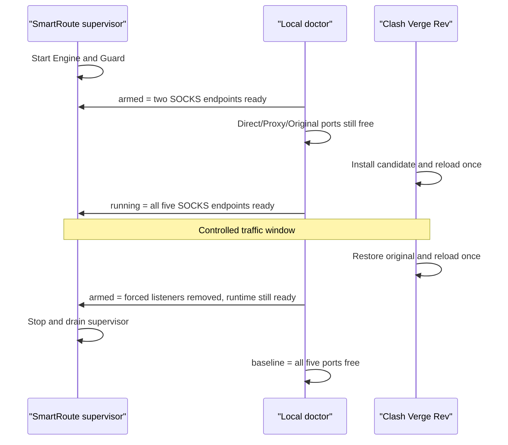

# ADR-0040: Arm the runtime before activating the Clash transform

Status: Accepted
Date: 2026-08-04

## Context

The composed Clash script replaces the final `MATCH` with a loopback SOCKS adapter that points at the SmartRoute Guard. Reloading that script before Guard is listening creates an avoidable interval in which all catch-all traffic reaches an unavailable local endpoint. Starting SmartRoute only after reload is therefore the wrong operational order even when both steps succeed.

The reverse problem exists during rollback. Stopping Guard before the original script has been restored and reloaded removes the endpoint while the active runtime configuration still routes the final `MATCH` to it.

## Decision

Live activation uses an explicitly verified three-phase local topology:

`smartroute doctor` performs only loopback checks. For an expected SOCKS endpoint it sends method negotiation and stops before a destination `CONNECT`; for an expected-free endpoint it verifies that the address can be bound. Its phases are:

| Phase | Engine + Guard | Direct + Proxy + Original |
| --- | --- | --- |
| `baseline` | Available | Available |
| `armed` | SOCKS5 ready | Available |
| `running` | SOCKS5 ready | SOCKS5 ready |

Candidate composition reserves all five ports against both Mihomo top-level listener fields and explicit listener entries. The private candidate manifest records the exact topology. A separate private runtime workspace pins the SmartRoute binary, generates an absolute-path configuration, starts observations paused, preallocates a random trial session, and records the ordered activation/rollback runbook.

## Alternatives

| Alternative | Decision |
| --- | --- |
| Reload, then start Guard quickly | Rejected: still creates a catch-all outage window |
| Start only Guard before reload | Rejected: Guard would immediately select an unavailable adaptive engine |
| Stop runtime before rollback | Rejected: recreates the same outage window in reverse |
| Probe public sites to prove listeners | Rejected for topology checks: local SOCKS negotiation is sufficient and network-free |

## Consequences

- Active activation and rollback have no deliberate Guard-unavailable interval.
- The doctor proves local protocol availability, not route identity, DNS correctness, target reachability, or application success; those remain separate smoke checks.
- A supervisor failure after activation remains possible and is still bounded by the original-policy Guard behavior and future OS-service integration.
- Runtime workspaces and candidate packages are private temporary artifacts and are never committed.

## Validation

Unit tests cover `baseline`, `armed`, `running`, and rejection of a non-SOCKS listener. The synthetic candidate test prepares a private runtime workspace, verifies permissions/configuration/random session generation, and asserts the exact activation and reverse-order rollback sequence. The first coordinated live trial passed `baseline`, `armed`, and `running` before normal traffic was invited.
