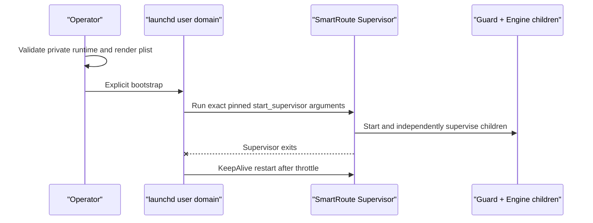

# ADR-0043: Own an active macOS trial Supervisor with a user LaunchAgent

Status: Accepted
Date: 2026-08-05

## Context

The first live trial started `smartroute supervise` in a temporary coding-agent PTY. The last Engine and Guard observations were normal, the host did not reboot, no crash report existed, and all three SmartRoute processes later disappeared together. Clash Verge retained the installed script and continued sending final-MATCH traffic to the absent Guard, producing `127.0.0.1:17893 connection refused`.

The internal Supervisor can restart Engine or Guard, but it cannot restart itself or outlive the process owner that launched it. ADR-0008 already identified this external boundary; the live failure made it a prerequisite whenever the adaptive transform remains active.

## Decision

For the macOS trial, generate a user LaunchAgent from the exact pinned live-runtime runbook:

`scripts/prepare-macos-launch-agent.rb` accepts only a private runtime, validates the pinned binary/config, requires exactly one matching `start_supervisor` command and random trial session, and emits a linted private plist. The plist uses `RunAtLoad`, `KeepAlive`, a five-second throttle, private stdout/stderr under the runtime, `Umask` 0077, and a direct argument array without a shell.

The generator never calls `launchctl`, reads or writes Clash, or reloads the active configuration. Bootstrap and bootout are explicit live operations. Rollback still restores and reloads the original Clash script before booting out the service.

## Alternatives

| Alternative | Reason rejected |
| --- | --- |
| Keep a Codex/terminal cell open | Its lifetime is not an operating-system reliability boundary |
| Make Guard restart the Supervisor | A child cannot reliably own its parent and Guard failure remains exposed |
| Let Clash retry the unavailable SOCKS adapter | Does not restore the missing listener and repeatedly fails new connections |
| Immediately build a full privileged installer | Unnecessary for a user-owned loopback Phase 0 trial and expands risk |

## Consequences

- Ending the coding-agent or terminal session no longer ends the trial Supervisor.
- Engine/Guard logs survive outside the launching PTY and remain local/private.
- A user login-domain service is macOS-specific; systemd and Windows service integration remain future work.
- The live runtime is relocated only while stopped into private user Application Support storage. The temporary source remains intact until the durable service and data are verified.
- An OS-service restart cannot replay connections that arrived during the failure window.

## Validation

`make macos-launch-agent-test` builds a synthetic private runtime, renders and parses the plist, verifies exact arguments/permissions/Umask/KeepAlive/RunAtLoad, rejects overwrite and pinned-binary drift, and never calls `launchctl` or binds a listener.

The first live bootstrap reported one running user LaunchAgent with the exact pinned runtime command, and `doctor -phase running` passed all five loopback SOCKS checks afterward. The runtime was then relocated to private Application Support storage. A deliberate Supervisor `SIGTERM` changed its PID, increased the LaunchAgent run count from 1 to 2, and all five checks passed again.
